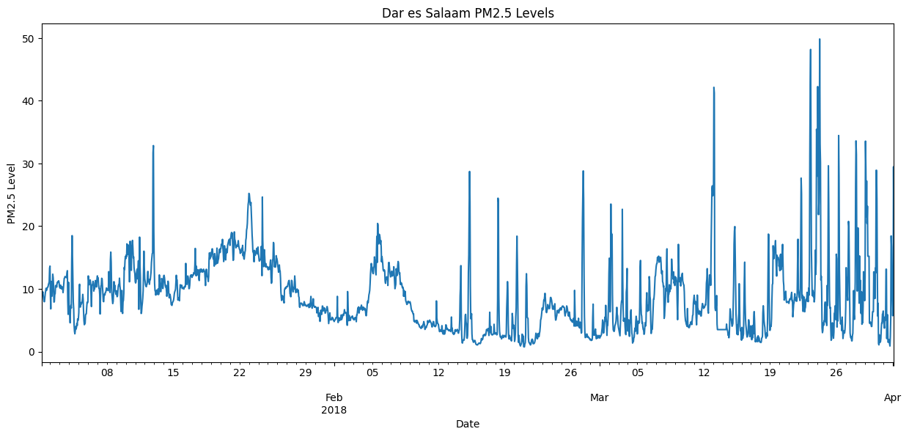
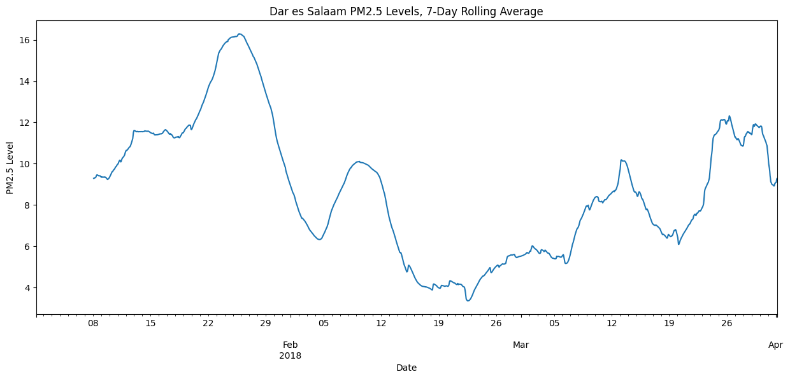
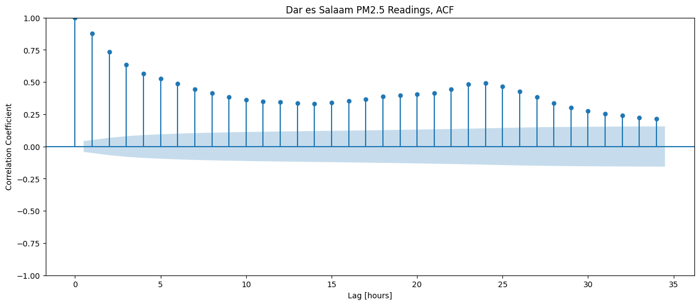
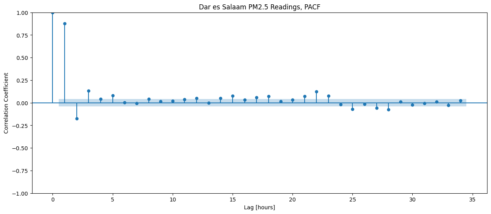
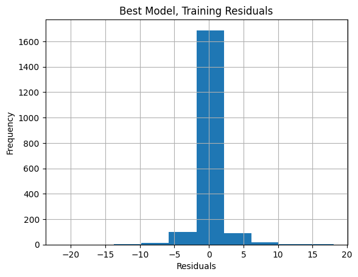
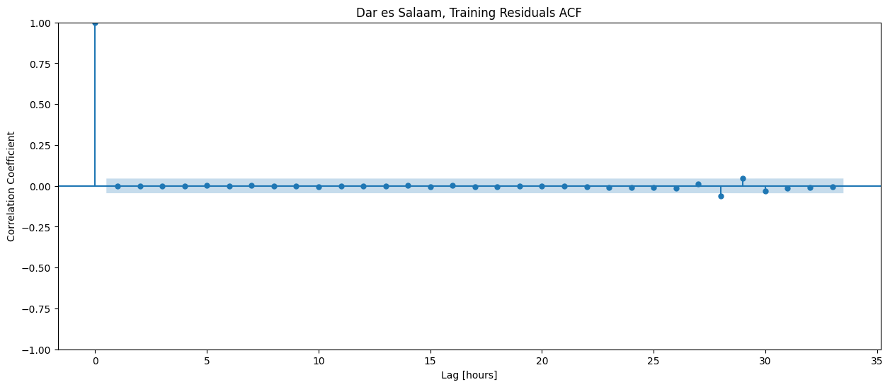

<font size="+3"><strong>3.5. Air Quality in Dar es Salaam 🇹🇿</strong></font>


```python
import warnings

warnings.simplefilter(action="ignore", category=FutureWarning)
warnings.filterwarnings("ignore", category=DeprecationWarning)
```


```python
# Import libraries here
from pprint import PrettyPrinter
from pymongo import MongoClient
import matplotlib.pyplot as plt

import pandas as pd

from sklearn.metrics import mean_absolute_error
from sklearn.linear_model import LinearRegression
import pytz
import plotly.express as px
```


```python
pp = PrettyPrinter(indent=2)
```

# Prepare Data

## Connect

<div style="padding: 1em; border: 1px solid #f0ad4e; border-left: 6px solid #f0ad4e; background-color: #fcf8e3; color: #8a6d3b; border-radius: 4px;">

<strong>🛠️ Instruction:</strong> Locate the IP address of the machine running MongoDB and assign it to the variable <code>host</code>. Make sure to use a <strong>string</strong> (i.e., wrap the IP in quotes).<br><br>

<strong>⚠️ Note:</strong> The IP address is <strong>dynamic</strong> — it may change every time you start the lab. Always check the current IP before proceeding.

</div>


**Task 3.5.1**


```python
# This will help connect with MongoDB
client = MongoClient(host="192.161.102.2", port=27017)
db = client['air-quality']
dar = db["dar-es-salaam"]
```


```python
pp.pprint(list(client.list_databases()))
```

    [ {'empty': False, 'name': 'admin', 'sizeOnDisk': 40960},
      {'empty': False, 'name': 'air-quality', 'sizeOnDisk': 5918720},
      {'empty': False, 'name': 'config', 'sizeOnDisk': 61440},
      {'empty': False, 'name': 'local', 'sizeOnDisk': 40960},
      {'empty': False, 'name': 'wqu-abtest', 'sizeOnDisk': 585728}]


```python
# look up the names of the databases
for c in db.list_collections():
    print(c['name'])
```

    dar-es-salaam
    system.buckets.dar-es-salaam
    nairobi
    system.buckets.nairobi
    system.views
    lagos
    system.buckets.lagos


```python
# total readings
dar.count_documents({})
```


    233262


```python
dar.find_one({})
```


    {'timestamp': datetime.datetime(2018, 1, 1, 0, 0, 48, 41000),
     'metadata': {'lat': -6.818,
      'lon': 39.285,
      'measurement': 'temperature',
      'sensor_id': 34,
      'sensor_type': 'DHT22',
      'site': 11},
     'temperature': 30.1,
     '_id': ObjectId('6525d778f44bfedd842c72d8')}


## Explore

**Task 3.5.2**


```python
# list() is used to convert the iterator to a list
sites = list(dar.distinct("metadata.site"))
sites
```


    [23, 11]


**Task 3.5.3**


```python
# Data from the site 23
dar.count_documents({"metadata.site": 23})
```


    60020


```python
# data from the site 11
dar.count_documents({"metadata.site": 11})
```


    173242


```python
# aggregate the count w.r.t the sites
result = dar.aggregate(
    [
        {"$group": {"_id": "$metadata.site", "count": {"$count" : {}}}}
    ]
)
readings_per_site = list(result)
readings_per_site
```


    [{'_id': 11, 'count': 173242}, {'_id': 23, 'count': 60020}]


## Import

**Task 3.5.4**


```python
# Preprocessing
def wrangle(collection):
    results = collection.find(
        {"metadata.site": 11, "metadata.measurement": "P2"},
        projection={"P2": 1, "timestamp": 1, "_id": 0},
    )

    
    df = pd.DataFrame(results).set_index("timestamp")

    df.index = df.index.tz_localize("UTC").tz_convert("Africa/Dar_es_Salaam")

    df = df[df["P2"] <= 100]

    df = df["P2"].resample("1H").mean().fillna(method="ffill")
    
    return df
```

Use your `wrangle` function to query the `dar` collection and return your cleaned results.


```python
y = wrangle(dar)
print(type(y))
```

    <class 'pandas.core.series.Series'>


## Explore Some More

**Task 3.5.5**


```python
df = pd.DataFrame(y)
df.shape
```


    (2160, 1)


```python
df.head()
```


<div>
<style scoped>
    .dataframe tbody tr th:only-of-type {
        vertical-align: middle;
    }

    .dataframe tbody tr th {
        vertical-align: top;
    }

    .dataframe thead th {
        text-align: right;
    }
</style>
<table border="1" class="dataframe">
  <thead>
    <tr style="text-align: right;">
      <th></th>
      <th>P2</th>
    </tr>
    <tr>
      <th>timestamp</th>
      <th></th>
    </tr>
  </thead>
  <tbody>
    <tr>
      <th>2018-01-01 03:00:00+03:00</th>
      <td>9.456327</td>
    </tr>
    <tr>
      <th>2018-01-01 04:00:00+03:00</th>
      <td>9.400833</td>
    </tr>
    <tr>
      <th>2018-01-01 05:00:00+03:00</th>
      <td>9.331458</td>
    </tr>
    <tr>
      <th>2018-01-01 06:00:00+03:00</th>
      <td>9.528776</td>
    </tr>
    <tr>
      <th>2018-01-01 07:00:00+03:00</th>
      <td>8.861250</td>
    </tr>
  </tbody>
</table>
</div>


```python
# Tme series plot of PM2.5 levels in Dar es Salaam
fig, ax = plt.subplots(figsize=(15, 6))

# use ax=ax in your plot
df["P2"].plot(xlabel="Date", ylabel="PM2.5 Level",  title="Dar es Salaam PM2.5 Levels", ax=ax);
```


    

    


**Task 3.5.6**


```python
# rolling average of the readings in df. Use a window size of 168 (the number of hours in a week)
fig, ax = plt.subplots(figsize=(15, 6))

# use ax=ax in your plot
df["P2"].rolling(168).mean().plot(xlabel="Date", ylabel="PM2.5 Level", title="Dar es Salaam PM2.5 Levels, 7-Day Rolling Average", ax=ax);
```


    

    


**Task 3.5.7**


```python
# ACF plot for the data in y, to understand how good lag(prev hours) is in predicting the current 
#  using corr coeff, how much predictive power we'll have if we know 6hr, 12hr...ago's data
from statsmodels.graphics.tsaplots import plot_acf, plot_pacf
from statsmodels.tsa.ar_model import AutoReg

fig, ax = plt.subplots(figsize=(15, 6))
plot_acf(y, ax=ax)
# use ax=ax in your plot
plt.xlabel("Lag [hours]")
plt.ylabel("Correlation Coefficient")
plt.title("Dar es Salaam PM2.5 Readings, ACF");
```


    

    


**Task 3.5.8**


```python
# Only by using PACF we get what prev hours / lag to chose as features to predict curr P2 level
# the idea is we remove the repel effect caused due to the 1 hour ago data
# so here the other hours beyond the first hour will shrink in size and reflect true correlation
# now will look which are strongly correlated to the current P2 level and above the blue cloud
# the blue cloud represents in significance level, the correlation matters above the blue cloud
fig, ax = plt.subplots(figsize=(15, 6))
plot_pacf(y, ax=ax)
# Use ax=ax in your plot
plt.xlabel("Lag [hours]")
plt.ylabel("Correlation Coefficient")
plt.title("Dar es Salaam PM2.5 Readings, PACF");
```


    

    


## Split

**Task 3.5.9**


```python
"""
Split y into training and test sets. 
The first 90% of the data should be in your training set. 
The remaining 10% should be in the test set.
Remember this is a time series data, we cannot shuffle or do any of those random train test split.
"""
```


    '\nSplit y into training and test sets. \nThe first 90% of the data should be in your training set. \nThe remaining 10% should be in the test set.\nRemember this is a time series data, we cannot shuffle or do any of those random train test split.\n'


```python
cutoff_test = int(len(y) * 0.9)
y_train = y[:cutoff_test]
y_test = y[cutoff_test:]
print("y_train shape:", y_train.shape)
print("y_test shape:", y_test.shape)
```

    y_train shape: (1944,)
    y_test shape: (216,)


```python
len(y_train) + len(y_test) == len(y)
```


    True


```python
y[:10]
```


    timestamp
    2018-01-01 03:00:00+03:00    9.456327
    2018-01-01 04:00:00+03:00    9.400833
    2018-01-01 05:00:00+03:00    9.331458
    2018-01-01 06:00:00+03:00    9.528776
    2018-01-01 07:00:00+03:00    8.861250
    2018-01-01 08:00:00+03:00    8.334375
    2018-01-01 09:00:00+03:00    7.966458
    2018-01-01 10:00:00+03:00    7.979792
    2018-01-01 11:00:00+03:00    8.601667
    2018-01-01 12:00:00+03:00    9.273958
    Freq: H, Name: P2, dtype: float64


```python

```

# Build Model

## Baseline

**Task 3.5.10**


```python
y_train_mean = y_train.mean()
y_pred_baseline = [y_train_mean] * len(y_train)
mae_baseline = mean_absolute_error(y_train, y_pred_baseline)

print("Mean P2 Reading:", y_train_mean)
print("Baseline MAE:", mae_baseline)
```

    Mean P2 Reading: 8.57142319061077
    Baseline MAE: 4.053101181299159


## Iterate

**Task 3.5.11**

<div class="alert alert-block alert-info">
    <p><b>Tip:</b> In this task, you'll need to combine the model you learned about in <b>Task 3.3.8</b> with the hyperparameter tuning technique you learned in <b>Task 3.4.9</b>.</p>
</div>


```python
"""
You're going to use an AutoReg model to predict PM2.5 readings, 
but which hyperparameter settings will give you the best performance? 
Use a for loop to train your AR model on using settings for lags from 1 to 30. 
Each time you train a new model, calculate its mean absolute error and append the result to the list maes. 
Then store your results in the Series mae_series.
"""
```


    "\nYou're going to use an AutoReg model to predict PM2.5 readings, \nbut which hyperparameter settings will give you the best performance? \nUse a for loop to train your AR model on using settings for lags from 1 to 30. \nEach time you train a new model, calculate its mean absolute error and append the result to the list maes. \nThen store your results in the Series mae_series.\n"


>So what exactly is AutoReg model?
Simply speaking it is just like a multiple linear regression with features
Going up to the value shown in the pacf plot that means they are features and our model will choose the right Coefficient for them and will predict the current time air quality based on it.


```python
# Create range to test different lags
p_params = range(1, 31)

# Create empty list to hold mean absolute error scores
maes = []

# Iterate through all values of p in `p_params`
for p in p_params:
    # Build model
    model = AutoReg(y_train, lags=p).fit()

    # Make predictions on training data, dropping null values caused by lag
    y_pred = model.predict().dropna()

    # Calculate mean absolute error for training data vs predictions
    mae = mean_absolute_error(y_train.iloc[p:], y_pred)

    # Append `mae` to list `maes`
    maes.append(mae)

# Put list `maes` into Series with index `p_params`
mae_series = pd.Series(maes, name="mae", index=p_params)

# Inspect head of Series
mae_series.head()
```


    1    1.059376
    2    1.045182
    3    1.032489
    4    1.032147
    5    1.031022
    Name: mae, dtype: float64


```python
mae_series.min()
```


    1.010284973611921


```python
ind = mae_series.argmin()
print(ind)
mae_series.min() == mae_series[ind+1] # 1 based indexing
```

    25


    True


**Task 3.5.12**


```python
best_p = ind + 1
best_model = AutoReg(y_train, lags=best_p).fit()
```

**Task 3.5.13**

> Residual just means the difference between the prediction and the original labels


```python
y_train_resid = best_model.resid
y_train_resid.name = "residuals"
y_train_resid.head()
```


    timestamp
    2018-01-02 05:00:00+03:00   -0.412913
    2018-01-02 06:00:00+03:00    1.484934
    2018-01-02 07:00:00+03:00    1.672359
    2018-01-02 08:00:00+03:00   -0.368030
    2018-01-02 09:00:00+03:00   -0.536868
    Freq: H, Name: residuals, dtype: float64


<div class="alert alert-info" role="alert">
  <strong>Slight Code Change</strong>

In the following task, you'll notice a small change in how plots are created compared to what you saw in the lessons.
While the lessons use the global matplotlib method like <code>plt.plot(...)</code>, in this task, you are expected to use the object-oriented (OOP) API instead.
This means creating your plots using <code>fig, ax = plt.subplots()</code> and then calling plotting methods on the <code>ax</code> object, such as <code>ax.plot(...)</code>, <code>ax.hist(...)</code>, or <code>ax.scatter(...)</code>.

If you're using pandas’ or seaborn’s built-in plotting methods (like <code>df.plot()</code> or <code>sns.lineplot()</code>), make sure to pass the <code>ax=ax</code> argument so that the plot is rendered on the correct axes.

This approach is considered best practice and will be used consistently across all graded tasks that involve matplotlib.
</div>


**Task 3.5.14**


```python
# Plot histogram of residuals
fig, ax = plt.subplots()

# Use ax=ax in your plot
y_train_resid.hist()
plt.xlabel("Residuals")
plt.ylabel("Frequency")
plt.title("Best Model, Training Residuals")
```


    Text(0.5, 1.0, 'Best Model, Training Residuals')


    

    


>Residuals are mostly around 0 which means our predictions are closed to the True values

**Task 3.5.15**


```python
"""
Create an ACF plot for y_train_resid. 
Be sure to label the x-axis as "Lag [hours]" and y-axis as "Correlation Coefficient". 
Use the title "Dar es Salaam, Training Residuals ACF".
"""
```


    '\nCreate an ACF plot for y_train_resid. \nBe sure to label the x-axis as "Lag [hours]" and y-axis as "Correlation Coefficient". \nUse the title "Dar es Salaam, Training Residuals ACF".\n'


```python
fig, ax = plt.subplots(figsize=(15, 6))

# Use ax=ax in your plot
plot_acf(y_train_resid, ax=ax)
plt.xlabel("Lag [hours]")
plt.ylabel("Correlation Coefficient")
plt.title("Dar es Salaam, Training Residuals ACF")
```


    Text(0.5, 1.0, 'Dar es Salaam, Training Residuals ACF')


    

    


## Evaluate

**Task 3.5.16**

This will be work forward cross validation and the length of the predictions will equal y_test
The idea is to visualise the line separating the training and the test on the right.
Using the training data on the left, we fit the model and then make the just next prediction which is equal to y_test first element.
Now we will expand the training set size by including the first y test as well and train the model fit it on this one increased training set and their four every prediction f at the same time after making the prediction will take the data point from the White test and add to the training set and then start prediction again to predict the next timestamp


```python
"""
Perform walk-forward validation for your model for the entire test set y_test. 
Store your model's predictions in the Series y_pred_wfv.
Make sure the name of your Series is "prediction" and the name of your Series index is "timestamp".
"""
```


    '\nPerform walk-forward validation for your model for the entire test set y_test. \nStore your model\'s predictions in the Series y_pred_wfv.\nMake sure the name of your Series is "prediction" and the name of your Series index is "timestamp".\n'


```python

y_pred_wfv = pd.Series()
history = y_train.copy()
for i in range(len(y_test)):
    model = AutoReg(history, lags=26).fit()
    next_val = model.forecast() # provides the just next hour(or day's) prediction
    y_pred_wfv = y_pred_wfv.append(next_val) # append the latest prediction [timestamp(index), p2]
    history = history.append(y_test[next_val.index]) # add the y_test data point using the timestamp of the predicted value
    
y_pred_wfv.name = "prediction"
y_pred_wfv.index.name = "timestamp"
y_pred_wfv.head()
```


    timestamp
    2018-03-23 03:00:00+03:00    10.414744
    2018-03-23 04:00:00+03:00     8.269589
    2018-03-23 05:00:00+03:00    15.178677
    2018-03-23 06:00:00+03:00    33.475398
    2018-03-23 07:00:00+03:00    39.571363
    Freq: H, Name: prediction, dtype: float64


```python
# Look at the coefficients of the model
print(model.params)
```

    const     0.477920
    P2.L1     1.024497
    P2.L2    -0.296574
    P2.L3     0.098520
    P2.L4    -0.041915
    P2.L5     0.061853
    P2.L6     0.015616
    P2.L7    -0.036154
    P2.L8     0.023809
    P2.L9    -0.000842
    P2.L10   -0.007056
    P2.L11   -0.025460
    P2.L12    0.062005
    P2.L13   -0.037525
    P2.L14   -0.026505
    P2.L15    0.047846
    P2.L16   -0.008707
    P2.L17   -0.016195
    P2.L18    0.052776
    P2.L19   -0.003153
    P2.L20   -0.002376
    P2.L21   -0.038542
    P2.L22    0.048031
    P2.L23    0.081055
    P2.L24    0.048787
    P2.L25   -0.063153
    P2.L26   -0.014458
    dtype: float64


```python
# above we see the params just like in multpiple linear regression andd their corresponding coeff
# also l1..l26 -> lag of 1 ... 26 days, shifting the data or rather looking back that many lag hrs
```

**Task 3.5.17**


```python
# Enter y_pred_wfv at ... (Ellipsis) to see the test mean absolute error

test_mae = mean_absolute_error(y_test, y_pred_wfv)
print("Test MAE (walk forward validation):", round(test_mae, 2))
```

    Test MAE (walk forward validation): 3.97


# Communicate Results

**Task 3.5.18**


```python
df_pred_test = pd.DataFrame(
    {"y_test": y_test, "y_pred_wfv": y_pred_wfv}
)
fig = px.line(df_pred_test)
fig.update_layout(
    title="Dar es Salaam, WFV Predictions",
    xaxis_title="Date",
    yaxis_title="PM2.5 Level",
)
```


<div>                            <div id="d990be49-f658-467d-845e-5427235078c7" class="plotly-graph-div" style="height:525px; width:100%;"></div>            <script type="text/javascript">                require(["plotly"], function(Plotly) {                    window.PLOTLYENV=window.PLOTLYENV || {};                                    if (document.getElementById("d990be49-f658-467d-845e-5427235078c7")) {                    Plotly.newPlot(                        "d990be49-f658-467d-845e-5427235078c7",                        [{"hovertemplate":"variable=y_test\u003cbr\u003etimestamp=%{x}\u003cbr\u003evalue=%{y}\u003cextra\u003e\u003c\u002fextra\u003e","legendgroup":"y_test","line":{"color":"#636efa","dash":"solid"},"marker":{"symbol":"circle"},"mode":"lines","name":"y_test","orientation":"v","showlegend":true,"x":["2018-03-23T03:00:00+03:00","2018-03-23T04:00:00+03:00","2018-03-23T05:00:00+03:00","2018-03-23T06:00:00+03:00","2018-03-23T07:00:00+03:00","2018-03-23T08:00:00+03:00","2018-03-23T09:00:00+03:00","2018-03-23T10:00:00+03:00","2018-03-23T11:00:00+03:00","2018-03-23T12:00:00+03:00","2018-03-23T13:00:00+03:00","2018-03-23T14:00:00+03:00","2018-03-23T15:00:00+03:00","2018-03-23T16:00:00+03:00","2018-03-23T17:00:00+03:00","2018-03-23T18:00:00+03:00","2018-03-23T19:00:00+03:00","2018-03-23T20:00:00+03:00","2018-03-23T21:00:00+03:00","2018-03-23T22:00:00+03:00","2018-03-23T23:00:00+03:00","2018-03-24T00:00:00+03:00","2018-03-24T01:00:00+03:00","2018-03-24T02:00:00+03:00","2018-03-24T03:00:00+03:00","2018-03-24T04:00:00+03:00","2018-03-24T05:00:00+03:00","2018-03-24T06:00:00+03:00","2018-03-24T07:00:00+03:00","2018-03-24T08:00:00+03:00","2018-03-24T09:00:00+03:00","2018-03-24T10:00:00+03:00","2018-03-24T11:00:00+03:00","2018-03-24T12:00:00+03:00","2018-03-24T13:00:00+03:00","2018-03-24T14:00:00+03:00","2018-03-24T15:00:00+03:00","2018-03-24T16:00:00+03:00","2018-03-24T17:00:00+03:00","2018-03-24T18:00:00+03:00","2018-03-24T19:00:00+03:00","2018-03-24T20:00:00+03:00","2018-03-24T21:00:00+03:00","2018-03-24T22:00:00+03:00","2018-03-24T23:00:00+03:00","2018-03-25T00:00:00+03:00","2018-03-25T01:00:00+03:00","2018-03-25T02:00:00+03:00","2018-03-25T03:00:00+03:00","2018-03-25T04:00:00+03:00","2018-03-25T05:00:00+03:00","2018-03-25T06:00:00+03:00","2018-03-25T07:00:00+03:00","2018-03-25T08:00:00+03:00","2018-03-25T09:00:00+03:00","2018-03-25T10:00:00+03:00","2018-03-25T11:00:00+03:00","2018-03-25T12:00:00+03:00","2018-03-25T13:00:00+03:00","2018-03-25T14:00:00+03:00","2018-03-25T15:00:00+03:00","2018-03-25T16:00:00+03:00","2018-03-25T17:00:00+03:00","2018-03-25T18:00:00+03:00","2018-03-25T19:00:00+03:00","2018-03-25T20:00:00+03:00","2018-03-25T21:00:00+03:00","2018-03-25T22:00:00+03:00","2018-03-25T23:00:00+03:00","2018-03-26T00:00:00+03:00","2018-03-26T01:00:00+03:00","2018-03-26T02:00:00+03:00","2018-03-26T03:00:00+03:00","2018-03-26T04:00:00+03:00","2018-03-26T05:00:00+03:00","2018-03-26T06:00:00+03:00","2018-03-26T07:00:00+03:00","2018-03-26T08:00:00+03:00","2018-03-26T09:00:00+03:00","2018-03-26T10:00:00+03:00","2018-03-26T11:00:00+03:00","2018-03-26T12:00:00+03:00","2018-03-26T13:00:00+03:00","2018-03-26T14:00:00+03:00","2018-03-26T15:00:00+03:00","2018-03-26T16:00:00+03:00","2018-03-26T17:00:00+03:00","2018-03-26T18:00:00+03:00","2018-03-26T19:00:00+03:00","2018-03-26T20:00:00+03:00","2018-03-26T21:00:00+03:00","2018-03-26T22:00:00+03:00","2018-03-26T23:00:00+03:00","2018-03-27T00:00:00+03:00","2018-03-27T01:00:00+03:00","2018-03-27T02:00:00+03:00","2018-03-27T03:00:00+03:00","2018-03-27T04:00:00+03:00","2018-03-27T05:00:00+03:00","2018-03-27T06:00:00+03:00","2018-03-27T07:00:00+03:00","2018-03-27T08:00:00+03:00","2018-03-27T09:00:00+03:00","2018-03-27T10:00:00+03:00","2018-03-27T11:00:00+03:00","2018-03-27T12:00:00+03:00","2018-03-27T13:00:00+03:00","2018-03-27T14:00:00+03:00","2018-03-27T15:00:00+03:00","2018-03-27T16:00:00+03:00","2018-03-27T17:00:00+03:00","2018-03-27T18:00:00+03:00","2018-03-27T19:00:00+03:00","2018-03-27T20:00:00+03:00","2018-03-27T21:00:00+03:00","2018-03-27T22:00:00+03:00","2018-03-27T23:00:00+03:00","2018-03-28T00:00:00+03:00","2018-03-28T01:00:00+03:00","2018-03-28T02:00:00+03:00","2018-03-28T03:00:00+03:00","2018-03-28T04:00:00+03:00","2018-03-28T05:00:00+03:00","2018-03-28T06:00:00+03:00","2018-03-28T07:00:00+03:00","2018-03-28T08:00:00+03:00","2018-03-28T09:00:00+03:00","2018-03-28T10:00:00+03:00","2018-03-28T11:00:00+03:00","2018-03-28T12:00:00+03:00","2018-03-28T13:00:00+03:00","2018-03-28T14:00:00+03:00","2018-03-28T15:00:00+03:00","2018-03-28T16:00:00+03:00","2018-03-28T17:00:00+03:00","2018-03-28T18:00:00+03:00","2018-03-28T19:00:00+03:00","2018-03-28T20:00:00+03:00","2018-03-28T21:00:00+03:00","2018-03-28T22:00:00+03:00","2018-03-28T23:00:00+03:00","2018-03-29T00:00:00+03:00","2018-03-29T01:00:00+03:00","2018-03-29T02:00:00+03:00","2018-03-29T03:00:00+03:00","2018-03-29T04:00:00+03:00","2018-03-29T05:00:00+03:00","2018-03-29T06:00:00+03:00","2018-03-29T07:00:00+03:00","2018-03-29T08:00:00+03:00","2018-03-29T09:00:00+03:00","2018-03-29T10:00:00+03:00","2018-03-29T11:00:00+03:00","2018-03-29T12:00:00+03:00","2018-03-29T13:00:00+03:00","2018-03-29T14:00:00+03:00","2018-03-29T15:00:00+03:00","2018-03-29T16:00:00+03:00","2018-03-29T17:00:00+03:00","2018-03-29T18:00:00+03:00","2018-03-29T19:00:00+03:00","2018-03-29T20:00:00+03:00","2018-03-29T21:00:00+03:00","2018-03-29T22:00:00+03:00","2018-03-29T23:00:00+03:00","2018-03-30T00:00:00+03:00","2018-03-30T01:00:00+03:00","2018-03-30T02:00:00+03:00","2018-03-30T03:00:00+03:00","2018-03-30T04:00:00+03:00","2018-03-30T05:00:00+03:00","2018-03-30T06:00:00+03:00","2018-03-30T07:00:00+03:00","2018-03-30T08:00:00+03:00","2018-03-30T09:00:00+03:00","2018-03-30T10:00:00+03:00","2018-03-30T11:00:00+03:00","2018-03-30T12:00:00+03:00","2018-03-30T13:00:00+03:00","2018-03-30T14:00:00+03:00","2018-03-30T15:00:00+03:00","2018-03-30T16:00:00+03:00","2018-03-30T17:00:00+03:00","2018-03-30T18:00:00+03:00","2018-03-30T19:00:00+03:00","2018-03-30T20:00:00+03:00","2018-03-30T21:00:00+03:00","2018-03-30T22:00:00+03:00","2018-03-30T23:00:00+03:00","2018-03-31T00:00:00+03:00","2018-03-31T01:00:00+03:00","2018-03-31T02:00:00+03:00","2018-03-31T03:00:00+03:00","2018-03-31T04:00:00+03:00","2018-03-31T05:00:00+03:00","2018-03-31T06:00:00+03:00","2018-03-31T07:00:00+03:00","2018-03-31T08:00:00+03:00","2018-03-31T09:00:00+03:00","2018-03-31T10:00:00+03:00","2018-03-31T11:00:00+03:00","2018-03-31T12:00:00+03:00","2018-03-31T13:00:00+03:00","2018-03-31T14:00:00+03:00","2018-03-31T15:00:00+03:00","2018-03-31T16:00:00+03:00","2018-03-31T17:00:00+03:00","2018-03-31T18:00:00+03:00","2018-03-31T19:00:00+03:00","2018-03-31T20:00:00+03:00","2018-03-31T21:00:00+03:00","2018-03-31T22:00:00+03:00","2018-03-31T23:00:00+03:00","2018-04-01T00:00:00+03:00","2018-04-01T01:00:00+03:00","2018-04-01T02:00:00+03:00"],"xaxis":"x","y":[9.015416666666667,13.385,31.3225,42.64666666666667,48.175000000000004,31.050416666666667,16.162499999999998,12.209999999999999,8.947083333333333,9.335416666666667,9.74,8.755,9.348333333333334,7.934166666666667,8.383333333333333,10.698333333333332,16.197916666666668,12.308750000000002,14.264583333333334,35.45291666666667,33.89791666666667,27.97791666666667,42.25875,34.884166666666665,21.84875,23.8096,30.110833333333332,49.846666666666664,33.13291666666667,30.14375,11.454583333333334,12.020434782608698,9.788695652173912,3.780416666666667,3.0295833333333335,3.3625000000000003,4.5796,4.203888888888889,4.909166666666667,4.817391304347826,7.404583333333334,7.919583333333333,5.581666666666667,4.6137500000000005,4.995416666666666,4.169583333333334,10.556666666666667,7.355416666666667,14.382083333333334,29.637083333333333,23.498333333333335,14.109166666666667,8.19375,6.940833333333333,7.0687500000000005,3.92375,1.80875,1.96125,3.1033333333333335,4.598333333333334,3.932608695652174,2.8316666666666666,2.1404166666666664,3.1029166666666668,6.115833333333334,6.167916666666667,7.3,5.447500000000001,5.082916666666667,15.535833333333334,14.795416666666666,3.9254166666666666,8.37375,4.890416666666667,6.7629166666666665,34.455416666666665,27.964166666666667,12.995833333333332,9.043333333333333,5.381818181818182,4.428181818181819,4.9525,4.482727272727273,3.3475,5.508181818181818,3.655,2.0936363636363637,2.7383333333333333,3.186666666666667,3.3558333333333334,2.966666666666667,3.4416666666666664,4.615833333333334,7.098333333333334,13.3925,9.301666666666668,11.775,8.981666666666667,8.18,13.259166666666667,20.768333333333334,20.03666666666667,13.9125,8.09125,2.9717391304347824,2.4366666666666665,2.191666666666667,2.405,1.7304166666666667,1.719090909090909,2.5779166666666664,2.9462499999999996,6.564166666666666,9.7325,5.934166666666666,5.150833333333334,8.292173913043479,11.051666666666668,26.365416666666665,33.60052631578947,31.398749999999996,15.024166666666666,9.659166666666666,10.51125,19.73391304347826,16.320416666666667,11.07875,7.7250000000000005,15.25590909090909,9.897499999999999,11.399999999999999,6.2024,6.093076923076922,9.566923076923077,4.370833333333334,4.75125,4.591666666666667,7.197500000000001,12.749166666666667,11.912916666666668,10.605,8.132083333333332,11.89,33.558,29.234583333333333,21.46875,27.207391304347826,20.457083333333333,23.189999999999998,15.212083333333332,15.212083333333332,15.212083333333332,15.212083333333332,4.7075000000000005,4.484583333333333,4.707916666666667,4.707916666666667,4.385555555555555,4.016666666666667,4.016666666666667,5.236,6.364166666666667,6.364166666666667,6.364166666666667,12.730434782608697,8.804166666666667,12.0175,8.465,13.342916666666667,12.563333333333333,28.91333333333333,28.91333333333333,24.311,12.442083333333334,5.6575,7.718500000000001,1.34,1.0891666666666666,2.6845833333333338,1.4229166666666666,1.5225,1.567391304347826,2.12,3.6604166666666664,4.5525,4.5525,5.973333333333333,6.078333333333333,6.477916666666666,4.861666666666667,4.284782608695652,3.748333333333333,5.511304347826087,4.972916666666666,5.6191666666666675,13.1425,13.1425,2.085,5.871666666666666,5.871666666666666,1.5116666666666667,1.5116666666666667,1.9511111111111115,1.5599999999999998,1.3017391304347827,0.9,2.4066666666666667,5.3212,18.45,16.690416666666668,8.459999999999999,8.459999999999999,5.725,8.089166666666666,29.476249999999997,16.780416666666667],"yaxis":"y","type":"scatter"},{"hovertemplate":"variable=y_pred_wfv\u003cbr\u003etimestamp=%{x}\u003cbr\u003evalue=%{y}\u003cextra\u003e\u003c\u002fextra\u003e","legendgroup":"y_pred_wfv","line":{"color":"#EF553B","dash":"solid"},"marker":{"symbol":"circle"},"mode":"lines","name":"y_pred_wfv","orientation":"v","showlegend":true,"x":["2018-03-23T03:00:00+03:00","2018-03-23T04:00:00+03:00","2018-03-23T05:00:00+03:00","2018-03-23T06:00:00+03:00","2018-03-23T07:00:00+03:00","2018-03-23T08:00:00+03:00","2018-03-23T09:00:00+03:00","2018-03-23T10:00:00+03:00","2018-03-23T11:00:00+03:00","2018-03-23T12:00:00+03:00","2018-03-23T13:00:00+03:00","2018-03-23T14:00:00+03:00","2018-03-23T15:00:00+03:00","2018-03-23T16:00:00+03:00","2018-03-23T17:00:00+03:00","2018-03-23T18:00:00+03:00","2018-03-23T19:00:00+03:00","2018-03-23T20:00:00+03:00","2018-03-23T21:00:00+03:00","2018-03-23T22:00:00+03:00","2018-03-23T23:00:00+03:00","2018-03-24T00:00:00+03:00","2018-03-24T01:00:00+03:00","2018-03-24T02:00:00+03:00","2018-03-24T03:00:00+03:00","2018-03-24T04:00:00+03:00","2018-03-24T05:00:00+03:00","2018-03-24T06:00:00+03:00","2018-03-24T07:00:00+03:00","2018-03-24T08:00:00+03:00","2018-03-24T09:00:00+03:00","2018-03-24T10:00:00+03:00","2018-03-24T11:00:00+03:00","2018-03-24T12:00:00+03:00","2018-03-24T13:00:00+03:00","2018-03-24T14:00:00+03:00","2018-03-24T15:00:00+03:00","2018-03-24T16:00:00+03:00","2018-03-24T17:00:00+03:00","2018-03-24T18:00:00+03:00","2018-03-24T19:00:00+03:00","2018-03-24T20:00:00+03:00","2018-03-24T21:00:00+03:00","2018-03-24T22:00:00+03:00","2018-03-24T23:00:00+03:00","2018-03-25T00:00:00+03:00","2018-03-25T01:00:00+03:00","2018-03-25T02:00:00+03:00","2018-03-25T03:00:00+03:00","2018-03-25T04:00:00+03:00","2018-03-25T05:00:00+03:00","2018-03-25T06:00:00+03:00","2018-03-25T07:00:00+03:00","2018-03-25T08:00:00+03:00","2018-03-25T09:00:00+03:00","2018-03-25T10:00:00+03:00","2018-03-25T11:00:00+03:00","2018-03-25T12:00:00+03:00","2018-03-25T13:00:00+03:00","2018-03-25T14:00:00+03:00","2018-03-25T15:00:00+03:00","2018-03-25T16:00:00+03:00","2018-03-25T17:00:00+03:00","2018-03-25T18:00:00+03:00","2018-03-25T19:00:00+03:00","2018-03-25T20:00:00+03:00","2018-03-25T21:00:00+03:00","2018-03-25T22:00:00+03:00","2018-03-25T23:00:00+03:00","2018-03-26T00:00:00+03:00","2018-03-26T01:00:00+03:00","2018-03-26T02:00:00+03:00","2018-03-26T03:00:00+03:00","2018-03-26T04:00:00+03:00","2018-03-26T05:00:00+03:00","2018-03-26T06:00:00+03:00","2018-03-26T07:00:00+03:00","2018-03-26T08:00:00+03:00","2018-03-26T09:00:00+03:00","2018-03-26T10:00:00+03:00","2018-03-26T11:00:00+03:00","2018-03-26T12:00:00+03:00","2018-03-26T13:00:00+03:00","2018-03-26T14:00:00+03:00","2018-03-26T15:00:00+03:00","2018-03-26T16:00:00+03:00","2018-03-26T17:00:00+03:00","2018-03-26T18:00:00+03:00","2018-03-26T19:00:00+03:00","2018-03-26T20:00:00+03:00","2018-03-26T21:00:00+03:00","2018-03-26T22:00:00+03:00","2018-03-26T23:00:00+03:00","2018-03-27T00:00:00+03:00","2018-03-27T01:00:00+03:00","2018-03-27T02:00:00+03:00","2018-03-27T03:00:00+03:00","2018-03-27T04:00:00+03:00","2018-03-27T05:00:00+03:00","2018-03-27T06:00:00+03:00","2018-03-27T07:00:00+03:00","2018-03-27T08:00:00+03:00","2018-03-27T09:00:00+03:00","2018-03-27T10:00:00+03:00","2018-03-27T11:00:00+03:00","2018-03-27T12:00:00+03:00","2018-03-27T13:00:00+03:00","2018-03-27T14:00:00+03:00","2018-03-27T15:00:00+03:00","2018-03-27T16:00:00+03:00","2018-03-27T17:00:00+03:00","2018-03-27T18:00:00+03:00","2018-03-27T19:00:00+03:00","2018-03-27T20:00:00+03:00","2018-03-27T21:00:00+03:00","2018-03-27T22:00:00+03:00","2018-03-27T23:00:00+03:00","2018-03-28T00:00:00+03:00","2018-03-28T01:00:00+03:00","2018-03-28T02:00:00+03:00","2018-03-28T03:00:00+03:00","2018-03-28T04:00:00+03:00","2018-03-28T05:00:00+03:00","2018-03-28T06:00:00+03:00","2018-03-28T07:00:00+03:00","2018-03-28T08:00:00+03:00","2018-03-28T09:00:00+03:00","2018-03-28T10:00:00+03:00","2018-03-28T11:00:00+03:00","2018-03-28T12:00:00+03:00","2018-03-28T13:00:00+03:00","2018-03-28T14:00:00+03:00","2018-03-28T15:00:00+03:00","2018-03-28T16:00:00+03:00","2018-03-28T17:00:00+03:00","2018-03-28T18:00:00+03:00","2018-03-28T19:00:00+03:00","2018-03-28T20:00:00+03:00","2018-03-28T21:00:00+03:00","2018-03-28T22:00:00+03:00","2018-03-28T23:00:00+03:00","2018-03-29T00:00:00+03:00","2018-03-29T01:00:00+03:00","2018-03-29T02:00:00+03:00","2018-03-29T03:00:00+03:00","2018-03-29T04:00:00+03:00","2018-03-29T05:00:00+03:00","2018-03-29T06:00:00+03:00","2018-03-29T07:00:00+03:00","2018-03-29T08:00:00+03:00","2018-03-29T09:00:00+03:00","2018-03-29T10:00:00+03:00","2018-03-29T11:00:00+03:00","2018-03-29T12:00:00+03:00","2018-03-29T13:00:00+03:00","2018-03-29T14:00:00+03:00","2018-03-29T15:00:00+03:00","2018-03-29T16:00:00+03:00","2018-03-29T17:00:00+03:00","2018-03-29T18:00:00+03:00","2018-03-29T19:00:00+03:00","2018-03-29T20:00:00+03:00","2018-03-29T21:00:00+03:00","2018-03-29T22:00:00+03:00","2018-03-29T23:00:00+03:00","2018-03-30T00:00:00+03:00","2018-03-30T01:00:00+03:00","2018-03-30T02:00:00+03:00","2018-03-30T03:00:00+03:00","2018-03-30T04:00:00+03:00","2018-03-30T05:00:00+03:00","2018-03-30T06:00:00+03:00","2018-03-30T07:00:00+03:00","2018-03-30T08:00:00+03:00","2018-03-30T09:00:00+03:00","2018-03-30T10:00:00+03:00","2018-03-30T11:00:00+03:00","2018-03-30T12:00:00+03:00","2018-03-30T13:00:00+03:00","2018-03-30T14:00:00+03:00","2018-03-30T15:00:00+03:00","2018-03-30T16:00:00+03:00","2018-03-30T17:00:00+03:00","2018-03-30T18:00:00+03:00","2018-03-30T19:00:00+03:00","2018-03-30T20:00:00+03:00","2018-03-30T21:00:00+03:00","2018-03-30T22:00:00+03:00","2018-03-30T23:00:00+03:00","2018-03-31T00:00:00+03:00","2018-03-31T01:00:00+03:00","2018-03-31T02:00:00+03:00","2018-03-31T03:00:00+03:00","2018-03-31T04:00:00+03:00","2018-03-31T05:00:00+03:00","2018-03-31T06:00:00+03:00","2018-03-31T07:00:00+03:00","2018-03-31T08:00:00+03:00","2018-03-31T09:00:00+03:00","2018-03-31T10:00:00+03:00","2018-03-31T11:00:00+03:00","2018-03-31T12:00:00+03:00","2018-03-31T13:00:00+03:00","2018-03-31T14:00:00+03:00","2018-03-31T15:00:00+03:00","2018-03-31T16:00:00+03:00","2018-03-31T17:00:00+03:00","2018-03-31T18:00:00+03:00","2018-03-31T19:00:00+03:00","2018-03-31T20:00:00+03:00","2018-03-31T21:00:00+03:00","2018-03-31T22:00:00+03:00","2018-03-31T23:00:00+03:00","2018-04-01T00:00:00+03:00","2018-04-01T01:00:00+03:00","2018-04-01T02:00:00+03:00"],"xaxis":"x","y":[10.414744193640711,8.26958912244238,15.178677227585204,33.47539758883478,39.57136338012402,42.16615873496421,21.533000104893596,12.465191963608541,12.32966934469001,9.091695874593086,10.769932716209516,11.004261056804912,8.729951182055107,10.763181192209316,8.777951294224552,9.803613055832626,12.382676117589117,16.14470544084672,10.748104915685882,14.688192823984908,38.3636279998514,27.095643158946608,22.387931021040867,42.07717506971507,27.02101146515622,21.601838121704922,27.34644373681222,31.26837702050949,50.67682297419977,19.855727756448424,29.383293433128845,5.948143944729864,13.959939799735546,9.562654592489928,7.855417000628106,4.8399982631459615,5.487937025304329,7.269786212314166,6.396726866696905,9.650927999721493,3.894357424840402,9.618108977107262,12.086848002770516,9.657180830797587,8.556351876333824,8.445435721375283,5.7313191906925525,9.25909873234844,5.844395754705946,15.111568869466538,34.36872101851134,20.643744674368946,11.042769870371023,5.96460947394327,5.815029086894624,6.853352881815395,3.490621772622019,2.051942352117414,3.4551629718926793,3.461177691818153,5.214614608070798,5.203897985127984,2.817008193655747,3.3345069789768162,4.227948569044215,6.983654749613553,6.476696020470077,7.176082425205449,5.083177476114558,5.428886906652515,16.65294833538482,14.305503180481526,4.956909333726833,11.552193304964874,2.985575519248664,6.123878077076123,35.95593716698773,20.38382611656013,9.911966784841313,7.70827090205899,5.105673883249083,6.641946611536924,5.611457858618229,4.159895634189368,4.691499084513156,5.759835602771948,3.498381643266188,4.99945800251444,2.562049329074261,3.5528733464173134,4.417585685180569,3.7361266355907503,6.784713855693922,5.731436892942861,6.49553508486275,12.765715225392201,6.603376886572121,12.927756500268723,10.940506052307324,10.798552017855773,12.283448520215746,18.648652169474037,15.950618919362721,11.254338691954986,6.7005461233190715,3.2726065606339585,4.012691937260247,2.7822462597993827,3.5276062085085256,2.164311983121861,2.2934697366021646,3.790262717022723,3.5833799444147254,7.280279133898285,8.922609152348649,5.286097911401683,6.0569667259744495,10.071326325612846,11.43128829622434,26.854441633875503,28.77378741034057,26.37430204370026,10.33015020212035,11.270262174220097,12.416827588741207,21.249460947199474,11.990181821074613,8.713084640318758,6.485172205753443,16.186161281347424,7.945212648554865,11.690418561045425,4.230871262457038,6.530410502375994,10.528736763761255,4.920694579232666,7.498394488284131,5.683808175186083,7.368026924617743,12.994950452437797,11.103129746991321,12.47579457469507,10.997311820117668,14.86725496043169,32.991226441180494,21.602032837103934,16.33697433079577,27.321176018777066,17.903282359086212,22.70951203183128,11.070425506115662,16.064049478667197,14.435461772635822,14.836029166478134,2.546272440201104,7.028213159702844,5.420671218838294,5.134202493816251,5.301010179865559,3.852118033088416,5.668125166213722,7.545585166865584,8.261975838976623,7.290718475022322,5.9794928773221425,14.30177139049226,10.162939334436192,15.991293788802722,7.697612205269773,15.253212240844178,11.967317068193168,28.948346914681697,24.179396305949176,20.476274232981247,10.323255203457931,6.137087586303663,9.425493011525491,0.06417975681085819,2.6732370161525107,3.8757841442760563,2.2405987624013335,2.094289475318146,2.6953016210482454,3.3160007481386815,4.430498242314491,4.954063217943486,5.39299290736745,7.570464739326732,7.440062181112969,7.398828117072722,5.972006197860617,4.4353082024330375,5.139796104958788,8.38067109744945,7.901676709317363,7.103906724381053,12.904753999059784,10.312914630501346,-0.19360824905855933,6.87270802106047,5.0902657859121465,1.6471138761933455,2.214573419607139,2.4866114916834583,2.4443730699820962,1.6721133225551477,1.5179350508855909,3.8499939608825997,5.897463181287787,17.977822546425095,13.85189768002978,6.939370317609752,8.114680206353341,5.710798497574409,9.133960009293455,28.94661520489083],"yaxis":"y","type":"scatter"}],                        {"template":{"data":{"histogram2dcontour":[{"type":"histogram2dcontour","colorbar":{"outlinewidth":0,"ticks":""},"colorscale":[[0.0,"#0d0887"],[0.1111111111111111,"#46039f"],[0.2222222222222222,"#7201a8"],[0.3333333333333333,"#9c179e"],[0.4444444444444444,"#bd3786"],[0.5555555555555556,"#d8576b"],[0.6666666666666666,"#ed7953"],[0.7777777777777778,"#fb9f3a"],[0.8888888888888888,"#fdca26"],[1.0,"#f0f921"]]}],"choropleth":[{"type":"choropleth","colorbar":{"outlinewidth":0,"ticks":""}}],"histogram2d":[{"type":"histogram2d","colorbar":{"outlinewidth":0,"ticks":""},"colorscale":[[0.0,"#0d0887"],[0.1111111111111111,"#46039f"],[0.2222222222222222,"#7201a8"],[0.3333333333333333,"#9c179e"],[0.4444444444444444,"#bd3786"],[0.5555555555555556,"#d8576b"],[0.6666666666666666,"#ed7953"],[0.7777777777777778,"#fb9f3a"],[0.8888888888888888,"#fdca26"],[1.0,"#f0f921"]]}],"heatmap":[{"type":"heatmap","colorbar":{"outlinewidth":0,"ticks":""},"colorscale":[[0.0,"#0d0887"],[0.1111111111111111,"#46039f"],[0.2222222222222222,"#7201a8"],[0.3333333333333333,"#9c179e"],[0.4444444444444444,"#bd3786"],[0.5555555555555556,"#d8576b"],[0.6666666666666666,"#ed7953"],[0.7777777777777778,"#fb9f3a"],[0.8888888888888888,"#fdca26"],[1.0,"#f0f921"]]}],"heatmapgl":[{"type":"heatmapgl","colorbar":{"outlinewidth":0,"ticks":""},"colorscale":[[0.0,"#0d0887"],[0.1111111111111111,"#46039f"],[0.2222222222222222,"#7201a8"],[0.3333333333333333,"#9c179e"],[0.4444444444444444,"#bd3786"],[0.5555555555555556,"#d8576b"],[0.6666666666666666,"#ed7953"],[0.7777777777777778,"#fb9f3a"],[0.8888888888888888,"#fdca26"],[1.0,"#f0f921"]]}],"contourcarpet":[{"type":"contourcarpet","colorbar":{"outlinewidth":0,"ticks":""}}],"contour":[{"type":"contour","colorbar":{"outlinewidth":0,"ticks":""},"colorscale":[[0.0,"#0d0887"],[0.1111111111111111,"#46039f"],[0.2222222222222222,"#7201a8"],[0.3333333333333333,"#9c179e"],[0.4444444444444444,"#bd3786"],[0.5555555555555556,"#d8576b"],[0.6666666666666666,"#ed7953"],[0.7777777777777778,"#fb9f3a"],[0.8888888888888888,"#fdca26"],[1.0,"#f0f921"]]}],"surface":[{"type":"surface","colorbar":{"outlinewidth":0,"ticks":""},"colorscale":[[0.0,"#0d0887"],[0.1111111111111111,"#46039f"],[0.2222222222222222,"#7201a8"],[0.3333333333333333,"#9c179e"],[0.4444444444444444,"#bd3786"],[0.5555555555555556,"#d8576b"],[0.6666666666666666,"#ed7953"],[0.7777777777777778,"#fb9f3a"],[0.8888888888888888,"#fdca26"],[1.0,"#f0f921"]]}],"mesh3d":[{"type":"mesh3d","colorbar":{"outlinewidth":0,"ticks":""}}],"scatter":[{"fillpattern":{"fillmode":"overlay","size":10,"solidity":0.2},"type":"scatter"}],"parcoords":[{"type":"parcoords","line":{"colorbar":{"outlinewidth":0,"ticks":""}}}],"scatterpolargl":[{"type":"scatterpolargl","marker":{"colorbar":{"outlinewidth":0,"ticks":""}}}],"bar":[{"error_x":{"color":"#2a3f5f"},"error_y":{"color":"#2a3f5f"},"marker":{"line":{"color":"#E5ECF6","width":0.5},"pattern":{"fillmode":"overlay","size":10,"solidity":0.2}},"type":"bar"}],"scattergeo":[{"type":"scattergeo","marker":{"colorbar":{"outlinewidth":0,"ticks":""}}}],"scatterpolar":[{"type":"scatterpolar","marker":{"colorbar":{"outlinewidth":0,"ticks":""}}}],"histogram":[{"marker":{"pattern":{"fillmode":"overlay","size":10,"solidity":0.2}},"type":"histogram"}],"scattergl":[{"type":"scattergl","marker":{"colorbar":{"outlinewidth":0,"ticks":""}}}],"scatter3d":[{"type":"scatter3d","line":{"colorbar":{"outlinewidth":0,"ticks":""}},"marker":{"colorbar":{"outlinewidth":0,"ticks":""}}}],"scattermapbox":[{"type":"scattermapbox","marker":{"colorbar":{"outlinewidth":0,"ticks":""}}}],"scatterternary":[{"type":"scatterternary","marker":{"colorbar":{"outlinewidth":0,"ticks":""}}}],"scattercarpet":[{"type":"scattercarpet","marker":{"colorbar":{"outlinewidth":0,"ticks":""}}}],"carpet":[{"aaxis":{"endlinecolor":"#2a3f5f","gridcolor":"white","linecolor":"white","minorgridcolor":"white","startlinecolor":"#2a3f5f"},"baxis":{"endlinecolor":"#2a3f5f","gridcolor":"white","linecolor":"white","minorgridcolor":"white","startlinecolor":"#2a3f5f"},"type":"carpet"}],"table":[{"cells":{"fill":{"color":"#EBF0F8"},"line":{"color":"white"}},"header":{"fill":{"color":"#C8D4E3"},"line":{"color":"white"}},"type":"table"}],"barpolar":[{"marker":{"line":{"color":"#E5ECF6","width":0.5},"pattern":{"fillmode":"overlay","size":10,"solidity":0.2}},"type":"barpolar"}],"pie":[{"automargin":true,"type":"pie"}]},"layout":{"autotypenumbers":"strict","colorway":["#636efa","#EF553B","#00cc96","#ab63fa","#FFA15A","#19d3f3","#FF6692","#B6E880","#FF97FF","#FECB52"],"font":{"color":"#2a3f5f"},"hovermode":"closest","hoverlabel":{"align":"left"},"paper_bgcolor":"white","plot_bgcolor":"#E5ECF6","polar":{"bgcolor":"#E5ECF6","angularaxis":{"gridcolor":"white","linecolor":"white","ticks":""},"radialaxis":{"gridcolor":"white","linecolor":"white","ticks":""}},"ternary":{"bgcolor":"#E5ECF6","aaxis":{"gridcolor":"white","linecolor":"white","ticks":""},"baxis":{"gridcolor":"white","linecolor":"white","ticks":""},"caxis":{"gridcolor":"white","linecolor":"white","ticks":""}},"coloraxis":{"colorbar":{"outlinewidth":0,"ticks":""}},"colorscale":{"sequential":[[0.0,"#0d0887"],[0.1111111111111111,"#46039f"],[0.2222222222222222,"#7201a8"],[0.3333333333333333,"#9c179e"],[0.4444444444444444,"#bd3786"],[0.5555555555555556,"#d8576b"],[0.6666666666666666,"#ed7953"],[0.7777777777777778,"#fb9f3a"],[0.8888888888888888,"#fdca26"],[1.0,"#f0f921"]],"sequentialminus":[[0.0,"#0d0887"],[0.1111111111111111,"#46039f"],[0.2222222222222222,"#7201a8"],[0.3333333333333333,"#9c179e"],[0.4444444444444444,"#bd3786"],[0.5555555555555556,"#d8576b"],[0.6666666666666666,"#ed7953"],[0.7777777777777778,"#fb9f3a"],[0.8888888888888888,"#fdca26"],[1.0,"#f0f921"]],"diverging":[[0,"#8e0152"],[0.1,"#c51b7d"],[0.2,"#de77ae"],[0.3,"#f1b6da"],[0.4,"#fde0ef"],[0.5,"#f7f7f7"],[0.6,"#e6f5d0"],[0.7,"#b8e186"],[0.8,"#7fbc41"],[0.9,"#4d9221"],[1,"#276419"]]},"xaxis":{"gridcolor":"white","linecolor":"white","ticks":"","title":{"standoff":15},"zerolinecolor":"white","automargin":true,"zerolinewidth":2},"yaxis":{"gridcolor":"white","linecolor":"white","ticks":"","title":{"standoff":15},"zerolinecolor":"white","automargin":true,"zerolinewidth":2},"scene":{"xaxis":{"backgroundcolor":"#E5ECF6","gridcolor":"white","linecolor":"white","showbackground":true,"ticks":"","zerolinecolor":"white","gridwidth":2},"yaxis":{"backgroundcolor":"#E5ECF6","gridcolor":"white","linecolor":"white","showbackground":true,"ticks":"","zerolinecolor":"white","gridwidth":2},"zaxis":{"backgroundcolor":"#E5ECF6","gridcolor":"white","linecolor":"white","showbackground":true,"ticks":"","zerolinecolor":"white","gridwidth":2}},"shapedefaults":{"line":{"color":"#2a3f5f"}},"annotationdefaults":{"arrowcolor":"#2a3f5f","arrowhead":0,"arrowwidth":1},"geo":{"bgcolor":"white","landcolor":"#E5ECF6","subunitcolor":"white","showland":true,"showlakes":true,"lakecolor":"white"},"title":{"x":0.05},"mapbox":{"style":"light"}}},"xaxis":{"anchor":"y","domain":[0.0,1.0],"title":{"text":"Date"}},"yaxis":{"anchor":"x","domain":[0.0,1.0],"title":{"text":"PM2.5 Level"}},"legend":{"title":{"text":"variable"},"tracegroupgap":0},"margin":{"t":60},"title":{"text":"Dar es Salaam, WFV Predictions"}},                        {"responsive": true}                    ).then(function(){

var gd = document.getElementById('d990be49-f658-467d-845e-5427235078c7');
var x = new MutationObserver(function (mutations, observer) {{
        var display = window.getComputedStyle(gd).display;
        if (!display || display === 'none') {{
            console.log([gd, 'removed!']);
            Plotly.purge(gd);
            observer.disconnect();
        }}
}});

// Listen for the removal of the full notebook cells
var notebookContainer = gd.closest('#notebook-container');
if (notebookContainer) {{
    x.observe(notebookContainer, {childList: true});
}}

// Listen for the clearing of the current output cell
var outputEl = gd.closest('.output');
if (outputEl) {{
    x.observe(outputEl, {childList: true});
}}

                        })                };                });            </script>        </div>


---
Copyright 2024 WorldQuant University. This
content is licensed solely for personal use. Redistribution or
publication of this material is strictly prohibited.

