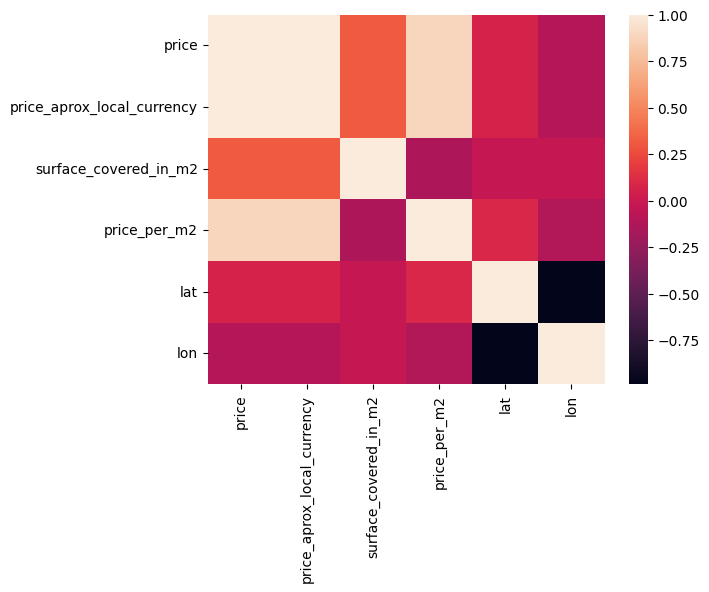
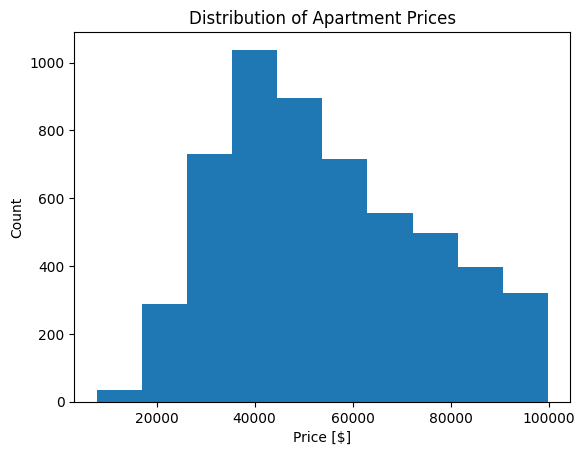
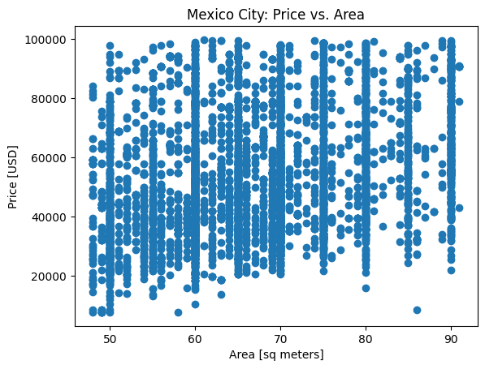
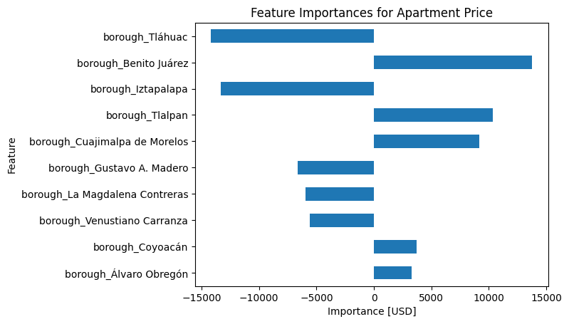

<font size="+3"><strong>2.5. Predicting Apartment Prices in Mexico City 🇲🇽</strong></font>


```python
import warnings

warnings.simplefilter(action="ignore", category=FutureWarning)
```

In this assignment, you'll decide which libraries you need to complete the tasks. You can import them in the cell below. 👇


```python
# Import libraries here
import pandas as pd
import matplotlib.pyplot as plt
import seaborn as sns
import plotly.express as px

from glob import glob

from sklearn.pipeline import make_pipeline
from category_encoders import OneHotEncoder
from sklearn.impute import SimpleImputer
from sklearn.metrics import mean_absolute_error
from sklearn.linear_model import LinearRegression, Ridge
from sklearn.utils.validation import check_is_fitted

```

# Prepare Data

## Import

**Task 2.5.1**

<div class="alert alert-block alert-info">
<b>Tip:</b> Don't try to satisfy all the criteria in the first version of your <code>wrangle</code> function. Instead, work iteratively. Start with the first criteria, test it out with one of the Mexico CSV files in the <code>data/</code> directory, and submit it to the grader for feedback. Then add the next criteria.</div>


```python
# Build your `wrangle` function
def wrangle(filepath):
    df = pd.read_csv(filepath)

    # Subset
    mask1 = df["property_type"] == "apartment"
    mask2 = df["price_aprox_usd"] < 100_000
    mask3 = df["place_with_parent_names"].str.contains('Distrito Federal')

    df = df[mask1 & mask2 & mask3]

    # Quantiles
    low, high = df["surface_covered_in_m2"].quantile([0.1, 0.9])
    mask4 = df["surface_covered_in_m2"].between(low, high)
    df = df[mask4]

    # Lat-lon
    df[["lat", "lon"]] = df["lat-lon"].str.split(',', expand=True).astype(float)
    df.drop(columns=["lat-lon"], inplace=True)

    # boroughs
    df["borough"] = df["place_with_parent_names"].str.split('|', expand=True)[1]
    df.drop(columns = 'place_with_parent_names', inplace=True)

    # null values
    df.drop(columns = ["surface_total_in_m2", "price_usd_per_m2", "floor", "rooms", "expenses"], inplace=True)

    # low / high cardinality
    df.drop(columns = ["operation", "property_type", "currency", "properati_url"], inplace=True)

    # leakage
    df.drop(columns = ['price_aprox_local_currency', 'price', 'price_per_m2'], inplace=True)

    
    return df
    
```


```python
# Use this cell to test your wrangle function on the file `mexico-city-real-estate-1.csv`
frame1 = wrangle("data/mexico-city-real-estate-1.csv")
```


```python
df = frame1
df.head()
```


<div>
<style scoped>
    .dataframe tbody tr th:only-of-type {
        vertical-align: middle;
    }

    .dataframe tbody tr th {
        vertical-align: top;
    }

    .dataframe thead th {
        text-align: right;
    }
</style>
<table border="1" class="dataframe">
  <thead>
    <tr style="text-align: right;">
      <th></th>
      <th>price_aprox_usd</th>
      <th>surface_covered_in_m2</th>
      <th>lat</th>
      <th>lon</th>
      <th>borough</th>
    </tr>
  </thead>
  <tbody>
    <tr>
      <th>11</th>
      <td>94022.66</td>
      <td>57.0</td>
      <td>23.634501</td>
      <td>-102.552788</td>
      <td>Benito Juárez</td>
    </tr>
    <tr>
      <th>20</th>
      <td>70880.12</td>
      <td>56.0</td>
      <td>19.402413</td>
      <td>-99.095391</td>
      <td>Iztacalco</td>
    </tr>
    <tr>
      <th>21</th>
      <td>68228.99</td>
      <td>80.0</td>
      <td>19.357820</td>
      <td>-99.149406</td>
      <td>Benito Juárez</td>
    </tr>
    <tr>
      <th>22</th>
      <td>24235.78</td>
      <td>60.0</td>
      <td>19.504985</td>
      <td>-99.208557</td>
      <td>Azcapotzalco</td>
    </tr>
    <tr>
      <th>26</th>
      <td>94140.20</td>
      <td>50.0</td>
      <td>19.354219</td>
      <td>-99.126244</td>
      <td>Coyoacán</td>
    </tr>
  </tbody>
</table>
</div>


```python
df.isnull().sum() / len(df)
```


    place_with_parent_names       0.000000
    price                         0.000000
    price_aprox_local_currency    0.000000
    price_aprox_usd               0.000000
    surface_covered_in_m2         0.000000
    price_per_m2                  0.000000
    lat                           0.054496
    lon                           0.054496
    borough                       0.000000
    dtype: float64


```python
df.select_dtypes("object").nunique()
```


    place_with_parent_names    14
    borough                    14
    dtype: int64


```python
corr = df.select_dtypes("number").drop(columns='price_aprox_usd').corr()
sns.heatmap(corr)
```


    <Axes: >


    

    


```python
df.head()
```


<div>
<style scoped>
    .dataframe tbody tr th:only-of-type {
        vertical-align: middle;
    }

    .dataframe tbody tr th {
        vertical-align: top;
    }

    .dataframe thead th {
        text-align: right;
    }
</style>
<table border="1" class="dataframe">
  <thead>
    <tr style="text-align: right;">
      <th></th>
      <th>price_aprox_usd</th>
      <th>surface_covered_in_m2</th>
      <th>lat</th>
      <th>lon</th>
      <th>borough</th>
    </tr>
  </thead>
  <tbody>
    <tr>
      <th>11</th>
      <td>94022.66</td>
      <td>57.0</td>
      <td>23.634501</td>
      <td>-102.552788</td>
      <td>Benito Juárez</td>
    </tr>
    <tr>
      <th>20</th>
      <td>70880.12</td>
      <td>56.0</td>
      <td>19.402413</td>
      <td>-99.095391</td>
      <td>Iztacalco</td>
    </tr>
    <tr>
      <th>21</th>
      <td>68228.99</td>
      <td>80.0</td>
      <td>19.357820</td>
      <td>-99.149406</td>
      <td>Benito Juárez</td>
    </tr>
    <tr>
      <th>22</th>
      <td>24235.78</td>
      <td>60.0</td>
      <td>19.504985</td>
      <td>-99.208557</td>
      <td>Azcapotzalco</td>
    </tr>
    <tr>
      <th>26</th>
      <td>94140.20</td>
      <td>50.0</td>
      <td>19.354219</td>
      <td>-99.126244</td>
      <td>Coyoacán</td>
    </tr>
  </tbody>
</table>
</div>


```python
low, high = df["surface_covered_in_m2"].quantile([0.1, 0.9])
low, high
```


    (51.0, 350.0)


```python

```

**Task 2.5.2** 


```python
files = glob("data/mexico-city-real-estate-*.csv")
files = sorted(files)
files
```


    ['data/mexico-city-real-estate-1.csv',
     'data/mexico-city-real-estate-2.csv',
     'data/mexico-city-real-estate-3.csv',
     'data/mexico-city-real-estate-4.csv',
     'data/mexico-city-real-estate-5.csv']


**Task 2.5.3**


```python
df = pd.concat([wrangle(file) for file in files], ignore_index=True)
print(df.info())
df.head()
```

    <class 'pandas.core.frame.DataFrame'>
    RangeIndex: 5473 entries, 0 to 5472
    Data columns (total 5 columns):
     #   Column                 Non-Null Count  Dtype  
    ---  ------                 --------------  -----  
     0   price_aprox_usd        5473 non-null   float64
     1   surface_covered_in_m2  5473 non-null   float64
     2   lat                    5149 non-null   float64
     3   lon                    5149 non-null   float64
     4   borough                5473 non-null   object 
    dtypes: float64(4), object(1)
    memory usage: 213.9+ KB
    None


<div>
<style scoped>
    .dataframe tbody tr th:only-of-type {
        vertical-align: middle;
    }

    .dataframe tbody tr th {
        vertical-align: top;
    }

    .dataframe thead th {
        text-align: right;
    }
</style>
<table border="1" class="dataframe">
  <thead>
    <tr style="text-align: right;">
      <th></th>
      <th>price_aprox_usd</th>
      <th>surface_covered_in_m2</th>
      <th>lat</th>
      <th>lon</th>
      <th>borough</th>
    </tr>
  </thead>
  <tbody>
    <tr>
      <th>0</th>
      <td>94022.66</td>
      <td>57.0</td>
      <td>23.634501</td>
      <td>-102.552788</td>
      <td>Benito Juárez</td>
    </tr>
    <tr>
      <th>1</th>
      <td>70880.12</td>
      <td>56.0</td>
      <td>19.402413</td>
      <td>-99.095391</td>
      <td>Iztacalco</td>
    </tr>
    <tr>
      <th>2</th>
      <td>68228.99</td>
      <td>80.0</td>
      <td>19.357820</td>
      <td>-99.149406</td>
      <td>Benito Juárez</td>
    </tr>
    <tr>
      <th>3</th>
      <td>24235.78</td>
      <td>60.0</td>
      <td>19.504985</td>
      <td>-99.208557</td>
      <td>Azcapotzalco</td>
    </tr>
    <tr>
      <th>4</th>
      <td>94140.20</td>
      <td>50.0</td>
      <td>19.354219</td>
      <td>-99.126244</td>
      <td>Coyoacán</td>
    </tr>
  </tbody>
</table>
</div>


## Explore

<div class="alert alert-info" role="alert">
  <strong>Slight Code Change</strong>

In the following task, you'll notice a small change in how plots are created compared to what you saw in the lessons.
While the lessons use the global matplotlib method like <code>plt.plot(...)</code>, in this task, you are expected to use the object-oriented (OOP) API instead.
This means creating your plots using <code>fig, ax = plt.subplots()</code> and then calling plotting methods on the <code>ax</code> object, such as <code>ax.plot(...)</code>, <code>ax.hist(...)</code>, or <code>ax.scatter(...)</code>.

If you're using pandas’ or seaborn’s built-in plotting methods (like <code>df.plot()</code> or <code>sns.lineplot()</code>), make sure to pass the <code>ax=ax</code> argument so that the plot is rendered on the correct axes.

This approach is considered best practice and will be used consistently across all graded tasks that involve matplotlib.
</div>


**Task 2.5.4**


```python
fig, ax = plt.subplots() 

# Plot the histogram on the axes object
ax.hist(df["price_aprox_usd"]) 

# Label axes using the axes 
ax.set_xlabel("Price [$]")
ax.set_ylabel("Count")


# Add title 
ax.set_title("Distribution of Apartment Prices");
```


    

    


**Task 2.5.5**


```python
fig, ax = plt.subplots() 

# Create the scatter plot on the axes object
ax.scatter(df['surface_covered_in_m2'], df['price_aprox_usd']) 

# Label axes 
ax.set_xlabel("Area [sq meters]")
ax.set_ylabel("Price [USD]")

#  Add title 
ax.set_title("Mexico City: Price vs. Area");
```


    

    


Do you see a relationship between price and area in the data? How is this similar to or different from the Buenos Aires dataset?<span style='color: transparent; font-size:1%'>WQU WorldQuant University Applied Data Science Lab QQQQ</span>


```python
df['price_aprox_usd'].corr(df['surface_covered_in_m2'])
```


    0.27631633036352404


**Task 2.5.6** **(UNGRADED)** Create a Mapbox scatter plot that shows the location of the apartments in your dataset and represent their price using color. 

What areas of the city seem to have higher real estate prices?


```python
# Plot Mapbox location and price

fig = px.scatter_mapbox(
    df,
    lat='lat',
    lon='lon',
    width=600,
    height=600,
    color='price_aprox_usd',
    mapbox_style='open-street-map'
)


fig.show()
```


<div>                            <div id="48ba60b8-4b4d-45ec-b462-bcfa01a1815e" class="plotly-graph-div" style="height:600px; width:600px;"></div>            <script type="text/javascript">                require(["plotly"], function(Plotly) {                    window.PLOTLYENV=window.PLOTLYENV || {};                                    if (document.getElementById("48ba60b8-4b4d-45ec-b462-bcfa01a1815e")) {                    Plotly.newPlot(                        "48ba60b8-4b4d-45ec-b462-bcfa01a1815e",                        [{"hovertemplate":"lat=%{lat}\u003cbr\u003elon=%{lon}\u003cbr\u003eprice_aprox_usd=%{marker.color}\u003cextra\u003e\u003c\u002fextra\u003e","lat":[23.634501,19.4024128,19.35782,19.504985,19.354219,19.400785,19.366632,19.400731,19.337163,19.435666,19.2990233,19.453854,19.458968,19.332034,19.305214,19.370272,19.386715,19.458968,19.445471,19.443903,19.317741,19.365843,19.365843,19.399841,19.465454,19.334546,19.376392,19.416439,19.401456,19.4045899,19.4553585442,19.440749,19.484532,19.452143,19.386551,19.466822,19.462425,null,19.474885,19.36994,19.379525,19.400731,19.480501,23.634501,null,19.402752,19.465454,19.414261,null,19.405883,19.471896,19.309208,19.304501,19.36269,19.400097,19.484532,19.278198,19.383251,19.461871,19.422398,null,19.453513,19.439037,null,19.384327,19.317698,19.503195,19.524143,19.325608,19.332149,19.410307,19.379109,19.452419,19.287188,19.475187,19.273716,19.396862,19.422243,19.469418,19.262049,19.402944,19.379525,19.346767,19.384808,23.634501,19.283388,19.456145,19.410307,19.334546,19.370272,19.307417,19.384808,19.473415,19.44673,19.302076,19.472155,19.456439,19.368823,19.395097,19.320269,19.468092,null,19.2818221685,19.418844,null,19.397649,19.408805,23.634501,19.313878,19.392025,19.384808,19.361114,19.490331,19.3821,19.461416,19.363469,19.440749,19.45178,19.478815,19.409843,19.273713,19.348122,19.404442,19.384506,19.505199,19.3883217,19.472155,19.391754,null,19.383446,19.324386,19.452689,19.3915,19.436264,19.422676,null,19.457685,19.511198,19.404918,19.396893,19.443178,19.4555330491,19.448187,19.461306,19.419427,19.194247,19.474223,19.489901,19.39177,19.385994,19.404661,19.30241,19.455894,19.383948,19.422817,19.2990233,19.446253,19.383599,19.383251,19.427118,19.398983,19.384371,19.39557,19.383446,19.382649,19.406759,19.49662,19.39617,19.370046,19.359901,19.427754,19.396705,19.298168,19.369509,19.456595,19.4179232,19.307754,19.410307,19.461871,19.527836,19.359897,19.445816,19.444865,19.377369,19.352333,19.456595,19.4113101,19.392349,19.504602,19.384327,19.439037,19.357981,19.445816,19.387651,19.464437,19.334546,19.347664,19.301945,19.29312,19.36269,19.324947,19.391834,19.360367,19.298168,19.469681,19.392025,19.301945,19.415143,19.524143,19.393257,19.336195,19.410419,19.479793,19.400785,19.497521,19.45789,19.363469,19.260421,19.39942,19.400097,19.393751,19.365843,19.36678,19.323772,19.415461,19.395058,19.312223,19.27838,19.428767,19.403309,19.350145,19.402944,19.453201,19.417636,19.410215,19.392814,19.409843,19.362679,19.48888,19.334738,19.369859,19.410412,19.468775,19.470215,19.3223015,19.39106,19.41275,19.38751,19.361385,19.38828,19.3865508,19.452365,19.392185,19.323772,19.441047,null,19.399461,19.4900536,19.417363,19.386852,19.326922,19.439253,null,null,19.384467,19.309208,19.383446,19.392349,19.411112,19.369509,19.364891,19.445553,23.634501,19.3778105,19.417923,19.38828,19.370046,19.29707,19.441879,19.452255,19.458831,19.298347,19.401456,19.386852,19.473415,19.3437444,19.371132,19.452689,19.359901,19.365843,19.368568,19.457129,19.441809,19.449997,19.287188,19.383446,19.460913,19.3579916,19.40263,19.404442,19.46731,19.383547,null,19.377369,19.4959960885,null,19.342508,19.366738,19.385853,19.436738,19.318662,19.371745,19.352333,19.460913,19.386033,19.46731,19.4306069,19.366738,19.343558,19.472155,19.35782,null,19.372248,19.3604024,19.37197,19.394628,19.311038,19.346609,19.377171,19.317698,19.473693,19.422817,19.361993,19.538431,19.406489,null,19.476817,19.377523,19.452689,19.457911,19.455518,19.461871,19.39942,19.524143,19.519199,19.443903,19.392349,19.445743,19.446873,19.392425,19.2963742,19.390062,19.386385,19.404661,19.410307,19.457982,19.391579,19.452473,null,19.387209,19.448187,19.396705,19.379802,19.501818,null,19.3653,19.386852,19.386852,null,19.383078,19.386852,19.36269,19.385027,19.334265,19.401819,19.458968,19.486021,null,19.41275,19.417923,19.422817,19.2878066,19.35782,19.365917,19.405298,19.3200381,19.306092,19.311038,19.4558491807,19.377811,19.3865940087,19.328243,19.328392,19.342083,19.439253,null,19.516777,19.42196,19.372724,19.457982,19.4503249,19.523798,19.335364,19.500817,19.2990233,19.336994,19.36243,19.329989,19.461349,19.387868,19.443592,null,19.366996,null,null,19.370822,19.443178,19.3703924,19.475187,19.402944,19.391819,19.39942,19.399375,19.455243,19.400623,19.28008,19.3847719,19.493185,19.439946,19.379765,19.49551,19.35944,19.382649,19.487856,19.289772,19.452689,19.392349,19.348122,19.473415,19.392349,19.455894,19.414009,19.474655,19.342083,19.525082,19.4302678,19.446852,19.396593,19.40012,19.328669,19.336195,19.346609,19.336195,19.52589,19.376392,19.442791,19.38499,19.439253,19.377033,null,19.453691,19.392349,19.380953,19.444584,19.456941,19.307417,19.313175,19.440147,19.517644,19.347664,19.401819,null,19.481886,19.400785,19.38828,19.365533,19.47963,19.375412,19.486385,19.455159,19.441809,19.443903,19.333901,19.453036,19.49662,19.462598,19.410412,19.365533,19.35944,19.342083,19.3012,null,19.374704,19.427072,19.4594892,19.387868,19.395835,19.459691,23.634501,19.41084,19.428622,19.281423,19.363542,19.43895,19.440943,19.342083,19.456941,19.415143,19.4126915168,19.36461,19.439253,19.448187,19.421989,19.439253,19.334868,19.401312,19.381729,19.444584,19.48888,19.394628,19.376456,19.4285813,19.38855,19.394628,19.336195,19.41263,19.2990233,19.396538,19.377651,19.283605,19.395097,19.36461,19.490177,19.384955,19.473415,19.388662,19.524143,19.429183,19.451685,19.416376,19.396705,19.328705,19.490054,19.486053,19.368823,19.453854,19.457982,19.357504,19.27362,19.395097,null,19.392349,19.365584,19.451919,19.42116,19.304502,19.365843,19.456993,19.369859,19.383799,19.36269,19.450342,19.363254,null,19.461662,19.469681,null,19.449216,null,19.444538,null,19.366448,19.472155,19.460913,19.443178,19.468775,19.365843,19.455944,19.396705,19.49551,19.40012,19.408179,19.363542,19.374721,19.403109,19.285943,19.36269,19.486808,19.365843,null,19.302076,19.300642,19.477476,19.520214,19.524143,19.41066,19.303392,19.392349,19.299713,19.384808,19.308685,null,19.476817,19.461306,19.436404,19.487729,19.394361,19.392382,19.37335,19.4306069,19.361837,19.326215,19.472155,19.368823,19.395097,19.508114,19.472481,19.308076,19.365865,null,19.310943,19.317534,19.335103,19.439131,19.438456,19.488871,19.386852,19.343979,19.440749,19.387651,19.407816,19.452331,19.307737,19.292877,19.3217152,19.441879,19.328366,19.317698,19.363343,null,19.470991,19.446256,19.39516,19.472155,19.445743,19.317698,19.562385,19.473486,19.363469,19.452419,19.375223,19.470215,19.392185,19.38642,19.396893,19.474446,null,19.477389,19.362363,19.2990233,19.386551,19.309208,19.46731,19.453854,19.283701,19.365427,19.388044,19.366738,19.287188,19.437147,19.445816,19.408155,19.410307,19.51918,19.365624,19.451809,19.345152,19.305666,19.428152,19.445553,19.511437,19.404288,19.527514,19.454332,19.199665,19.305233,19.299713,19.454332,19.29707,19.469689,19.417363,19.3707909,19.456993,19.264647,null,19.359407,19.397531,19.325608,19.388044,19.35782,19.336195,19.496491,19.431252,19.306256,19.371132,19.458968,19.317741,19.382145,19.453854,19.422397,null,19.387651,null,19.447374,19.417363,19.374628,19.291685,19.416195,19.443178,19.399226,19.441043,19.501572,19.39942,19.4546836,19.410055,19.389044,19.38828,19.411112,19.4661858,19.523731,19.395427,19.468153,19.384037,19.363542,19.473415,23.634501,19.392349,19.441809,19.482603,19.396247,19.444606,19.348586,19.269985,19.452365,19.2990233,19.396593,19.472155,19.446829,19.415143,19.383446,19.418844,19.396247,19.363469,19.35568,19.376456,19.348909,19.380236,null,19.446207,19.446198,19.516777,19.441392,19.410307,null,19.402991,19.377369,19.417923,19.455944,19.306092,19.2990233,19.486215,19.377033,19.417923,19.512787,19.402944,19.441879,19.395077,19.523341,19.3513303772,19.524143,19.375618,19.472155,19.357981,19.416408,19.472155,null,19.391054,19.3915,19.410215,19.467806,19.487416,19.375618,null,19.446524,19.41526,19.469689,19.41275,19.472155,19.354219,19.455525,19.446313,19.305449,19.453142,19.378533,19.410419,19.411112,19.389067,19.443178,null,19.410307,19.456454,19.317887,19.323772,19.448311,19.352333,19.309208,19.298168,19.2990233,19.366505,null,19.486329,19.4301421,19.498246,19.333981,19.386836,null,19.291903,19.48314,19.364891,19.472155,19.321644,19.363542,19.439858,19.504985,19.317534,19.450827,19.36867,19.490054,19.399226,19.402944,19.381259203,19.446256,19.396727,19.348122,null,19.4526892,19.424719,19.401819,19.388044,19.2833321409,19.472155,19.382956,19.333981,19.383966,19.378786,null,19.348122,19.452301,19.368697,19.446313,19.441234,19.392185,19.384467,19.3246591,19.448187,19.444569,19.457982,19.446829,19.412097,19.439759,19.412142,23.634501,19.35782,19.392349,19.439253,19.527836,19.306255,19.264442,19.400785,19.392025,19.453697,19.314895,23.634501,19.414261,19.3029619922,null,23.634501,23.634501,19.458118,19.407816,19.369418,19.394965,19.469689,19.36269,19.362027,19.428152,19.263022,19.472155,19.345893,19.410307,19.372724,19.415783,19.39932,19.444688,19.402386,19.462598,19.4445021981,19.464589,19.404377,19.377383,19.359901,19.334546,19.452621,19.375983,19.366866,19.440549,19.410307,19.388044,19.416151,19.378321,19.357981,19.318575,19.517598,19.35782,19.441816,19.380236,19.353813,null,19.35782,19.45984,19.450827,19.302219,19.400763,19.441043,19.403302,19.3939,19.396705,19.412061,19.2833726485,19.441809,19.409701,19.401819,19.489521,19.2672863,19.278036,19.29292,19.36269,19.329521,19.355462,19.423086,19.326922,19.48492,19.397983,19.324239,19.318989,19.334546,19.465454,19.363174,null,19.375374,19.482603,19.373503,19.357715,19.452621,19.343979,19.37335,19.365611,19.359625,19.342083,null,19.451576,19.473415,19.376456,19.449392,null,19.486016,19.4752953603,19.2990233,19.285118,19.498877,19.376456,19.324386,19.450551,19.399461,19.452728,19.299511,null,19.377383,19.400785,19.420551,19.516777,null,19.318989,19.408805,19.49662,19.396727,19.394638,19.395427,19.308287,19.38828,19.449292,23.634501,19.4597505,19.453564,19.281164,19.457352,19.413992,19.335108,19.41497,19.336455,19.41627,19.318989,19.445219,19.369509,19.415175,19.374721,19.412142,19.456993,19.366914,19.377369,19.359645,19.370272,19.506042,19.480501,19.470991,19.496491,19.281164,23.634501,19.335073,19.444584,19.39169,19.33427,19.450551,19.466822,19.370272,19.452419,null,19.450827,19.476577,19.452255,19.382649,19.474655,19.34518,19.415143,19.472155,null,19.398514,19.43672,19.448226,19.283831,19.40012,19.311038,19.452297,19.451597,19.335419,19.411434,19.280481,19.38828,19.392349,null,19.39942,19.367348,19.380443,null,19.377404,19.262049,19.412142,19.493185,19.398514,19.370822,19.408805,19.323772,19.410412,19.367721,19.38634,19.3905245,19.298168,19.474706,19.40012,19.392025,19.360367,19.41031,19.472155,19.359901,19.366632,19.31999,19.451809,19.429916,19.374721,19.472155,19.490709,19.411112,19.441374,19.446144,19.452503,19.382649,19.375733,19.325608,19.441043,19.442796,19.484988,19.516777,19.466724,19.383327,19.38828,19.454582,19.307417,19.377169,19.427443,19.402197,19.408758,19.391819,19.284672,19.48888,null,null,19.474706,19.44212,19.395097,19.366505,19.356537,19.445816,19.281164,19.411434,19.291001,19.428152,19.313806,19.410307,23.634501,19.394628,19.359901,19.357981,19.496491,19.474885,19.36269,null,19.359901,19.410307,19.402799,19.39365,null,19.410553,19.285943,19.392349,19.363542,19.439636,19.382768,19.402799,19.454332,19.439253,19.414009,19.444337,19.313878,null,19.359897,null,19.377625,19.455566,19.418198,19.460316,19.399867,19.502823,19.4920787,19.382649,19.511198,19.310879,19.384371,19.401934,19.449556,19.377724,null,19.463891,19.476817,19.487416,19.4110686915,19.329995,19.379082,19.398983,19.475745,19.462355,19.372724,19.404442,19.454332,19.472155,19.484504,19.461256,19.381691,19.450551,19.367943,19.317337,19.2802991012,19.403707,null,19.348586,19.381174,19.482659,19.436436,19.374721,19.282552,19.449392,19.3653,19.442774,19.35944,19.446829,19.52686,19.458383,19.404604,19.410307,19.296529,19.861804,19.397983,19.371321,19.4426,19.382649,19.446253,null,19.2790911,19.413992,19.48888,19.366408,19.4753714,19.360846,19.39527,19.374009,19.405526,19.298083,19.420907,19.396893,19.4258822217,19.451872,19.365865,19.404661,19.391819,19.290953,19.348122,19.296478,19.317345,19.402339,19.470215,null,19.336195,19.474655,19.414261,19.40176,19.49041,19.44168,19.369509,19.441809,19.365843,19.399461,19.428622,19.443357,19.454231,19.412913,19.3850289,19.524143,19.523000777,19.392185,19.484503,19.410307,19.400097,19.465166,19.396705,19.39912,19.413758,19.522966,19.296354,19.482325,null,19.440749,null,23.634501,19.457911,19.4306069,19.404061,19.443178,23.634501,19.444449,19.398514,19.479793,19.478625,19.472155,19.455859297,19.346767,19.458765,19.2790911,null,19.452689,19.475639,19.441816,19.264168,19.399978,19.415035,19.301865,19.313878,19.3230172472,19.302512,19.377169,19.481949,19.395097,19.3275633,19.366505,19.36461,19.375983,19.443178,19.302512,19.384262,19.366632,19.453201,19.29292,19.452301,null,19.395097,19.400687,19.472481,19.322108,19.284672,null,23.634501,19.478815,19.477827,19.39556,19.418058,19.428152,19.348122,19.478815,23.634501,19.410307,19.411112,19.44673,null,19.474885,19.454332,19.438604,19.356318,19.272016,19.443592,19.346609,19.2814228,19.327745,19.454082,19.369509,19.385027,19.387651,19.39942,19.474655,null,19.457352,null,19.439759,19.31691,19.384399,19.400731,19.2990233,19.38797,19.393568,19.306198,19.482761,19.305987,19.299518,19.466822,19.415783,19.525082,19.304032,19.370046,19.456993,null,19.365843,19.48888,19.315626,null,19.291269,19.43965,19.454082,19.437147,null,19.444538,19.440749,19.293561,19.44661,19.479793,null,19.318989,19.421296,19.449392,19.4279665308,19.335043,19.308287,19.3653,19.324075,19.491447,19.449997,19.309208,19.451872,19.381978,19.328643,19.454332,19.383446,19.370046,19.371843,19.48778,19.4753714,19.455909878,19.496491,19.403155,19.399226,19.413393,19.410079,19.443903,19.527845,19.452503,19.450423,19.414009,19.460012,19.444584,19.410307,19.29707,19.422225,19.333996,19.464589,19.288229,19.446053,19.52381,19.453457,19.453691,19.453909,19.456993,19.441816,19.465454,19.369859,19.428152,19.365484,19.359901,19.470359,19.452301,19.45178,19.35782,19.346609,19.336828,19.462355,19.46212,19.4823253,19.365865,19.391903,19.472155,19.472155,19.4736729503,null,19.456002,19.348823,19.475745,19.453665,19.3246591,19.359901,19.306092,null,19.473415,19.4473207,19.450551,19.443178,19.2903346,19.440749,19.504985,19.291594,19.317698,19.435768,19.477827,19.351371,19.38828,19.452245,19.284672,19.3679029336,19.421822,19.415143,19.402944,19.2790911,19.448311,19.329188,19.501052,19.446313,19.394073,19.373446,19.400379,19.375311,19.4566382427,19.396705,null,23.634501,19.366738,19.355921,19.329479,19.428152,19.3653,19.496491,19.457182,19.443178,19.302588,19.480501,19.39868,19.2837372171,19.35066,23.634501,19.351277,19.383446,19.375278,19.52589,19.2660749,19.505199,19.368364,19.485465,19.357981,23.634501,19.410904,19.370272,19.361468,19.400731,19.457911,19.3905096814,19.284672,19.422817,null,19.448847,null,null,19.406622,19.436561,19.2812307923,19.46646,null,19.332034,19.291964,null,19.41973,19.392349,19.384327,19.38828,19.410307,19.428152,19.404515,19.378533,19.443178,19.506875,19.391834,19.456439,19.282522,19.41973,19.438641,19.342342,19.376392,19.345893,19.444723,19.509401,19.361385,19.376456,19.387651,19.332495,null,19.504985,19.436516,19.397356,19.468775,19.2990233,19.370272,19.473486,19.392349,19.392025,19.357981,19.415783,19.304501,null,19.398732,19.317698,19.410215,19.465349,19.364257,19.39617,19.39617,19.445742,19.442774,19.386852,19.445816,19.371132,19.441043,19.3674239,null,19.448187,19.388044,19.449216,19.446466,19.466822,19.334265,19.456993,19.493185,19.501421,19.409843,19.404661,19.362795,19.390271,19.355805,19.427249,19.376456,19.384327,19.472481,19.365484,19.405014,19.316985,19.368335,19.337943,19.383327,19.477389,19.35944,19.330173,19.527836,19.445829,19.445743,19.407816,19.359897,19.364993,19.389717,19.401507,19.44365,19.392025,19.395835,19.329109,19.3268,19.456208,19.461871,19.304038,19.33795,19.383958,19.452253,19.359625,19.370046,19.408179,19.39867,19.367943,19.409843,19.472155,19.387651,19.328299,19.477476,19.401371,null,19.396705,19.359748,19.445845,19.514181,null,19.39942,null,19.386385,19.408234,19.396893,19.369859,19.287188,19.413536,19.474421,19.283038,19.496491,19.414009,19.2990233,19.394965,19.441439,19.3471146,null,19.472155,19.332034,19.377171,19.35944,19.309208,19.436607,null,19.445742,19.457982,19.433883,19.399121,19.444924,19.407816,19.396705,19.474885,19.450242,19.474427,19.386852,19.387764,19.363469,19.365917,19.428152,19.474885,19.452365,19.398671,19.367307,19.461349,19.359645,null,19.314216,19.404403,19.344499,19.375451,19.364891,19.2859196,19.39557,19.356419,19.492195,19.441879,19.339707,19.480501,19.392983,19.454332,19.336994,19.428554,19.361114,19.2834536638,19.487416,19.369509,19.420584,19.350684,19.374628,19.374721,19.314143,19.343424,19.496639,19.303392,19.352333,19.2833321409,19.39557,null,19.480371,19.405208,19.3653,19.374721,19.318989,19.369859,19.306198,19.386852,19.3948036,19.473415,19.445743,19.484532,null,19.3368492055,19.372724,19.403794,23.634501,19.528208,19.409843,19.466238,19.431421,19.405911,19.335224,19.304502,19.482603,19.405298,19.446704,19.281164,19.402944,19.281785669,19.328362,19.383569,19.37523,19.443753,19.4558087159,19.456941,19.474706,19.419485,19.407301,19.483301,19.372724,19.405883,19.402944,19.399108,19.410511,19.459211,19.416847,19.3339242,19.478815,19.410553,19.479793,19.452245,19.377383,19.35944,19.487416,19.359407,19.39912,19.313878,19.426974,19.446915,19.446852,19.479793,19.461256,19.383446,19.461662,19.396893,19.455641,19.401057,19.480501,19.444584,19.366362,19.403155,19.3672829798,19.377875,19.384371,19.403836,19.423673,19.3324895,19.336994,19.395523,19.483167,19.352333,19.4795898,19.396247,19.401819,19.381324,19.320269,19.39527,19.284672,19.455518,19.4005128,19.486053,19.49662,19.366632,19.377169,19.365478,19.466822,null,19.436561,19.390062,null,19.363542,19.396247,19.41973,19.480501,19.440749,19.4582517611,19.449216,19.459992,null,19.309713,19.307033,19.376456,19.337688,19.44365,19.444233,19.375299,19.395358,19.384371,19.385603,19.400165,19.353066,19.383948,19.492195,19.417636,19.375105,19.441043,19.367348,19.2738496,19.404403,19.2990233,19.454332,19.350145,19.377404,19.3928098,19.370010759,19.428767,19.2990233,19.402151,19.317534,null,19.446829,null,19.428767,19.474655,19.427754,19.489477,19.487517,19.396727,19.386852,19.348085,19.35782,19.449392,19.362463,19.480501,19.443903,19.325848,19.447127,null,19.406854,19.403155,19.396727,null,19.4557176701,19.416979,null,19.387651,null,19.527836,19.3706856,19.412142,19.453564,19.4468231,19.365175,19.457911,19.394628,23.634501,19.308513,19.396502,19.51119,19.458968,19.46033,19.416439,19.452419,null,19.470991,19.303392,19.367607,19.328411,19.453996,23.634501,19.400165,19.440749,19.317698,19.4518716,19.30618,19.317698,19.449997,19.370272,19.392349,19.386033,19.336195,19.428152,19.343558,19.400446,19.386852,19.399516,19.384365,19.33427,19.400785,19.403331,19.455771,19.455666,19.347893,19.399226,19.445742,19.456993,19.366632,19.446313,19.365865,19.376456,19.456439,null,19.485552,19.307417,19.452143,19.475745,19.466954,19.417923,null,19.313878,19.395097,19.392349,19.440749,19.456211,19.444584,19.325989,19.410079,19.509401,19.460012,19.30665,19.456208,19.364891,19.359645,19.402151,19.455291,19.417364,19.3217152,19.346609,19.445553,19.379804,19.370046,19.3834462,19.506042,19.273713,19.397933,19.380951,null,19.430326,19.366302,null,19.260945,19.305561,null,19.524702,19.374579,19.38828,19.417923,19.450302,19.369214,19.403707,19.519327,19.348823,19.401279,19.441695,19.3138777,null,19.402712,19.451809,null,19.322108,19.496204,19.369509,19.298168,19.4300346249,19.422879,19.396213,19.366632,19.309047,19.410307,null,23.634501,19.466822,19.269059,19.376392,19.370272,19.409843,null,19.369509,19.332435,19.304032,null,19.342083,19.474655,19.428852,19.410079,19.431252,19.525082,19.334736,19.3608931,19.504985,19.440749,19.393568,19.396727,19.437147,19.486385,19.2990233,19.384117,19.455098,19.372724,19.453564,19.461256,19.414713,19.376536,19.384467,19.348122,19.492195,19.510884,19.428152,19.350684,19.466822,19.460586,19.375394,19.51119,19.462355,19.342083,19.4426,19.365175,19.273468,19.318989,19.326368,19.454332,19.397983,19.2981689,19.372724,19.377369,19.235328,19.390062,19.445553,19.469418,19.30618,19.450028,null,19.452689,19.478815,19.412142,19.365917,19.440749,null,19.318989,19.2812510467,19.474655,19.364388,19.366738,19.333312,19.375983,19.363524,19.425659624,19.366708,19.491802,19.407816,19.452301,19.3757,19.365917,19.398044,19.399461,19.465454,19.365382,19.374721,19.504985,19.335027,19.454082,19.416119,19.391819,19.386852,19.3324251,19.397933,19.502529,19.439037,19.474885,19.374703,19.2593219936,19.472155,19.4179244,19.332435,19.524143,19.391819,null,19.417363,19.2790911,19.35782,19.366302,19.382649,19.332495,null,19.378897,19.359901,19.441879,null,19.377369,null,19.44029,19.454722,19.453175,19.39942,19.368544,19.308287,19.370822,19.309524,19.440749,19.396705,19.456993,19.374721,19.369859,19.446256,19.478539,19.311959,19.307417,19.444584,19.428152,19.378233,19.444192,19.446256,19.443178,19.374704,19.316319,19.456439,19.470041,19.329869,19.304032,19.458551,19.445816,19.365002,19.367943,19.422397,19.453036,19.4304191011,19.2464696,19.396705,19.527514,19.348122,19.371543,19.373161,19.559639,19.474884,19.392349,19.396893,19.3961879,19.405867,19.470359,19.365002,19.359897,null,null,23.634501,19.4525158577,19.441439,19.387613,19.2990233,19.361993,19.458118,23.634501,19.472155,19.295734,23.634501,19.40135,19.2834131562,19.484703,19.403504,19.364993,19.452419,19.409843,19.428767,19.388044,19.419403,19.386551,19.396705,19.487275,19.44673,19.452621,19.371567,19.332427,19.361385,19.398044,19.400785,19.310943,19.411112,19.397983,19.474203,19.370043,19.45178,19.454947,null,19.470111,19.337874,19.493185,19.458405,19.369509,19.477396,19.472155,19.370046,19.298168,19.404661,19.373446,19.403836,19.337163,19.38642,19.307417,19.379525,19.365843,19.405883,19.392349,19.517343,19.448187,19.2833321409,19.4461929779,19.417923,19.366738,19.452419,19.445816,19.395629,19.439253,19.478815,19.3615,null,19.397531,19.3651763,19.396727,19.524143,19.270885,19.445735,19.307417,19.4164389,19.457685,19.368942,19.265581,19.365917,null,19.384327,19.482603,19.492195,19.307773,19.453691,19.281686,19.449997,19.2990233,19.385027,19.392349,19.444584,null,19.362547,19.407301,19.445816,19.455666,19.410412,23.634501,19.451872,19.420903,19.313878,19.307417,19.287188,19.399121,19.317234,19.369859,19.386852,null,19.441879,19.41275,19.346609,19.306256,19.2990233,19.389552,19.428767,19.3335463,19.435424,19.342083,19.386033,19.457058,19.492195,19.3284362748,19.458723,19.33795,19.397258,19.454722,19.392185,19.473415,19.418666,19.41084,19.449292,19.369214,19.446915,19.39557,19.2464696,19.444688,19.378533,19.386033,19.318662,19.370272,19.469689,null,19.410966,19.443592,19.386033,19.372724,19.446852,19.413992,19.453533,19.38828,19.375412,19.305666,19.29707,19.302192,19.348122,19.440749,19.443178,19.307754,19.517644,19.380375,19.45178,19.456993,19.393042,19.366505,19.523798,19.861804,19.317534,19.394628,19.284047,19.428152,19.337163,null,19.392349,19.305233,19.361993,19.370046,19.446253,19.401456,19.374704,19.535893,null,19.375412,19.451496,19.371132,19.3036201615,19.469631,19.451919,19.357803,19.2990233,19.456145,19.384685,19.384467,19.339707,19.393846,19.3203783,19.384327,19.35782,19.455666,19.311038,19.281761,19.362864,19.2790911,19.301382,19.396294,19.402478,19.390201,19.283388,19.429622,19.48641,19.517509,19.386663,19.2990233,19.309824,19.392303,19.363529,19.428152,19.403028,19.371132,19.363618,19.452365,19.452245,19.355986,19.329109,19.461416,19.24647,19.37523,19.474706,19.2811497758,19.450256,19.364891,19.428767,19.326922,19.4561747,19.2790911,19.382649,19.290554,19.414009,19.288873,19.410079,19.309208,19.370272,19.386821,19.301989,19.3653,19.410307,19.454082,19.448126,19.404442,19.383044,19.359901,19.470215,19.446185,19.487275,19.484356,null,19.4540833,19.366738,19.453854,19.402944,19.486016,19.4417291,19.455159,19.378466,19.396727,19.377369,19.392349,19.382649,19.465349,19.496491,19.453854,19.452245,19.410307,19.428152,19.405887,19.305233,19.470359,19.369509,19.384467,19.386852,19.365567,19.381125,19.3513303772,19.332495,19.37314,19.465454,19.48964,19.395077,null,19.303385,19.325608,19.370501,19.403707,null,19.408805,19.452621,19.454332,19.363469,19.477476,19.311038,19.399226,19.44365,19.474884,19.410553,19.326108,null,null,19.474655,19.496076,19.287455,19.359397,19.428767,19.401507,19.484504,19.457982,19.377369,19.459793,19.407816,19.452665,19.369555,null,19.417636,19.443285,19.302588,19.406458,19.360367,19.3742208,19.456208,19.298168,19.309208,19.38828,19.410307,19.455259,19.461256,19.307417,19.403028,19.511198,19.328386,19.414009,19.336195,19.317698,19.281164,19.396265,null,19.418048,19.399108,19.2790911,19.456208,19.373469,19.349781,19.366738,19.474631,19.530514,19.374721,19.368335,null,19.2990233,19.495085,19.376456,19.507825,19.538431,19.369814,19.448226,19.527836,19.31691,19.363469,19.391336,19.432399,19.318336,19.861804,19.368823,19.368823,19.415143,19.454332,19.368335,null,19.475187,19.348211,19.458844,19.320839,19.453854,null,19.403193,19.284947,19.492195,19.452728,19.305233,19.305561,19.395835,19.473002,19.374721,19.49141,19.403193,19.352219,19.446823,null,19.398794,19.38828,19.360243,19.343679,19.426948,19.456439,19.317158,19.417923,19.438863,19.2834536638,19.302083,19.301865,19.457982,null,19.446053,null,19.308287,19.408758,19.45178,19.461256,19.302588,19.509401,19.395629,19.39942,null,19.439648,19.442254,19.4418,19.354509,19.465454,19.4186657,19.44365,19.359901,19.430525,19.3016532399,19.371132,null,19.4105829791,19.470991,19.2609627863,19.410307,19.367307,19.346281,23.634501,19.401209,19.449634,19.451682,19.298168,null,19.383251,19.317698,19.385867,19.465454,19.443357,19.474655,19.321156,19.281423,19.452689,19.399671,19.2990233,19.436561,19.445744,19.473632,19.455641,null,19.39617,19.455894,19.440749,19.291594,19.3324283,19.404442,19.3731619,19.401819,19.416834,19.416306029,19.317534,19.451919,19.376478,19.379571,19.339013,19.281423,19.293424,19.454332,19.48888,19.442152,19.359901,19.373493,19.485524,19.392025,19.416195,19.287188,19.36269,19.452015,19.44821,19.426948,19.298168,19.453691,19.364245,19.42196,19.441879,19.339253,19.333946,19.444569,19.403155,null,19.501052,19.281996,19.348122,19.451496,19.377171,19.361468,19.281164,19.365917,19.394525,19.386852,19.472481,19.393846,19.44365,19.490331,19.298168,19.470215,19.410307,19.441234,19.457911,19.429437,19.37335,null,19.336195,19.365917,19.320091,19.472155,19.5226965,19.486255,19.378533,19.417186,19.42078,19.458968,19.363542,19.403561,19.299735,19.450242,19.496639,19.457982,19.402944,19.348122,19.460786,19.370822,19.464025,19.284672,19.363542,19.3653,19.291981,19.38828,19.387209,19.498399,19.44365,19.381386,19.382649,19.435303,19.410215,19.377369,19.383948,19.2811700298,19.400623,19.3366,19.39527,19.346609,null,19.504985,19.39365,19.365312,19.441809,19.411112,19.428622,19.474446,19.284672,19.485544,19.313878,19.484532,19.475237,19.4211791,19.308287,19.413523,19.448311,19.421988,19.396213,19.454459,19.35282,19.375412,19.365467,19.3757,23.634501,19.377369,19.362547,19.380951,19.3182548,19.39365,19.485001,19.4557379025,19.348122,19.378481,19.400785,19.398671,19.400731,19.51119,19.393385,19.410215,19.395835,19.396705,19.371249,null,19.445186,19.466385,19.466822,19.409748,null,19.384467,19.41947,19.449518,19.287428,19.410307,19.413992,19.317698,19.302569,19.313878,19.305561,19.441821,19.417363,19.404661,19.396502,19.335419,19.482603,19.329109,19.384371,19.466659,19.279682,19.412142,19.493185,19.501543,19.368281,19.446253,19.444888,19.365088,null,19.417923,19.506314,19.410215,19.375733,19.396747,19.412142,19.36269,19.3615,19.3626963,19.365865,19.454082,19.427754,19.474655,23.634501,19.376802,19.428622,19.456145,19.453691,19.396247,19.395097,19.305481,19.452503,19.309208,19.368823,19.454082,19.410501,19.402944,19.370272,19.390271,19.414261,19.414969,19.370272,19.309824,19.498877,null,19.33427,19.366632,19.312223,19.446915,19.472155,19.365917,19.445553,19.4192243949,19.524143,19.497521,19.397983,19.2947596,19.370272,19.493185,19.391819,19.445743,19.463957,19.427754,19.306198,null,19.453564,19.410307,19.456747,19.543029,19.351371,19.387651,19.273713,19.342083,19.398514,null,19.365156,19.465454,19.453854,19.2990233,19.428152,19.396705,19.445744,19.418198,19.328705,19.390434,19.400379,19.361276,19.403155,19.449277,null,19.442792,19.386852,19.428554,19.2833726485,19.398167,19.491447,19.418573,23.634501,19.485524,19.425063,19.474655,19.368628,19.51119,null,19.363524,null,19.39801,19.385989,19.402751,null,null,19.306092,19.445816,19.478815,19.387651,19.318989,19.372724,19.43672,19.2990233,19.438456,19.400919,19.455936,19.29744,19.392349,19.3921846,19.364891,19.314216,19.341176,19.366738,19.364257,19.377404,19.348122,19.482603,19.306202,19.336195,19.417923,null,19.376089,19.384664,19.3923495,19.416881,19.410966,19.523798,19.409748,19.396705,19.287188,19.3653,19.399226,19.399461,19.414713,19.377369,19.398671,19.385989,19.242355,19.264168,19.384117,19.452503,19.440569,19.470359,19.37487,19.428767,19.452689,19.437841,19.397901,19.454183,19.39617,19.444723,23.634501,null,19.386852,19.472155,19.445816,19.446313,19.456941,19.474706,19.377671,19.506042,19.400097,19.383446,null,19.452015,19.456513,19.310943,19.326149,19.408155,19.370822,19.446915,19.317698,19.467806,19.2990233,19.462355,19.394628,null,19.41031,19.452301,19.371745,19.393674,19.345528,19.328386,19.473001,19.35782,19.439253,19.446852,19.428152,19.360367,19.366505,null,19.391819,19.404403,23.634501,19.35697,19.417636,19.485634,19.402752,19.397531,19.328705,19.445742,19.355673,19.470991,19.516777,19.36783,19.366302,19.417923,19.410441,19.404661,19.4451458852,23.634501,19.45178,19.383446,19.474655,19.395835,19.3930294,23.634501,23.634501,19.466857,19.473486,null,19.304501,19.263022,19.52303,19.375618,19.445845,19.398006,19.451872,19.460741,19.383958,19.470359,null,19.417923,19.436607,19.348558,19.3757,19.281996,19.417355,19.346609,19.30086,19.469681,19.401819,19.44365,19.365478,19.394361,19.426948,19.447138,19.487729,19.383327,19.3605334,19.449392,19.441816,19.40579,19.454582,19.383957,19.396705,19.470215,19.4557379025,19.428767,19.366505,19.395629,19.416291,19.409843,19.380648,19.395097,null,19.414771,null,19.448187,19.461416,19.396593,19.470991,19.446915,19.485643,19.456145,19.326922,19.346281,19.328705,19.424449,19.325709,19.305214,null,19.384808,19.392185,19.383948,19.282042,19.3843257,19.44661,19.482603,19.472155,null,19.382649,19.452689,null,19.470991,19.444584,19.326553,19.379571,19.410307,19.416881,19.452297,19.281423,19.450028,19.474655,19.522966,19.443592,19.456208,19.47107,19.402944,null,19.365917,19.366541,19.381174,19.454332,19.366738,19.382986,19.29292,19.427276,19.449997,19.359645,19.365533,19.418844,19.52589,19.371543,19.44168,19.454082,null,19.387651,19.482603,19.482761,19.2836156943,null,19.452751,19.384117,19.453691,19.357821,19.383446,19.398671,19.441695,19.486395,19.307621,23.634501,19.466822,19.465349,19.449216,null,19.386601,19.444905,19.456567,19.364613,19.38642,19.446,19.427754,19.441382,23.634501,19.448187,19.394628,19.410966,19.441258,19.383446,19.387764,19.458118,19.460012,19.302588,19.456439,null,19.3653,19.365917,19.401496,null,19.376456,19.444584,19.442152,19.444688,null,19.354219,23.634501,19.448187,19.378801,19.432399,19.44087,19.342083,19.401083,19.365533,19.380392,19.490054,19.393568,19.486395,19.41275,19.363073,19.462355,19.443903,19.441809,null,19.39527,19.473001,19.3742208,19.496491,19.36783,19.441809,19.323772,19.440749,19.375088,19.3437444,19.428152,19.363524,19.302412,19.439253,19.33795,19.504985,null,19.336455,19.371543,19.443031,19.341894,19.440749,19.453996,19.371635,19.365843,19.467363,19.490054,19.385989,19.452665,19.452365,19.378533,19.351369,19.361103,19.463891,19.446053,null,19.472155,19.342316,19.270885,19.506042,19.445954,19.487517,19.474885,23.634501,19.457058,19.48888,19.4556013336,19.312223,19.409979,23.634501,19.407816,19.447127,19.410307,19.374413,19.324612,19.452419,19.460087,19.2464696,19.422716,19.400165,19.2990233,19.413992,19.33773,19.382944,19.448311,19.440147,19.351371,19.484532,19.389011,23.634501,19.469681,19.429437,19.408007,19.480501,19.447998,19.410307,19.291321,19.415143,19.43011152,19.384327,19.306114,19.281164,19.511896,19.403155,19.402991,19.4418,19.343979,19.381125,19.408758,19.488564,19.387764,19.423086,19.384117,19.399841,19.449667,19.466954,23.634501,19.405668,19.2990233,19.457982,19.449392,19.3563,19.336195,19.465454,19.452689,19.39912,19.403109,19.394628,19.459208,19.201259,19.396727,19.480058,19.45178,19.38855,19.377169,19.326462,19.373027,19.312223,19.400165,19.30618,19.446524,19.382484,19.400007,19.365175,19.303385,null,19.351874,19.32831,19.365917,19.399108,19.395835,19.415681,19.457058,19.351371,19.527513,19.40012,19.359625,19.452245,19.392349,19.439253,19.451872,19.493185,19.398671,19.45178,19.386852,19.333946,19.389571,19.475187,null,19.348586,19.452571,19.365156,null,19.292312,19.336195,19.387651,19.280541,19.451872,19.441029,19.443178,19.428152,19.307417,19.387651,19.2710426663,19.408155,19.417923,19.428152,19.364099,19.339707,19.377404,19.314143,19.371245,null,19.396893,19.326399,19.2990233,19.281335,19.346609,19.445553,19.466387,19.34189,19.370152,19.454082,19.291321,19.411676,19.365917,19.350145,19.451872,19.368823,19.453697,19.435722,19.474043,19.521893,19.468775,19.525055,19.52589,19.391606,19.43895,19.418198,19.281164,19.397095,19.3109098,19.363518,19.378533,19.472481,19.422746,null,19.380264,19.305361,19.404403,19.451872,null,19.412142,19.3773693,19.494439,19.395794,19.406622,19.373039,19.428622,19.47107,19.287188,19.474655,19.443178,19.440749,19.377369,19.474655,19.320256,19.428767,19.469681,19.386852,19.35944,19.349357,19.444584,19.281164,19.4682551,19.366632,19.441439,19.470064,19.365175,19.382649,19.452689,19.369509,19.502529,19.464589,19.367424,19.39632,19.336994,19.391761,null,19.412142,19.451872,19.481707,19.472481,19.422817,19.371543,19.290953,19.384808,19.514181,19.457982,19.318989,19.337322,19.402752,19.322108,23.634501,19.386447,19.307417,19.511198,19.443178,null,19.396058,19.346609,19.451293,19.366728,19.328705,19.377171,19.456595,19.517598,19.332428,19.383251,19.323772,19.371745,19.444428,19.450827,19.445438,19.52589,19.450551,19.323772,19.377404,19.370046,19.414617,19.452301,19.39942,19.473415,19.329109,19.527836,19.410307,19.394558,19.370083,19.439253,19.439253,19.346609,19.446391,19.473415,19.383251,19.445553,19.366505,19.428767,19.36312,19.306187,19.36985,19.305233,19.445553,19.396705,19.339026,19.346767,19.383446,19.525055,null,19.477965,19.366632,19.303448,19.442152,19.4473488,19.496204,19.413496,19.474655,19.445743,19.374628,19.445553,19.410215,19.301945,19.456145,19.389578,19.365843,19.378897,19.387209,19.377369,19.46212,19.33247,19.412017,19.368544,null,19.365259,19.342273,19.452689,19.383958,19.405425,19.358121,19.30609,19.399108,19.392185,19.496491,19.453854,19.453691,19.357982,null,19.473693,19.457182,19.403428,19.384117,null,19.457641,19.36594,19.307755,19.3905245,19.457058,19.452621,23.634501,null,19.38462941,19.470991,19.465454,19.474066,19.456993,19.444578,19.464,19.452986,19.456993,19.369814,19.366632,19.37335,19.400623,19.467806,19.439858,19.401819,19.370385,19.410307,19.455944,19.400249,19.367943,19.363694,19.366753,19.410307,19.348461,19.4585508,19.295353,19.465454,19.455894,19.400165,19.401819,19.394628,19.34867,19.335483,19.400165,19.379235,19.452689,19.395097,19.417636,19.456439,19.2777130408,19.473415,19.303585,19.326108,19.502823,19.484532,19.451872,19.40012,19.462355,19.396727,19.293561,19.394675,19.446198,19.452365,19.369859,19.436856,19.411528,19.2912360087,19.453854,19.396502,19.470991,19.402339,19.391606,null,19.4557627884,19.404604,19.38642,19.33795,19.410055,23.634501,19.334265,19.383251,19.439636,19.323772,19.36197,19.454082,19.359407,19.2990233,19.336195,19.453909,19.464928,19.363161,19.403836,19.439131,19.479793,19.469681,null,19.361993,19.494457,19.370272,19.473415,19.265581,19.309208,null,19.474706,19.324123,19.418666,19.501421,19.385144,19.399226,19.397531,19.452049,19.43951,19.367286,19.454332,19.446829,19.381646,19.472863741,19.372724,19.469681,19.385989,19.45984,19.3782697,19.411434,19.470359,19.513586,19.445553,19.396893,19.469418,19.439253,19.376456,19.428152,19.393754,19.527836,19.420658,19.2990233,19.468775,19.392025,19.442212,19.383446,19.384632,19.452245,19.451576,19.538179,19.32804,19.359901,19.2988863462,19.372724,19.398111,19.339088,19.441695,19.410553,19.305266,19.361468,19.446915,19.445744,19.354947,19.371627,19.4451,19.369509,19.37487,19.45069,19.26596,19.472084,19.37314,19.405526,19.348122,19.306198,null,19.417923,19.376598,19.3019190415,19.436723,19.446915,19.392349,19.485695,19.392349,19.28008,19.439636,19.44888,null,19.473486,19.428384,19.452419,19.412017,19.359901,19.480501,19.443178,19.376898,19.2638584,19.454082,19.446313,19.4007847,19.397983,19.41973,null,19.382768,19.417826,19.284672,19.4555235,19.391819,19.287188,19.395511,19.391903,19.305704,19.440749,19.384808,19.457466,19.472155,19.457982,19.383446,19.529876543,19.329298,19.379827,19.487517,19.3669496,19.449997,19.469689,19.428152,19.404661,19.452503,19.392349,19.370046,19.477476,19.428152,19.39912,19.2790911,19.372724,19.35782,19.2606184237,19.403968,19.363542,19.402339,19.3016127368,19.44365,19.305666,19.326108,19.371745,19.38855,19.417923,19.451919,19.398936,19.481712,19.491531,19.383446,19.328362,19.304943,19.446829,null,19.298168,19.410964,19.3074425541,19.394628,19.455292,19.445743,19.453609,19.363524,null,19.2811295215,19.413992,19.306256,19.2990233,19.410553,19.409843,19.396893,null,19.484532,19.402944,19.484532,19.313878,19.365405,19.428152,19.30515,19.409748,19.422716,19.454459,19.376598,19.452365,19.39617,19.304501,19.360367,19.41084,19.346609,19.376392,19.36839,19.2790911,19.194247,19.317698,19.40012,19.336079,null,19.487416,19.452301,19.478091,23.634501,19.396942,19.467806,19.448658,19.411112,19.374721,19.446852,19.2711236877,19.444584,19.448187,19.362555,19.473415,19.428767,null,19.446558,19.400882,19.446915,19.453691,19.451872,19.444584,19.462367,19.3905245,19.365723,19.3850289,null,19.446829,19.472155,19.308287,19.371745,19.484061,23.634501,19.381691,19.308287,19.410307,19.366738,19.386852,19.317698,19.398867,19.429916,19.444584,19.452419,null,19.292179,19.376392,19.359269,19.473415,19.388596,19.40201,19.404442,19.348586,19.422817,19.469631,19.453996,19.298347,19.377404,19.538595,19.395523,19.399375,19.395097,19.524143,19.466367,19.383446,19.455894,19.421296,19.365865,19.3644396155,19.417636,19.451872,19.487275,19.455139,19.296354,19.378533,19.477074,19.395835,19.358058,19.44447,null,null,19.482603,19.449031,19.378484,19.360367,19.254105,19.4674899832,19.396593,19.27362,19.336697,19.410307,19.441043,19.414261,19.291594,19.377404,19.335103,19.507822,19.401083,19.304032,19.414009,19.527662,19.435768,19.480154,19.425951,19.4746093,19.469681,19.466822,null,19.448187,19.454332,19.457982,19.364891,19.292125,19.423992,19.384808,19.364323,19.305233,null,19.297083,19.410966,19.306987,19.440749,19.287188,19.445744,19.336455,19.382013,19.298168,19.473415,19.405526,19.422817,19.459485,19.458254,19.427586,19.413758,19.428767,19.431021,19.472155,19.419375,19.3834049,19.400446,19.474655,19.346281,19.474706,19.363542,19.425024,19.323772,19.4753714,19.469681,19.315926,19.517598,19.307737,19.4572866,19.418702,19.396593,19.375699,19.387209,19.326462,19.2968406,19.368091,19.306198,19.390271,19.365843,19.2990233,null,19.2895752661,19.404403,19.506042,19.298347,19.49662,19.456747,19.360107,19.406274,19.458968,null,19.395629,19.389044,19.439253,19.400731,19.528208,19.522966,19.39617,19.450827,19.2990233,19.41973,19.446915,19.445845,19.412707,19.444584,null,null,19.396705,19.407816,19.402944,19.298187,19.452245,19.320391,19.470359,19.401819,19.39912,19.439253,19.383251,19.400249,19.472155,19.520075,19.4859724335,19.366738,19.417923,23.634501,19.401209,19.363351,19.496491,null,19.401496,19.339707,19.480501,19.410307,19.456183,19.305666,19.367424,19.412142,19.50254,19.446256,19.284672,19.453142,19.375605,19.391848,19.466609,19.43895,19.292877,19.365867,19.348586,19.475745,19.441695,19.281423,19.511896,19.472155,19.334652,19.377166,19.455139,null,19.421296,19.348122,19.395835,19.397983,19.395835,19.377383,19.372248,19.428152,19.413393,19.323772,19.452751,19.4201369532,null,19.484912,19.440749,19.307754,19.443178,19.342083,19.4739758,19.445816,23.634501,19.281438,19.346609,19.473693,19.445486,19.377166,19.443178,19.372248,19.366632,19.412199,19.455981,19.416195,19.377388,19.2812105381,19.343558,19.470991,19.4569412,19.3569503,19.380689,19.338455,19.348586,19.427607,19.398383,19.375983,19.343099,19.41263,19.383446,19.366607,19.382649,19.392349,19.407022,19.446945,19.376392,19.2990233,19.2990233,19.5250821,19.34189,19.418177,19.322333,19.459211,19.460609,19.465349,19.403155,19.442774,19.451496,19.466822,19.493185,19.4076686744,19.304501,19.392688,19.384955,19.39023,19.3915,19.402944,19.49985,19.487777,19.42198,null,19.349188,19.374891,19.452689,19.356955,null,19.47076,19.428767,19.370272,19.447872,19.2990233,19.446572,19.451872,19.453036,19.41275,19.3579685,null,19.335023,19.444584,null,19.380747,19.392349,19.368553,19.397901,19.386033,19.363518,19.474655,19.44447,19.35697,19.440749,19.449997,null,19.305561,19.509401,19.2572314,19.415799,null,19.366738,19.321737,null,19.302588,19.456151,null,19.428767,19.4514501,19.315626,19.339707,19.36839,19.418702,19.2790911,19.380525,19.307417,19.391834,19.415163,19.2572314,19.344535,19.382649,19.318989,19.377171,19.446313,19.403155,null,null,19.376536,19.462355,null,19.400731,19.361122,19.39617,19.415142,19.449392,19.506042,19.376456,19.486385,null,19.410307,19.394412,19.436404,19.3645488287,19.413523,19.474655,19.3996886,19.458968,19.359897,19.378486,19.496071,19.477389,19.39579,19.391122,19.3217152,19.373239,19.375412,19.4157721,19.281074,null,19.45178,19.394358,19.235012,19.480501,19.330307,19.487416,19.456595,19.41084,19.465431,19.441291,19.377383,19.449392,19.457058,19.460046,19.40012,19.30618,19.308287,null,null,19.361111,19.466822,19.3131683817,19.2990233,19.478109,19.383446,19.449997,19.499001,19.363542,19.307417,19.390292,19.472155,19.308287,19.387651,19.368942,19.410079,19.44365,19.307773,19.459992,19.315626,19.412168,19.415783,19.323772,19.407278,19.377369,null,19.496214,19.380747,19.318779,19.363542,19.2811295213,19.501987,19.371543,19.400687,19.309208,19.469681,null,19.269939,19.328887,19.408425,19.41031,19.425951,19.3905245,19.317741,19.307417,19.307323,19.375299,19.435105,19.368591,19.380951,19.4258822217,19.3465713713,19.446885,19.388253,19.496204,19.395097,19.293561,19.454332,19.395097,19.397983,19.377369,19.397983,19.523798,19.348122,19.39912,19.469681,19.375299,19.439253,19.329109,19.366632,23.634501,19.402752,19.410553,19.391074,19.333398,19.371567,19.413758,19.292928,19.35282,19.367365,19.2790911,19.352333,19.382019,19.416195,19.413992,19.41275,19.500817,19.376456,19.399671,19.383446,19.417363,19.472155,19.487416,19.487517,19.449392,19.444584,19.410055,19.401819,19.453996,19.455664,19.474885,19.264168,19.474885,19.36269,19.291345,19.354987,19.469681,19.443592,19.400623,19.399108,19.317698,19.321198,19.427607,19.4557682512,19.402944,19.450028,19.480205,23.634501,19.2742314,19.302588,19.444975,null,19.454332,19.328705,null,19.436847,19.287188,19.397983,null,19.4828871,19.2811295216,19.492571,19.446313,null,23.634501,19.445743,19.375374,19.41031,null,19.41263,19.384808,19.357803,19.386852,19.393817,19.298168,19.384117,19.346687,19.305666,19.376536,19.474655,19.472155,19.359397,19.348122,null,19.305233,19.45178,19.306202,19.39177,19.426948,19.42257,19.450342,19.392349,null,19.418058,19.305987,19.483441,19.329553,23.634501,19.364891,19.461871,19.370046,19.410215,19.336455,19.281164,19.455139,19.401357,19.436847,19.443206,19.302569,19.422817,19.298168,19.402301,19.379571,19.472979,19.427859,19.386033,19.439759,19.456603,19.396705,19.511664,19.448847,19.465349,19.359901,19.363537,19.465454,19.366738,19.445744,19.408758,null,19.415143,19.490331,19.527514,null,19.473001,19.387651,19.523341,19.409748,19.490352,19.377369,19.283388,19.452365,null,19.451561,19.456941,19.392349,23.634501,19.392349,19.4174,19.377369,19.2572314,19.473693,19.305666,19.43894,19.397356,null,19.468153,19.38855,19.40135,null,19.305561,19.469691,19.434204,19.492195,19.417923,19.367696,19.361111,19.441147,19.377369,19.317497,19.452621,19.329109,null,19.452245,null,19.491353,19.3985412,19.506139,19.462598,19.400249,19.472155,19.410215,19.470272,19.372248,19.336828,19.366448,19.3246591,19.42564,null,19.357967,19.399871,19.39452,null,19.417363,19.403109,19.307417,19.440749,19.391834,19.265898,19.338055,19.392411,19.366467,19.402752,19.375374,null,19.51119,19.38972,19.307754,19.370272,19.359901,19.443903,19.39942,19.419007,19.4260036385,19.338391,19.510384,19.410307,19.3605334,19.439253,19.371132,19.466382,19.449216,19.334546,19.401079,19.469681,19.363254,19.402944,23.634501,19.473415,19.328705,19.439253,19.441879,19.379048,19.451716,19.371132,19.380078,19.285943,19.405526,19.452621,19.473415,19.412142,19.477415,19.379048,19.377383,19.349148,19.398732,19.370046,19.472155,19.35776,19.306198,19.382649,19.39604,19.413992,19.399871,null,19.456993,19.35214,19.453854,19.450302,19.38855,19.409843,null,19.457058,19.368063,null,19.2990233,19.285943,19.383327,19.451597,19.398383,null,19.436024,19.483239,19.396247,19.392025,19.450214,19.370822,19.52686,19.370272,19.332034,19.41652,19.402799,19.428622,19.439253,19.370822,19.410463,19.338223,19.387535,19.456145,19.456439,19.401357,19.470015,19.396705,19.443178,19.490004,19.395097,19.314143,19.441809,null,19.375983,19.37909,19.375374,19.402944,null,19.371132,19.371543,19.439759,19.395097,19.487416,null,19.346931,19.428384,19.366408,19.393571,19.445816,19.404442,19.466822,19.407378,19.417636,19.406879,19.36594,19.320091,null,19.369503,19.384792,19.267002,19.39942,19.398514,19.351371,19.428152,19.317698,19.407767,19.511896,19.316659,19.377383,19.33427,19.492195,19.396893,19.485524,19.442152,19.396247,19.428767,null,19.366505,19.364891,19.472155,19.474655,19.472481,19.3602,19.324386,19.441816,19.474655,19.413499,19.38665,19.307417,19.4030618414,19.396893,19.482603,19.454332,23.634501,19.368823,19.409843,19.392185,19.443178,19.452301,19.456993,19.295734,19.477416,19.41031,19.452051,19.456747,19.29707,19.363161,19.443031,19.443486,19.523341,19.27817,19.346609,19.403057,19.417636,19.4277135821,19.440749,19.444584,19.365843,19.318989,19.384478,19.452297,19.392349,19.361468,19.504985,19.381691,19.429437,19.389362,null,19.417923,19.41031,19.39365,19.363524,19.4419033,19.391579,19.439253,19.460913,19.308287,19.475187,19.496204,19.363254,19.368823,19.39516,19.2990233,19.441392,19.511898,19.362683,19.400249,19.378477,19.440888,19.392025,19.386551,19.2672863,19.332262,19.436404,19.374212,19.408032,null,19.498877,19.292928,19.445553,19.366738,19.400731,19.464922,19.3948036,19.443903,null,19.409843,19.506042,19.359407,19.369859,19.375299,19.457485,19.383446,19.391834,null,19.453817,19.357504,19.334265,19.329003,19.446524,19.473486,19.303736,19.332428,19.354614,19.379612,19.399375,19.395835,19.484703,19.323772,19.35944,19.4068945,19.402752,19.466822,19.36237,19.524702,19.441879,null,19.492195,19.376456,19.411528,19.44365,19.37523,19.400165,19.452689,19.454722,19.375374,19.407816,19.351371,19.474655,19.2012003,19.473415,19.430326,19.392349,19.365478,19.392156,19.2953472868,19.466822,19.445816,19.445442,19.40814,19.386852,19.366252,19.455431,19.527836,19.329989,19.359901,null,19.402944,19.437841,19.395511,19.376456,19.523798,19.363542,19.445743,19.386852,null,19.418844,19.498877,19.527836,19.393568,19.523007,19.415143,19.505199,19.4126732,19.527513,19.363254,19.456993,19.367943,19.478815,19.392025,19.334582,19.404661,19.477396,19.452365,19.438456,19.372724,19.2990233,19.369859,19.427443,19.470272,19.443031,19.373281,19.278375,19.418177,null,19.4913127077,19.392349,19.392025,19.414261,19.36269,19.386496,19.398983,19.390062,19.3615578,19.417923,19.478815,null,19.481266,19.407816,19.414261,19.480501,19.333514,19.369509,19.287188,19.496491,19.314895,19.404661,19.419403,19.38581,19.452365,19.493185,19.41263,19.428152,19.336195,19.452365,19.417771,19.504985,19.446532,19.368321,19.446313,19.417923,19.2846159,19.380329,19.431994,19.408758,19.43672,19.306989,19.457911,19.412199,19.474885,19.39942,null,19.448187,19.448187,19.394628,19.377016,19.417364,19.345534,19.4306069,19.472084,19.318989,19.455518,19.409748,19.346609,19.454582,19.305666,19.2805405,19.282183,19.354219,19.382997,19.456747,19.382649,null,19.418048,19.511015,19.474285,19.287188,19.370046,null,null,19.342083,null,19.41263,19.334868,19.387651,19.410307,19.37909,19.346767,19.400785,19.350829,19.381403,19.377169,19.461871,19.370822,19.428554,19.2790911,19.368942,19.326316,19.452297,19.305233,19.2834941715,19.383205,19.38828,19.425194,19.317961,19.321198,19.401819,19.392349,19.375374,19.44673,19.305661,19.317741,null,19.387209,null,19.2834131562,19.2990233,null,19.452253,19.291405,19.40201,19.390201,19.387651,19.472155,19.324386,19.365843,19.457058,null,19.384327,19.452297,19.496204,19.400731,19.365917,19.315626,19.369859,19.394628,19.302569,19.386852,19.449997,19.364891,19.444361,23.634501,19.492195,19.396862,19.295734,19.456145,19.487517,19.49774,19.366505,19.368058,19.410307,19.363254,19.441809,null,19.380951,19.402944,19.404442,19.481886,null,19.473415,19.321703,19.366467,19.450242,19.511437,19.482603,19.2790911,19.466974,19.436607,19.464589,19.400379,19.336455,19.368823,19.383958,19.374721,19.427276,19.392349,null,19.426633,null,19.439131,19.370822,19.395629,19.441029,19.363161,19.371543,19.363254,19.367721,19.449997,19.384955,null,19.511896,19.2790911,19.405911,19.353876,19.436264,19.343558,19.384478,19.414261,19.293561,19.342083,19.3457296,19.305214,19.452665,19.322108,null,19.440749,19.312223,19.449701,19.337943,19.371543,null,19.405526,19.444584,19.374721,19.368823,19.474655,19.368823,null,19.403193,19.376456,19.373161,19.39617,19.396157,19.472959,19.392349,19.414786,19.402151,19.443178,null,19.436607,19.370272,19.417363,19.317534,19.371516,19.346609,19.3500766159,19.399461,19.277989,19.29707,19.456208,19.460913,19.314831,19.420936,19.456941,19.356717,19.391933,19.395835,null,19.33795,19.448187,19.454332,19.363254,19.379525,19.365917,19.460913,19.3757,19.3366,19.395835,19.392349,19.389882,19.41497,null,19.336438,null,19.395097,19.2990233,19.326922,19.2990233,19.306198,19.363518,19.314216,19.242553,19.473415,19.456941,19.51119,19.36197,19.517509,19.477827,19.439253,19.325848,19.365175,19.458968,19.370822,19.339161,19.343741,19.472481,19.377369,19.376392,19.383446,19.5085,19.474285,19.365156,19.417923,19.473486,19.359407,null,19.417923,null,19.391579,19.29707,19.377369,null,19.396705,19.386852,19.359901,19.362795,null,19.465454,23.634501,19.452689,19.383251,19.345528,19.498877,19.399461,19.324239,19.306198,19.344617,19.309208,19.519199,19.345618,19.381943,null,19.402478,19.485695,19.3653,19.299504,null,19.485524,19.366505,19.401819,19.32469,19.44673,19.470041,19.371132,19.363161,19.40012,19.472959,19.43672,null,19.504955,19.377404,19.306452,19.456208,19.498994,19.394628,19.451553,19.367424,null,19.306198,19.387764,19.469681,null,19.401953,19.302111,19.303448,19.370272,19.473183,19.392349,19.314216,19.441695,19.45593,19.312223,19.405883,19.410553,19.454332,19.371759,19.455666,19.519252,19.3366,19.441879,19.384808,19.4583731537,19.461256,19.451872,19.395835,19.399671,19.396727,19.348122,19.3605334,19.399226,19.455859297,19.440888,19.363161,19.455894,19.33287,19.474826,19.472155,19.293132,19.376392,19.309208,19.382649,19.414295,19.348122,19.387651,19.303392,19.496204,null,19.473415,19.454332,19.37335,19.39579,null,null,19.359897,19.44763,19.439253,19.453036,19.440888,19.487517,19.465349,19.410307,19.451872,19.457352,19.464,19.408786,19.475187,19.337163,19.4045153,19.415163,23.634501,19.299735,19.406561,null,19.335148,19.332428,19.3310115786,null,19.451919,19.289772,19.406622,19.449216,19.452365,19.449997,19.391074,19.490054,19.469691,19.396893,19.449392,19.372724,19.49141,19.459523,19.40459,19.396862,19.441879,null,19.446915,19.439131,19.402197,19.359142,19.478815,null,19.306809,19.39942,null,null,19.484703,19.434204,19.443206,19.376456,19.449997,19.386432,19.281164,19.450214,19.40263,19.452692,19.43672,19.481431,19.390672,19.459299,19.374694,null,19.363618,19.470359,19.470272,19.324386,19.428831,null,19.376392,19.441695,19.44365,19.373038,null,19.283559,19.41275,19.410307,19.27362,19.377369,19.36269,19.397933,19.407816,19.411112,19.353774,19.472155,19.48492,19.377369,19.339799,null,19.32582,19.357504,19.395097,19.324386,19.45178,19.353937,19.400623,19.446915,19.428152,19.440749,19.472155,19.370046,19.312223,23.634501,19.367348,19.456169,19.38642,19.370272,19.412142,19.375228,19.446198,19.315626,19.405911,19.317698,19.392349,19.470359,19.382145,19.308287,19.402042,19.402516,19.452728,19.348122,19.41569,19.366738,19.413523,19.452689,19.441879,19.441879,19.401819,19.472155,19.392349,19.40135,19.469681,19.45178,19.414806,null,19.366738,19.527836,19.365917,19.391636,19.412998,19.359897,19.367829,19.383446,19.502823,19.404661,19.535561,19.396727,19.381946,19.38828,19.395827,19.392349,19.45628,null,19.441453,19.386852,19.478647],"legendgroup":"","lon":[-102.552788,-99.0953907,-99.149406,-99.208557,-99.126244,-99.147419,-99.1979,-99.125466,-99.080899,-99.14973,-99.0436467,-99.193979,-99.152898,-99.062028,-99.046887,-99.149127,-99.143999,-99.152898,-99.17317,-99.171681,-99.119331,-99.149901,-99.149901,-99.154813,-99.162665,-99.207876,-99.192439,-99.125632,-99.146787,-99.0601489,-99.1632923484,-99.141649,-99.207027,-99.181477,-99.193708,-99.157379,-99.17654,null,-99.188231,-99.007399,-99.188914,-99.125466,-99.178139,-102.552788,null,-99.098587,-99.162665,-99.104118,null,-99.183079,-99.224024,-99.171906,-99.123121,-99.150565,-99.122093,-99.207027,-99.200831,-99.105499,-99.129227,-99.167129,null,-99.210223,-99.119514,null,-99.215523,-99.061256,-99.206723,-99.160149,-99.06112,-99.244008,-99.065399,-99.187689,-99.175058,-99.170525,-99.175019,-99.186416,-99.172659,-99.127305,-99.164299,-99.1138,-99.199727,-99.188914,-99.123658,-99.137496,-102.552788,-99.055038,-99.201167,-99.065399,-99.207876,-99.149127,-99.125191,-99.155339,-99.143539,-99.161695,-99.049427,-99.161186,-99.144414,-99.224603,-99.150424,-99.055412,-99.088883,null,-99.1876426712,-99.132357,null,-99.093087,-99.129702,-102.552788,-99.094271,-99.135302,-99.155339,-99.222666,-99.207579,-99.204573,-99.133163,-99.010141,-99.141649,-99.15709,-99.196831,-99.125509,-99.120741,-99.125716,-99.162688,-99.135865,-99.155991,-99.1862188,-99.161186,-99.056058,null,-99.137643,-99.124228,-99.117987,-99.038137,-99.099608,-99.097893,null,-99.121754,-99.200576,-99.1978,-99.152302,-99.144234,-99.1633956134,-99.161176,-99.127826,-99.067675,-99.141976,-99.18722,-99.192497,-99.159996,-99.106613,-99.133858,-99.109299,-99.18355,-99.067884,-99.058911,-99.0436467,-99.157519,-99.190834,-99.105499,-99.141954,-99.154034,-99.135965,-99.132937,-99.137643,-99.143384,-99.125172,-99.185876,-99.13791,-99.146155,-99.189606,-99.171109,-99.181902,-99.113106,-99.172532,-99.20456,-99.1483827,-99.12497,-99.065399,-99.129227,-99.169827,-99.18956,-99.170462,-99.156877,-99.198052,-99.121169,-99.20456,-99.064722,-99.07093,-99.153096,-99.215523,-99.119514,-99.080612,-99.170462,-99.142257,-99.175369,-99.207876,-99.125001,-99.0495332,-99.052935,-99.150565,-99.083468,-99.188695,-99.192614,-99.113106,-99.086136,-99.135302,-99.049533,-99.14685,-99.160149,-99.157113,-99.23692,-99.194748,-99.100174,-99.147419,-99.203979,-99.20016,-99.010141,-99.120697,-99.141673,-99.122093,-99.049999,-99.149901,-99.21145,-99.116562,-99.124168,-99.13078,-99.105454,-99.199387,-99.1459,-99.145494,-99.086731,-99.199727,-99.132967,-99.153292,-99.14595,-99.175476,-99.125509,-99.171002,-99.179278,-99.176758,-99.135812,-99.098521,-99.115636,-99.140075,-99.1035542,-99.14775,-99.126007,-99.142247,-99.246689,-99.195529,-99.1937082,-99.124572,-99.135357,-99.116562,-99.135306,null,-99.175182,-99.0935504,-99.068463,-99.194748,-99.121203,-99.163605,null,null,-99.135872,-99.171906,-99.137643,-99.07093,-99.193066,-99.172532,-99.148384,-99.097057,-102.552788,-99.1975082,-99.148384,-99.195529,-99.146155,-99.051074,-99.167819,-99.124703,-99.203999,-99.116905,-99.146787,-99.194748,-99.143539,-99.1561883,-99.173156,-99.117987,-99.189606,-99.149901,-99.15031,-99.174456,-99.156423,-99.18117,-99.170525,-99.137643,-99.12858,-99.0648692,-99.078233,-99.162688,-99.133163,-99.074514,null,-99.198052,-99.2017929554,null,-99.137204,-99.14554,-99.137921,-99.138619,-99.07476,-99.212281,-99.121169,-99.12858,-99.18296,-99.133163,-99.0949899,-99.14554,-99.15189,-99.161186,-99.149406,null,-99.133377,-99.1497664,-99.175052,-99.143842,-99.101601,-99.072311,-99.188503,-99.061256,-99.164851,-99.058911,-99.137782,-99.143669,-99.133375,null,-99.188708,-99.193103,-99.117987,-99.144234,-99.123801,-99.129227,-99.141673,-99.160149,-99.151759,-99.171681,-99.07093,-99.174986,-99.158503,-99.140582,-99.1186279,-99.192293,-99.142736,-99.133858,-99.065399,-99.19269,-99.182986,-99.168346,null,-99.222038,-99.161176,-99.181902,-99.111326,-99.116044,null,-99.148217,-99.194748,-99.194748,null,-99.185903,-99.194748,-99.150565,-99.223488,-99.205021,-99.184615,-99.152898,-99.118413,null,-99.126007,-99.148384,-99.058911,-99.0522925,-99.149406,-99.196977,-99.164986,-99.082512,-99.113431,-99.101601,-99.2046815157,-99.197508,-99.1936147213,-99.077778,-99.087854,-99.0532159,-99.163605,null,-99.160149,-99.174559,-99.137094,-99.19269,-99.1351802,-99.155941,-99.024154,-99.184177,-99.0436467,-99.162355,-99.176957,-99.085524,-99.149071,-99.142256,-99.121407,null,-99.191824,null,null,-99.105239,-99.144234,-99.1249413,-99.175019,-99.199727,-99.188639,-99.141673,-99.149986,-99.184091,-99.14173,-99.217066,-99.1664667,-99.205755,-99.099697,-99.150386,-99.201675,-99.217652,-99.143384,-99.0909786,-99.05598,-99.117987,-99.07093,-99.125716,-99.143539,-99.07093,-99.18355,-99.142481,-99.189277,-99.0532159,-99.144372,-99.1373136,-99.154461,-99.133163,-99.1532,-99.070529,-99.23692,-99.072311,-99.23692,-99.151703,-99.192439,-99.124128,-99.227853,-99.163605,-99.129878,null,-99.180039,-99.07093,-99.245651,-99.174675,-99.156312,-99.125191,-99.115,-99.172286,-99.138753,-99.125001,-99.184615,null,-99.112749,-99.147419,-99.195529,-99.1923,-99.093286,-99.144234,-99.181492,-99.200508,-99.156423,-99.171681,-99.240356,-99.15556,-99.185876,-99.131469,-99.098521,-99.1923,-99.217652,-99.0532159,-99.116511,null,-99.1404,-99.166079,-99.1221422,-99.142256,-99.135191,-99.155801,-102.552788,-99.120408,-99.14602,-99.141801,-99.224084,-99.161234,-99.09249,-99.0532159,-99.156312,-99.14685,-99.1277845949,-99.14455,-99.163605,-99.161176,-99.110763,-99.163605,-99.060641,-99.173525,-99.164986,-99.174675,-99.179278,-99.143842,-99.145563,-99.0609099,-99.055877,-99.143842,-99.23692,-99.155464,-99.0436467,-99.141249,-99.128459,-99.19472,-99.150424,-99.14455,-99.205132,-99.227837,-99.143539,-99.147988,-99.160149,-99.139946,-99.157107,-99.157502,-99.181902,-99.164986,-99.093551,-99.109844,-99.224603,-99.193979,-99.19269,-99.234987,-99.155521,-99.150424,null,-99.07093,-99.192475,-99.131919,-99.161997,-99.123118,-99.149901,-99.118637,-99.135812,-99.10155,-99.150565,-99.126058,-99.174611,null,-99.190926,-99.086136,null,-99.175596,null,-99.162752,null,-99.21224,-99.161186,-99.12858,-99.144234,-99.115636,-99.149901,-99.211803,-99.181902,-99.201675,-99.1532,-99.148713,-99.224084,-99.140098,-99.150557,-99.044333,-99.150565,-99.18371,-99.149901,null,-99.049427,-99.11401,-99.093448,-99.135933,-99.160149,-99.070237,-99.243225,-99.07093,-99.037758,-99.137496,-99.148313,null,-99.188708,-99.127826,-99.173617,-99.10539,-99.082092,-99.187073,-99.174777,-99.0949899,-99.22252,-99.044148,-99.161186,-99.224603,-99.150424,-99.197712,-99.182374,-99.167762,-99.148341,null,-99.049669,-99.058491,-99.235722,-99.161361,-99.150497,-99.109581,-99.194748,-99.124863,-99.141649,-99.142257,-99.129707,-99.177162,-99.047271,-99.117048,-99.2645126,-99.167819,-99.114767,-99.061256,-99.224118,null,-99.168165,-99.147767,-99.168487,-99.161186,-99.174986,-99.061256,-99.141146,-99.185753,-99.010141,-99.175058,-99.182056,-99.140075,-99.135357,-99.222521,-99.152302,-99.088493,null,-99.150971,-99.017827,-99.0436467,-99.193708,-99.171906,-99.133163,-99.193979,-99.220215,-99.243484,-99.185753,-99.14554,-99.170525,-99.167073,-99.170462,-99.107965,-99.065399,-99.143403,-99.196608,-99.170181,-99.197821,-99.051631,-99.106194,-99.097057,-99.133339,-99.119604,-99.15184,-99.200287,-99.153915,-99.12269,-99.037758,-99.200287,-99.051074,-99.085457,-99.068463,-99.1370465,-99.118637,-99.112747,null,-99.060657,-99.182964,-99.06112,-99.185753,-99.149406,-99.23692,-99.149702,-99.146999,-99.236671,-99.173156,-99.152898,-99.119331,-99.142159,-99.193979,-99.09769,null,-99.142257,null,-99.137868,-99.068463,-99.188927,-99.11704,-99.157971,-99.144234,-99.134352,-99.175585,-99.17551,-99.141673,-99.1933664,-99.114487,-99.179657,-99.195529,-99.193066,-99.1545368,-99.137538,-99.05035,-99.189217,-99.140704,-99.224084,-99.143539,-102.552788,-99.07093,-99.156423,-99.194748,-99.190282,-99.1740457,-99.115129,-99.11523,-99.124572,-99.0436467,-99.133163,-99.161186,-99.159454,-99.14685,-99.137643,-99.132357,-99.190282,-99.010141,-99.099406,-99.145563,-99.073563,-99.139978,null,-99.169959,-99.139166,-99.160149,-99.174422,-99.065399,null,-99.173922,-99.198052,-99.148384,-99.211803,-99.113431,-99.0436467,-99.092376,-99.129878,-99.148384,-99.141393,-99.199727,-99.167819,-99.168409,-99.1517,-99.0816683695,-99.160149,-99.194918,-99.161186,-99.080612,-99.126701,-99.161186,null,-99.14077,-99.038137,-99.14595,-99.130254,-99.118006,-99.194918,null,-99.142241,-99.075364,-99.085457,-99.126007,-99.161186,-99.126244,-99.124086,-99.14006,-99.051736,-99.180214,-99.187561,-99.194748,-99.193066,-99.162824,-99.144234,null,-99.065399,-99.123252,-99.135625,-99.116562,-99.157021,-99.121169,-99.171906,-99.113106,-99.0436467,-99.222297,null,-99.086792,-99.109777,-99.202133,-99.233654,-99.217824,null,-99.124191,-99.211139,-99.148384,-99.161186,-99.044846,-99.224084,-99.150241,-99.208557,-99.058491,-99.156468,-99.218886,-99.093551,-99.134352,-99.199727,-99.1038592905,-99.147767,-99.115875,-99.125716,null,-99.1179867,-99.06065,-99.184615,-99.185753,-99.0550169349,-99.161186,-99.145972,-99.233654,-99.101121,-99.208595,null,-99.125716,-99.207422,-99.208668,-99.14006,-99.136622,-99.135357,-99.135872,-99.140855,-99.161176,-99.168699,-99.19269,-99.159454,-99.073245,-99.1047,-99.146127,-102.552788,-99.149406,-99.07093,-99.163605,-99.169827,-99.234777,-99.124863,-99.147419,-99.135302,-99.180085,-99.09423,-102.552788,-99.104118,-99.0406322479,null,-102.552788,-102.552788,-99.125557,-99.129707,-99.007392,-99.181702,-99.085457,-99.150565,-99.19464,-99.106194,-99.119657,-99.161186,-99.067395,-99.065399,-99.137094,-99.060391,-99.154999,-99.16605,-99.069638,-99.131469,-99.1660007089,-99.183659,-99.076596,-99.144978,-99.189606,-99.207876,-99.154479,-99.017354,-99.221296,-99.168493,-99.065399,-99.185753,-99.147042,-99.102702,-99.080612,-99.08635,-99.137671,-99.149406,-99.092908,-99.139978,-99.163605,null,-99.149406,-99.124797,-99.156468,-99.049311,-99.132191,-99.175585,-99.14489,-99.128976,-99.181902,-99.1448,-99.0550169349,-99.156423,-99.069021,-99.184615,-99.079282,-99.1659764,-99.170541,-99.064874,-99.150565,-99.08413,-99.065676,-99.145135,-99.121203,-99.11168,-99.146696,-99.117785,-99.094437,-99.207876,-99.162665,-99.013236,null,-99.137657,-99.194748,-99.112912,-99.084599,-99.154479,-99.124863,-99.174777,-99.140876,-99.152478,-99.0532159,null,-99.190662,-99.143539,-99.145563,-99.138544,null,-99.180528,-99.1893056412,-99.0436467,-99.217489,-99.207909,-99.145563,-99.124228,-99.156352,-99.175182,-99.161658,-99.150433,null,-99.144978,-99.147419,-99.14649,-99.160149,null,-99.094437,-99.129702,-99.185876,-99.115875,-99.186447,-99.05035,-99.146309,-99.195529,-99.17551,-102.552788,-99.2067717,-99.133092,-99.20237,-99.155304,-99.138695,-99.083164,-99.065035,-99.149511,-99.087547,-99.094437,-99.171761,-99.172532,-99.146898,-99.140098,-99.146127,-99.118637,-99.1516,-99.198052,-99.138745,-99.149127,-99.153915,-99.178139,-99.168165,-99.149702,-99.20237,-102.552788,-99.128238,-99.174675,-99.03793,-99.083374,-99.156352,-99.157379,-99.149127,-99.175058,null,-99.156468,-99.180073,-99.124703,-99.143384,-99.189277,-99.189969,-99.14685,-99.161186,null,-99.130366,-99.138969,-99.173938,-99.236992,-99.1532,-99.101601,-99.138695,-99.196136,-99.119331,-99.152197,-99.170604,-99.195529,-99.07093,null,-99.141673,-99.220413,-99.188263,null,-99.193301,-99.1138,-99.146127,-99.205755,-99.130366,-99.105239,-99.129702,-99.116562,-99.098521,-99.219332,-99.142743,-99.1797506,-99.113106,-99.18843,-99.1532,-99.135302,-99.192614,-99.098527,-99.161186,-99.189606,-99.1979,-99.117808,-99.170181,-99.108826,-99.140098,-99.161186,-99.178959,-99.193066,-99.160559,-99.170327,-99.120018,-99.143384,-99.139518,-99.06112,-99.175585,-99.154915,-99.11171,-99.160149,-99.131614,-99.152712,-99.195529,-99.145651,-99.125191,-99.187643,-99.096555,-99.101441,-99.129474,-99.188639,-99.220367,-99.179278,null,null,-99.18843,-99.155273,-99.150424,-99.222297,-99.018073,-99.170462,-99.20237,-99.152197,-99.123926,-99.106194,-99.106842,-99.065399,-102.552788,-99.143842,-99.189606,-99.080612,-99.149702,-99.188231,-99.150565,null,-99.189606,-99.065399,-99.151853,-99.14769,null,-99.133858,-99.044333,-99.07093,-99.224084,-99.166401,-99.165454,-99.151853,-99.200287,-99.163605,-99.142481,-99.116965,-99.094271,null,-99.18956,null,-99.187557,-99.126341,-99.144746,-99.142717,-99.146376,-99.154783,-99.1750238,-99.143384,-99.200576,-99.138695,-99.135965,-99.172434,-99.120018,-99.176934,null,-99.155763,-99.188708,-99.118006,-99.1931051016,-99.115928,-99.142673,-99.154034,-99.095737,-99.193313,-99.137094,-99.162688,-99.200287,-99.161186,-99.180683,-99.133059,-99.158135,-99.156352,-99.218478,-99.072241,-99.1848063469,-99.151813,null,-99.115129,-99.17284,-99.106549,-99.117256,-99.140098,-99.14574,-99.138544,-99.148217,-99.154919,-99.217652,-99.159454,-99.147293,-99.185711,-99.175377,-99.065399,-99.118675,-90.488467,-99.146696,-99.140985,-99.097198,-99.143384,-99.157519,null,-99.2114234,-99.138695,-99.179278,-99.204292,-99.1048072,-99.163444,-99.068478,-99.020302,-99.165735,-99.05033,-99.132313,-99.152302,-99.0609097481,-99.173522,-99.148341,-99.133858,-99.188639,-99.124863,-99.125716,-99.220693,-99.079012,-99.18437,-99.140075,null,-99.23692,-99.189277,-99.104118,-99.154049,-99.207561,-99.159496,-99.172532,-99.156423,-99.149901,-99.175182,-99.14602,-99.207884,-99.145452,-99.181919,-99.1944048,-99.160149,-99.1457437277,-99.135357,-99.211634,-99.065399,-99.122093,-99.156325,-99.181902,-99.141464,-99.125533,-99.145785,-99.138952,-99.185753,null,-99.141649,null,-102.552788,-99.144234,-99.0949899,-99.124172,-99.144234,-102.552788,-99.18071,-99.130366,-99.186945,-99.154723,-99.161186,-99.2047137022,-99.123658,-99.178604,-99.2114234,null,-99.117987,-99.063207,-99.092908,-99.119228,-99.177076,-99.141559,-99.108429,-99.094271,-99.0465371311,-99.142927,-99.187643,-99.209764,-99.150424,-99.1217504,-99.222297,-99.14455,-99.017354,-99.144234,-99.142927,-99.08305,-99.1979,-99.132967,-99.064874,-99.207422,null,-99.150424,-99.09121,-99.182374,-99.141935,-99.220367,null,-102.552788,-99.196831,-99.216217,-99.07988,-99.131088,-99.106194,-99.125716,-99.196831,-102.552788,-99.065399,-99.193066,-99.161695,null,-99.188231,-99.200287,-99.103424,-99.062294,-99.208006,-99.121407,-99.072311,-99.1418011,-99.073007,-99.125206,-99.172532,-99.223488,-99.142257,-99.141673,-99.189277,null,-99.155304,null,-99.1047,-99.135933,-99.068451,-99.125466,-99.0436467,-99.067408,-99.186143,-99.235825,-99.151089,-99.051035,-99.150439,-99.157379,-99.060391,-99.144372,-99.112841,-99.146155,-99.118637,null,-99.149901,-99.179278,-99.10273,null,-99.055684,-99.179173,-99.125206,-99.167073,null,-99.162752,-99.141649,-99.117034,-99.160309,-99.186945,null,-99.094437,-99.06582,-99.138544,-99.1459840536,-99.235537,-99.146309,-99.148217,-99.117756,-99.180214,-99.18117,-99.171906,-99.173522,-99.156831,-99.124224,-99.200287,-99.137643,-99.146155,-99.200287,-99.110583,-99.1048072,-99.2046815157,-99.149702,-99.074139,-99.134352,-99.131381,-99.127004,-99.171681,-99.149811,-99.120018,-99.201147,-99.142481,-99.153755,-99.174675,-99.065399,-99.051074,-99.167137,-99.2375,-99.183659,-99.12374,-99.120285,-99.151475,-99.21764,-99.180039,-99.208595,-99.118637,-99.092908,-99.162665,-99.135812,-99.106194,-99.196619,-99.189606,-99.183001,-99.207422,-99.15709,-99.149406,-99.072311,-99.135239,-99.193313,-99.143046,-99.185752,-99.148341,-99.188954,-99.161186,-99.161186,-99.0838479996,null,-99.191888,-99.125532,-99.095737,-99.122353,-99.140855,-99.189606,-99.113431,null,-99.143539,-99.1745277,-99.156352,-99.144234,-99.1272957,-99.141649,-99.208557,-99.052963,-99.061256,-99.086264,-99.216217,-99.161529,-99.195529,-99.15589,-99.220367,-99.0084283054,-99.144041,-99.14685,-99.199727,-99.2114234,-99.157021,-99.07105,-99.093589,-99.14006,-99.153915,-99.139389,-99.131088,-99.13952,-99.200373888,-99.181902,null,-102.552788,-99.14554,-99.180214,-99.070599,-99.106194,-99.148217,-99.149702,-99.214865,-99.144234,-99.048903,-99.178139,-99.132459,-99.0549311042,-99.122212,-102.552788,-99.221244,-99.137643,-99.205132,-99.151703,-99.2284223,-99.155991,-99.293257,-99.13018,-99.080612,-102.552788,-99.144807,-99.149127,-99.083751,-99.125466,-99.144234,-99.1797745215,-99.220367,-99.058911,null,-99.17845,null,null,-99.124168,-99.15195,-99.1871774197,-99.16088,null,-99.062028,-99.221756,null,-99.111403,-99.07093,-99.215523,-99.195529,-99.065399,-99.106194,-99.059758,-99.187561,-99.144234,-99.107449,-99.188695,-99.144414,-99.145634,-99.111403,-99.098522,-99.026005,-99.192439,-99.067395,-99.186447,-99.203751,-99.246689,-99.145563,-99.142257,-99.168057,null,-99.208557,-99.173988,-99.149456,-99.115636,-99.0436467,-99.149127,-99.185753,-99.07093,-99.135302,-99.080612,-99.060391,-99.123121,null,-99.185244,-99.061256,-99.14595,-99.150474,-99.161918,-99.13791,-99.13791,-99.159469,-99.154919,-99.194748,-99.170462,-99.173156,-99.175585,-99.2002892,null,-99.161176,-99.185753,-99.175596,-99.148569,-99.157379,-99.20502,-99.118637,-99.205755,-99.172919,-99.125509,-99.133858,-99.218987,-99.151588,-99.205849,-99.161264,-99.145563,-99.215523,-99.182374,-99.196619,-99.141464,-99.073218,-99.178389,-99.12367,-99.152712,-99.150971,-99.217652,-99.088004,-99.169827,-99.099647,-99.174986,-99.129707,-99.18956,-99.155739,-99.05073,-99.14682,-99.141269,-99.135302,-99.135191,-99.127632,-99.118822,-99.126229,-99.129227,-99.047919,-99.123458,-99.101064,-99.124704,-99.152478,-99.146155,-99.148713,-99.154329,-99.218478,-99.125509,-99.161186,-99.142257,-99.070236,-99.093448,-99.115535,null,-99.181902,-99.253796,-99.149765,-99.138695,null,-99.141673,null,-99.142736,-99.14455,-99.152302,-99.135812,-99.170525,-99.147313,-99.189081,-99.225393,-99.149702,-99.142481,-99.0436467,-99.181702,-99.135309,-99.0038712,null,-99.161186,-99.062028,-99.188503,-99.217652,-99.171906,-99.159948,null,-99.159469,-99.19269,-99.140613,-99.1414643,-99.139843,-99.129707,-99.181902,-99.188231,-99.194688,-99.088528,-99.194748,-99.205826,-99.010141,-99.196977,-99.106194,-99.188231,-99.124572,-99.134129,-99.141429,-99.149071,-99.138745,null,-99.135841,-99.175446,-99.185726,-99.143267,-99.148384,-99.0436792,-99.132937,-99.114266,-99.182526,-99.167819,-99.131065,-99.178139,-99.144299,-99.200287,-99.162355,-99.140051,-99.222666,-99.0550169349,-99.118006,-99.172532,-99.124863,-99.085273,-99.188927,-99.140098,-99.134709,-99.135933,-99.150459,-99.243225,-99.121169,-99.0551456809,-99.132937,null,-99.188398,-99.203968,-99.148217,-99.140098,-99.094437,-99.135812,-99.235825,-99.194748,-99.0976808,-99.143539,-99.174986,-99.207027,null,-99.1763359308,-99.137094,-99.155899,-102.552788,-99.156369,-99.125509,-99.108478,-99.143311,-99.063045,-99.121939,-99.123118,-99.194748,-99.164986,-99.12456,-99.20237,-99.199727,-99.1876251253,-99.077087,-99.159402,-99.029776,-99.132751,-99.2047029734,-99.156312,-99.18843,-99.133904,-99.184159,-99.108269,-99.137094,-99.183079,-99.199727,-99.115621,-99.119943,-99.127063,-99.154596,-99.158415,-99.196831,-99.133858,-99.186945,-99.15589,-99.144978,-99.217652,-99.118006,-99.060657,-99.141464,-99.094271,-99.10489,-99.128639,-99.154461,-99.186945,-99.133059,-99.137643,-99.190926,-99.152302,-99.137279,-99.184918,-99.178139,-99.174675,-99.076023,-99.074139,-99.206379354,-99.176416,-99.135965,-99.059832,-99.144432,-99.1257361,-99.162355,-99.195703,-99.117871,-99.121169,-99.1191274,-99.190282,-99.184615,-99.104164,-99.055412,-99.068478,-99.220367,-99.123801,-99.1895024,-99.109844,-99.185876,-99.1979,-99.187643,-99.19662,-99.157379,null,-99.15195,-99.192293,null,-99.224084,-99.190282,-99.111403,-99.178139,-99.141649,-99.1401529312,-99.175596,-99.153628,null,-99.1262,-99.1675842,-99.145563,-99.059181,-99.141269,-99.166078,-99.139692,-99.068457,-99.135965,-99.188292,-99.135621,-99.084569,-99.067884,-99.182526,-99.153292,-99.078451,-99.175585,-99.220413,-99.1566726,-99.175446,-99.0436467,-99.200287,-99.086731,-99.193301,-99.1497664,-99.0080487728,-99.1459,-99.0436467,-99.177065,-99.058491,null,-99.159454,null,-99.1459,-99.189277,-99.171109,-99.164582,-99.181718,-99.115875,-99.194748,-99.108036,-99.149406,-99.138544,-99.017724,-99.178139,-99.171681,-99.075081,-99.133204,null,-99.125897,-99.074139,-99.115875,null,-99.2047029734,-99.144176,null,-99.142257,null,-99.169827,-99.1409936,-99.146127,-99.133092,-99.1303962,-99.230064,-99.144234,-99.143842,-102.552788,-99.134255,-99.128797,-99.19437,-99.152898,-99.188194,-99.125632,-99.175058,null,-99.168165,-99.243225,-99.18973,-99.286873,-99.195188,-102.552788,-99.135621,-99.141649,-99.061256,-99.1735223,-99.161962,-99.061256,-99.18117,-99.149127,-99.07093,-99.18296,-99.23692,-99.106194,-99.15189,-99.165941,-99.194748,-99.154307,-99.156091,-99.083374,-99.147419,-99.145021,-99.134794,-99.188522,-99.078113,-99.134352,-99.159469,-99.118637,-99.1979,-99.14006,-99.148341,-99.145563,-99.144414,null,-99.122093,-99.125191,-99.181477,-99.095737,-99.117546,-99.148384,null,-99.094271,-99.150424,-99.07093,-99.141649,-99.185781,-99.174675,-99.110649,-99.127004,-99.203751,-99.153755,-99.148436,-99.126229,-99.148384,-99.138745,-99.177065,-99.130531,-99.159454,-99.2645126,-99.072311,-99.097057,-99.153143,-99.146155,-99.1376427,-99.153915,-99.120741,-99.146528,-99.13662,null,-99.109779,-99.193367,null,-99.126069,-99.171219,null,-99.149456,-99.146739,-99.195529,-99.148384,-99.125835,-99.136022,-99.151813,-99.152647,-99.125532,-99.154834,-99.142965,-99.094271,null,-99.070958,-99.170181,null,-99.141935,-99.086136,-99.172532,-99.113106,-99.1455409528,-99.058971,-99.142238,-99.1979,-99.10365,-99.065399,null,-102.552788,-99.157379,-99.210225,-99.192439,-99.149127,-99.125509,null,-99.172532,-99.168088,-99.112841,null,-99.0532159,-99.189277,-99.15547,-99.127004,-99.146999,-99.144372,-99.207898,-99.0247978,-99.208557,-99.141649,-99.186143,-99.115875,-99.167073,-99.181492,-99.0436467,-99.205132,-99.126505,-99.137094,-99.133092,-99.133059,-99.149175,-99.136148,-99.135872,-99.125716,-99.182526,-99.140364,-99.106194,-99.085273,-99.157379,-99.210014,-99.182066,-99.19437,-99.193313,-99.0532159,-99.097198,-99.230064,-99.167976,-99.094437,-99.1147,-99.200287,-99.146696,-99.1131054,-99.137094,-99.198052,-99.121824,-99.192293,-99.097057,-99.164299,-99.161962,-99.163061,null,-99.117987,-99.196831,-99.146127,-99.196977,-99.141649,null,-99.094437,-99.1872954369,-99.189277,-99.229659,-99.14554,-99.07315,-99.017354,-99.247303,-99.060587883,-99.205907,-99.200867,-99.129707,-99.207422,-99.196831,-99.196977,-99.174323,-99.175182,-99.162665,-99.207035,-99.140098,-99.208557,-99.235501,-99.125206,-99.145631,-99.188639,-99.194748,-99.0617338,-99.146528,-99.194061,-99.119514,-99.188231,-99.140201,-99.1264776886,-99.161186,-99.104437,-99.168088,-99.160149,-99.188639,null,-99.068463,-99.2114234,-99.149406,-99.193367,-99.143384,-99.168057,null,-99.140392,-99.189606,-99.167819,null,-99.198052,null,-99.088906,-99.1573,-99.113565,-99.141673,-99.163605,-99.146309,-99.105239,-99.069605,-99.141649,-99.181902,-99.118637,-99.140098,-99.135812,-99.147767,-99.151497,-99.117466,-99.125191,-99.174675,-99.106194,-99.2054,-99.166099,-99.147767,-99.144234,-99.1404,-98.970085,-99.144414,-99.165638,-99.085444,-99.112841,-99.127184,-99.170462,-99.01358,-99.218478,-99.09769,-99.15556,-99.1454980375,-99.1013498,-99.181902,-99.15184,-99.125716,-99.141669,-99.130394,-99.137195,-99.188233,-99.07093,-99.152302,-99.1874317,-99.067802,-99.183001,-99.01358,-99.18956,null,null,-102.552788,-99.124622941,-99.135247,-99.202726,-99.0436467,-99.137782,-99.125557,-102.552788,-99.161186,-99.146996,-102.552788,-99.114726,-99.0550598502,-99.211365,-99.154502,-99.155739,-99.175058,-99.125509,-99.1459,-99.185753,-99.135361,-99.193708,-99.181902,-99.104992,-99.161695,-99.154479,-99.141776,-99.139817,-99.246689,-99.174323,-99.147419,-99.049669,-99.193066,-99.146696,-99.171649,-99.075081,-99.15709,-99.151846,null,-99.080021,-99.063453,-99.205755,-99.187314,-99.172532,-99.150992,-99.161186,-99.146155,-99.113106,-99.133858,-99.139389,-99.059832,-99.080899,-99.222521,-99.125191,-99.188914,-99.149901,-99.183079,-99.07093,-99.151154,-99.161176,-99.0548881888,-99.1488432884,-99.148384,-99.14554,-99.175058,-99.170462,-99.192146,-99.163605,-99.196831,-99.098587,null,-99.182964,-99.2300641,-99.115875,-99.160149,-99.1138,-99.149575,-99.125191,-99.1256321,-99.121754,-99.224435,-99.171181,-99.196977,null,-99.215523,-99.194748,-99.182526,-99.047427,-99.180039,-99.143123,-99.18117,-99.0436467,-99.223488,-99.07093,-99.174675,null,-99.231102,-99.184159,-99.170462,-99.188522,-99.098521,-102.552788,-99.173522,-99.143238,-99.094271,-99.125191,-99.170525,-99.1414643,-99.089518,-99.135812,-99.194748,null,-99.167819,-99.126007,-99.072311,-99.236671,-99.0436467,-99.188614,-99.1459,-99.1232125,-99.135847,-99.0532159,-99.18296,-99.190308,-99.182526,-99.0879249573,-99.191074,-99.123458,-99.190934,-99.1573,-99.135357,-99.143539,-99.145075,-99.120408,-99.17551,-99.136022,-99.128639,-99.132937,-99.1013498,-99.16605,-99.187561,-99.18296,-99.07476,-99.149127,-99.085457,null,-99.147629,-99.121407,-99.18296,-99.137094,-99.154461,-99.138695,-99.1601435,-99.195529,-99.144234,-99.051631,-99.051074,-99.049333,-99.125716,-99.141649,-99.144234,-99.12497,-99.138753,-99.1491,-99.15709,-99.118637,-99.135072,-99.222297,-99.155941,-90.488467,-99.058491,-99.143842,-99.108279,-99.106194,-99.080899,null,-99.07093,-99.12269,-99.137782,-99.146155,-99.157519,-99.146787,-99.1404,-99.146974,null,-99.144234,-99.153453,-99.173156,-99.0404605865,-99.085422,-99.131919,-99.149583,-99.0436467,-99.201167,-99.135872,-99.135872,-99.131065,-99.18766,-99.0818007,-99.215523,-99.149406,-99.188522,-99.101601,-99.043289,-99.173988,-99.2114234,-99.117245,-99.070784,-99.120531,-99.0743,-99.055038,-99.100052,-99.214328,-99.133668,-99.029049,-99.0436467,-99.045654,-99.178634,-99.247293,-99.106194,-99.106774,-99.173156,-99.138818,-99.124572,-99.15589,-99.069396,-99.127632,-99.133163,-99.10135,-99.029776,-99.18843,-99.1870701313,-99.195016,-99.148384,-99.1459,-99.121203,-99.2032516,-99.2114234,-99.143384,-99.176758,-99.142481,-99.166238,-99.127004,-99.171906,-99.149127,-99.164805,-99.066093,-99.148217,-99.065399,-99.125206,-99.153688,-99.162688,-99.187798,-99.189606,-99.140075,-99.173164,-99.104992,-99.210811,null,-99.1252086,-99.14554,-99.193979,-99.199727,-99.180528,-99.1629024,-99.200508,-99.197501,-99.115875,-99.198052,-99.07093,-99.143384,-99.150474,-99.149702,-99.193979,-99.15589,-99.065399,-99.106194,-99.16285,-99.12269,-99.183001,-99.172532,-99.135872,-99.194748,-99.036448,-99.1226,-99.0817327425,-99.168057,-99.188301,-99.162665,-99.165167,-99.168409,null,-99.040458,-99.06112,-99.139389,-99.151813,null,-99.129702,-99.154479,-99.200287,-99.010141,-99.093448,-99.101601,-99.134352,-99.141269,-99.188233,-99.133858,-99.122758,null,null,-99.189277,-99.204251,-99.218351,-99.060607,-99.1459,-99.14682,-99.180683,-99.19269,-99.198052,-99.140935,-99.129707,-99.121497,-99.006656,null,-99.153292,-99.092053,-99.048903,-99.135814,-99.192614,-99.0090872,-99.126229,-99.113106,-99.171906,-99.195529,-99.065399,-99.150242,-99.133059,-99.125191,-99.106774,-99.200576,-99.08782,-99.14248,-99.23692,-99.061256,-99.20237,-99.18194,null,-99.158527,-99.115621,-99.2114234,-99.126229,-99.064839,-99.226194,-99.14554,-99.088611,-99.144348,-99.140098,-99.178389,null,-99.0436467,-99.093742,-99.145563,-99.143456,-99.143669,-99.29186,-99.173938,-99.169827,-99.135933,-99.010141,-99.14153,-99.119672,-99.07256,-90.488467,-99.224603,-99.224603,-99.14685,-99.200287,-99.178389,null,-99.175019,-99.102702,-99.204335,-99.087611,-99.193979,null,-99.155647,-99.193053,-99.182526,-99.121779,-99.12269,-99.171219,-99.135191,-99.182225,-99.140098,-99.092897,-99.155647,-99.157096,-99.130394,null,-99.096016,-99.195529,-99.089453,-99.035354,-99.106956,-99.144414,-99.08683,-99.148384,-99.172203,-99.0548023582,-99.230478,-99.108429,-99.19269,null,-99.138863,null,-99.146309,-99.129474,-99.15709,-99.133059,-99.048903,-99.203751,-99.192146,-99.141673,null,-99.08268,-99.149556,-99.156425,-99.149765,-99.162665,-99.1450748,-99.141269,-99.189606,-99.172792,-99.040979594,-99.173156,null,-99.066362679,-99.168165,-99.1195575893,-99.065399,-99.141429,-99.079687,-102.552788,-99.115341,-99.133323,-99.126111,-99.113106,null,-99.105499,-99.061256,-99.148503,-99.162665,-99.207884,-99.189277,-99.133879,-99.141801,-99.117987,-99.09683,-99.0436467,-99.15195,-99.174986,-99.122532,-99.137279,null,-99.13791,-99.18355,-99.141649,-99.052963,-99.0612554,-99.162688,-99.1303962,-99.184615,-99.101603,-99.1460050642,-99.058491,-99.131919,-99.127012,-99.146668,-99.182597,-99.141801,-99.221828,-99.200287,-99.179278,-99.18603,-99.189606,-99.189857,-99.210631,-99.135302,-99.157971,-99.170525,-99.150565,-99.146021,-99.173939,-99.106956,-99.113106,-99.180039,-99.302638,-99.174559,-99.167819,-99.182544,-99.237631,-99.168699,-99.074139,null,-99.093589,-99.164753,-99.125716,-99.153453,-99.188503,-99.083751,-99.20237,-99.196977,-99.071784,-99.194748,-99.182374,-99.18766,-99.141269,-99.207579,-99.113106,-99.140075,-99.065399,-99.136622,-99.144234,-99.14346,-99.174777,null,-99.23692,-99.196977,-99.122211,-99.161186,-99.1559565,-99.214043,-99.187561,-99.097597,-99.167909,-99.152898,-99.224084,-99.156308,-99.110083,-99.194688,-99.150459,-99.19269,-99.199727,-99.125716,-99.125137,-99.105239,-99.165779,-99.220367,-99.224084,-99.148217,-99.041115,-99.195529,-99.222038,-99.176524,-99.141269,-99.163546,-99.143384,-99.133876,-99.14595,-99.198052,-99.067884,-99.187091589,-99.14173,-99.176275,-99.068478,-99.072311,null,-99.208557,-99.14769,-99.199818,-99.156423,-99.193066,-99.14602,-99.088493,-99.220367,-99.21656,-99.094271,-99.207027,-99.210828,-99.1412912,-99.146309,-99.096141,-99.157021,-99.168753,-99.142238,-99.129125,-99.168727,-99.144234,-99.196621,-99.196831,-102.552788,-99.198052,-99.231102,-99.13662,-99.0844132,-99.14769,-99.144738,-99.2047137022,-99.125716,-99.197672,-99.147419,-99.134129,-99.125466,-99.19437,-99.21247,-99.14595,-99.135191,-99.181902,-99.140513,null,-99.135618,-99.160928,-99.157379,-99.13548,null,-99.135872,-99.100507,-99.13769,-99.122283,-99.065399,-99.138695,-99.061256,-99.167059,-99.094271,-99.171219,-99.156452,-99.068463,-99.133858,-99.128797,-99.119331,-99.194748,-99.127632,-99.135965,-99.188824,-99.208766,-99.146127,-99.205755,-99.206177,-99.293229,-99.157519,-99.171777,-99.148127,null,-99.148384,-99.158182,-99.14595,-99.139518,-99.179258,-99.146127,-99.150565,-99.098587,-99.1235565,-99.148341,-99.125206,-99.171109,-99.189277,-102.552788,-99.116562,-99.14602,-99.201167,-99.180039,-99.190282,-99.150424,-99.126693,-99.120018,-99.171906,-99.224603,-99.125206,-99.119954,-99.199727,-99.149127,-99.151588,-99.104118,-99.13917,-99.149127,-99.045654,-99.207909,null,-99.083374,-99.1979,-99.105454,-99.128639,-99.161186,-99.196977,-99.097057,-99.101099968,-99.160149,-99.203979,-99.146696,-99.1663731,-99.149127,-99.205755,-99.188639,-99.174986,-99.119607,-99.171109,-99.235825,null,-99.133092,-99.065399,-99.189193,-99.125098,-99.161529,-99.142257,-99.120741,-99.0532159,-99.130366,null,-99.160811,-99.162665,-99.193979,-99.0436467,-99.106194,-99.181902,-99.174986,-99.144746,-99.124996,-99.019779,-99.131088,-99.007324,-99.074139,-99.174463,null,-99.191379,-99.194748,-99.140051,-99.0550169349,-99.109248,-99.180214,-99.145958,-102.552788,-99.210631,-99.141693,-99.189277,-99.070683,-99.19437,null,-99.247303,null,-99.115035,-99.186285,-99.098584,null,null,-99.113431,-99.170462,-99.196831,-99.142257,-99.094437,-99.137094,-99.138969,-99.0436467,-99.150497,-99.147494,-99.21299,-99.145971,-99.07093,-99.1353572,-99.148384,-99.135841,-99.217558,-99.14554,-99.161918,-99.193301,-99.125716,-99.194748,-99.235727,-99.23692,-99.148384,null,-99.186225,-99.140542,-99.0709315,-99.109781,-99.147629,-99.155941,-99.13548,-99.181902,-99.170525,-99.148217,-99.134352,-99.175182,-99.149175,-99.198052,-99.134129,-99.186285,-99.097161,-99.119228,-99.205132,-99.120018,-99.177506,-99.183001,-99.187989,-99.1459,-99.117987,-99.220367,-99.16603,-99.153562,-99.13791,-99.186447,-102.552788,null,-99.194748,-99.161186,-99.170462,-99.14006,-99.156312,-99.18843,-99.2222662,-99.153915,-99.122093,-99.137643,null,-99.146021,-99.179793,-99.049669,-99.072396,-99.107965,-99.105239,-99.128639,-99.061256,-99.130254,-99.0436467,-99.193313,-99.143842,null,-99.098527,-99.207422,-99.212281,-99.187743,-99.189906,-99.08782,-99.087491,-99.149406,-99.163605,-99.154461,-99.106194,-99.192614,-99.222297,null,-99.188639,-99.175446,-102.552788,-99.23214,-99.153292,-99.17321,-99.098587,-99.182964,-99.164986,-99.159469,-99.100507,-99.168165,-99.160149,-99.218387,-99.193367,-99.148384,-99.06085,-99.133858,-99.1438865662,-102.552788,-99.15709,-99.137643,-99.189277,-99.135191,-99.0701574,-102.552788,-102.552788,-99.11711,-99.185753,null,-99.123121,-99.119657,-99.161839,-99.194918,-99.149765,-99.080694,-99.173522,-99.128196,-99.101064,-99.183001,null,-99.148384,-99.159948,-99.119901,-99.196831,-99.164753,-99.132645,-99.072311,-99.108382,-99.086136,-99.184615,-99.141269,-99.19662,-99.082092,-99.106956,-99.172552,-99.10539,-99.152712,-99.2267067,-99.138544,-99.092908,-99.198906,-99.145651,-99.092019,-99.181902,-99.140075,-99.204724431,-99.1459,-99.222297,-99.192146,-99.157479,-99.125509,-99.163811,-99.150424,null,-99.065035,null,-99.161176,-99.133163,-99.133163,-99.168165,-99.128639,-99.210749,-99.201167,-99.121203,-99.079687,-99.164986,-99.139442,-99.130934,-99.046887,null,-99.155339,-99.135357,-99.067884,-99.195935,-99.2155215,-99.160309,-99.194748,-99.161186,null,-99.143384,-99.117987,null,-99.168165,-99.174675,-99.115202,-99.146668,-99.065399,-99.109781,-99.138695,-99.141801,-99.163061,-99.189277,-99.145785,-99.121407,-99.126229,-99.18727,-99.199727,null,-99.196977,-99.222329,-99.17284,-99.200287,-99.14554,-99.241837,-99.064874,-99.171878,-99.18117,-99.138745,-99.1923,-99.132357,-99.151703,-99.141669,-99.159496,-99.125206,null,-99.142257,-99.194748,-99.151089,-99.0548452735,null,-99.056419,-99.205132,-99.180039,-99.123321,-99.137643,-99.134129,-99.142965,-99.113973,-99.230559,-102.552788,-99.157379,-99.150474,-99.175596,null,-99.144088,-99.139951,-99.204623,-99.161892,-99.222521,-99.136478,-99.171109,-99.131028,-102.552788,-99.161176,-99.143842,-99.147629,-99.142677,-99.137643,-99.205826,-99.125557,-99.153755,-99.048903,-99.144414,null,-99.148217,-99.196977,-99.173452,null,-99.145563,-99.174675,-99.18603,-99.16605,null,-99.126244,-102.552788,-99.161176,-99.14825,-99.119672,-99.102652,-99.0532159,-99.145033,-99.1923,-99.14769,-99.093551,-99.186143,-99.113973,-99.126007,-99.158843,-99.193313,-99.171681,-99.156423,null,-99.068478,-99.087491,-99.0090872,-99.149702,-99.21839,-99.156423,-99.116562,-99.141649,-99.141849,-99.1561883,-99.106194,-99.247303,-99.167398,-99.163605,-99.123458,-99.208557,null,-99.149511,-99.141669,-99.162435,-99.224525,-99.141649,-99.195188,-99.290484,-99.149901,-99.127026,-99.093551,-99.186285,-99.121497,-99.124572,-99.187561,-99.248993,-99.073199,-99.155763,-99.120285,null,-99.161186,-99.226668,-99.1138,-99.153915,-99.176116,-99.181718,-99.188231,-102.552788,-99.190308,-99.179278,-99.1630777717,-99.105454,-99.118822,-102.552788,-99.129707,-99.133204,-99.065399,-99.105499,-99.143684,-99.175058,-99.173988,-99.1013498,-99.162285,-99.135621,-99.0436467,-99.138695,-99.099021,-99.180028,-99.157021,-99.172286,-99.161529,-99.207027,-99.180415,-102.552788,-99.086136,-99.14346,-99.069186,-99.178139,-99.114832,-99.065399,-99.055733,-99.14685,-99.1456568241,-99.215523,-99.112416,-99.20237,-99.194208,-99.074139,-99.173922,-99.156425,-99.124863,-99.1226,-99.129474,-99.106194,-99.205826,-99.145135,-99.205132,-99.154813,-99.131613,-99.117546,-102.552788,-99.073498,-99.0436467,-99.19269,-99.138544,-99.099618,-99.23692,-99.162665,-99.117987,-99.141464,-99.150557,-99.143842,-99.127065,-99.130972,-99.115875,-99.099788,-99.15709,-99.055877,-99.187643,-99.050933,-99.140266,-99.105454,-99.135621,-99.161962,-99.142241,-99.150793,-99.147221,-99.230064,-99.040458,null,-99.008597,-99.077096,-99.196977,-99.115621,-99.135191,-99.112704,-99.190308,-99.161529,-99.1518421,-99.1532,-99.152478,-99.15589,-99.07093,-99.163605,-99.173522,-99.205755,-99.134129,-99.15709,-99.194748,-99.237631,-99.163652,-99.175019,null,-99.115129,-99.185712,-99.1138,null,-99.063064,-99.23692,-99.142257,-99.18368,-99.173522,-99.168787,-99.144234,-99.106194,-99.125191,-99.142257,-99.2091393471,-99.107965,-99.148384,-99.106194,-99.26406,-99.131065,-99.193301,-99.134709,-99.141925,null,-99.152302,-99.122097,-99.0436467,-99.142507,-99.072311,-99.097057,-99.161054,-99.166374,-99.1897013,-99.125206,-99.055733,-99.086638,-99.196977,-99.086731,-99.173522,-99.224603,-99.180085,-99.131739,-99.139228,-99.160477,-99.115636,-99.171219,-99.151703,-99.191812,-99.161234,-99.144746,-99.20237,-99.152302,-99.1307421,-99.231941,-99.187561,-99.182374,-99.065935,null,-99.250061,-99.072311,-99.175446,-99.173522,null,-99.146127,-99.198052,-99.194748,-99.138619,-99.124168,-99.290443,-99.14602,-99.18727,-99.170525,-99.189277,-99.144234,-99.141649,-99.198052,-99.189277,-99.073594,-99.1459,-99.086136,-99.194748,-99.217652,-99.228459,-99.174675,-99.20237,-99.1373195,-99.1979,-99.135247,-99.152056,-99.230064,-99.143384,-99.117987,-99.172532,-99.194061,-99.183659,-99.200287,-99.196831,-99.162355,-99.188716,null,-99.146127,-99.173522,-99.182837,-99.182374,-99.058911,-99.141669,-99.124863,-99.137496,-99.138695,-99.19269,-99.094437,-99.196825,-99.098587,-99.141935,-102.552788,-99.044231,-99.125191,-99.200576,-99.144234,null,-99.135265,-99.072311,-99.161471,-99.293457,-99.164986,-99.188503,-99.20456,-99.137671,-99.061256,-99.105499,-99.116562,-99.212281,-99.167254,-99.156468,-99.132699,-99.151703,-99.156352,-99.116562,-99.193301,-99.146155,-99.168512,-99.207422,-99.141673,-99.143539,-99.127632,-99.169827,-99.065399,-99.129707,-99.198338,-99.163605,-99.163605,-99.072311,-99.157492,-99.143539,-99.105499,-99.097057,-99.222297,-99.1459,-99.194926,-99.055725,-99.019798,-99.12269,-99.097057,-99.181902,-99.141994,-99.123658,-99.137643,-99.171219,null,-99.094716,-99.1979,-99.175262,-99.18603,-99.1969822,-99.086136,-99.124389,-99.189277,-99.174986,-99.188927,-99.097057,-99.14595,-99.049533,-99.201167,-99.070199,-99.149901,-99.140392,-99.222038,-99.198052,-99.143046,-99.144753,-99.144716,-99.163605,null,-99.218307,-99.258628,-99.117987,-99.101064,-99.144349,-99.256453,-99.113432,-99.115621,-99.135357,-99.149702,-99.193979,-99.180039,-99.234453,null,-99.164851,-99.214865,-99.142753,-99.205132,null,-99.149897,-99.163153,-99.044864,-99.1797506,-99.190308,-99.154479,-102.552788,null,-99.0717371553,-99.168165,-99.162665,-99.137224,-99.118637,-99.17637,-99.183377,-99.119334,-99.118637,-99.29186,-99.1979,-99.174777,-99.14173,-99.130254,-99.150241,-99.184615,-99.207105,-99.065399,-99.211803,-99.177444,-99.218478,-99.015699,-99.138046,-99.065399,-99.080398,-99.1271837,-99.058838,-99.162665,-99.18355,-99.135621,-99.184615,-99.143842,-99.125983,-99.159388,-99.135621,-99.109719,-99.117987,-99.150424,-99.153292,-99.144414,-99.1219578311,-99.143539,-99.046118,-99.122758,-99.154783,-99.207027,-99.173522,-99.1532,-99.193313,-99.115875,-99.117034,-99.063951,-99.139166,-99.124572,-99.135812,-99.139535,-99.16166,-99.1242957115,-99.193979,-99.128797,-99.168165,-99.18437,-99.191812,null,-99.1635246273,-99.175377,-99.222521,-99.123458,-99.114487,-102.552788,-99.20502,-99.105499,-99.166401,-99.116562,-99.006852,-99.125206,-99.060657,-99.0436467,-99.23692,-99.208595,-99.180214,-99.248065,-99.059832,-99.161361,-99.186945,-99.086136,null,-99.137782,-99.204734,-99.149127,-99.143539,-99.171181,-99.171906,null,-99.18843,-99.074132,-99.145075,-99.172919,-99.142575,-99.134352,-99.182964,-99.144241,-99.119872,-99.188816,-99.200287,-99.159454,-99.179944,-99.1669535637,-99.137094,-99.086136,-99.186285,-99.124797,-99.0225863,-99.152197,-99.183001,-99.125802,-99.097057,-99.152302,-99.164299,-99.163605,-99.145563,-99.106194,-99.082215,-99.169827,-99.146349,-99.0436467,-99.115636,-99.135302,-99.139539,-99.137643,-99.135881,-99.15589,-99.190662,-99.142771,-99.112399,-99.189606,-99.0497383475,-99.137094,-99.164431,-99.18541,-99.142965,-99.133858,-99.148363,-99.083751,-99.128639,-99.174986,-99.087529,-99.292652,-99.146494,-99.172532,-99.187989,-99.156985,-99.121915,-99.16983,-99.1883,-99.165735,-99.125716,-99.235825,null,-99.148384,-99.032234,-99.0409433842,-99.138968,-99.128639,-99.07093,-99.177444,-99.07093,-99.217066,-99.166401,-99.171819,null,-99.185753,-99.140161,-99.175058,-99.144716,-99.189606,-99.178139,-99.144234,-99.200361,-99.1671917,-99.125206,-99.14006,-99.147419,-99.146696,-99.111403,null,-99.165454,-99.119535,-99.220367,-99.1331631,-99.188639,-99.170525,-99.184236,-99.188954,-99.182983,-99.141649,-99.137496,-99.127209,-99.161186,-99.19269,-99.137643,-99.1527398676,-99.115548,-99.153139,-99.181718,-99.1370009,-99.18117,-99.085457,-99.106194,-99.133858,-99.120018,-99.07093,-99.146155,-99.093448,-99.106194,-99.141464,-99.2114234,-99.137094,-99.149406,-99.1262201965,-99.063337,-99.224084,-99.18437,-99.0409581363,-99.141269,-99.051631,-99.122758,-99.212281,-99.055877,-99.148384,-99.131919,-99.113335,-99.145483,-99.172373,-99.137643,-99.077087,-99.237689,-99.159454,null,-99.113106,-99.144837,-99.124982357,-99.143842,-99.200264,-99.174986,-99.126608,-99.247303,null,-99.1869950294,-99.138695,-99.236671,-99.0436467,-99.133858,-99.125509,-99.152302,null,-99.207027,-99.199727,-99.207027,-99.094271,-99.149041,-99.106194,-99.046802,-99.13548,-99.162285,-99.129125,-99.032234,-99.124572,-99.13791,-99.123121,-99.192614,-99.120408,-99.072311,-99.192439,-99.293322,-99.2114234,-99.141976,-99.061256,-99.1532,-99.173209,null,-99.118006,-99.207422,-99.094648,-102.552788,-99.1523,-99.130254,-99.142499,-99.193066,-99.140098,-99.154461,-99.2088389397,-99.174675,-99.161176,-99.295883,-99.143539,-99.1459,null,-99.138084,-99.180623,-99.128639,-99.180039,-99.173522,-99.174675,-99.193682,-99.1797506,-99.003974,-99.1944048,null,-99.159454,-99.161186,-99.146309,-99.212281,-99.188953,-102.552788,-99.158135,-99.146309,-99.065399,-99.14554,-99.194748,-99.061256,-99.067547,-99.108826,-99.174675,-99.175058,null,-99.116719,-99.192439,-99.227827,-99.143539,-99.131088,-99.174279,-99.162688,-99.115129,-99.058911,-99.085422,-99.195188,-99.116905,-99.193301,-99.180214,-99.195703,-99.149986,-99.150424,-99.160149,-99.090339,-99.137643,-99.18355,-99.06582,-99.148341,-99.1435929861,-99.153292,-99.173522,-99.104992,-99.12884,-99.138952,-99.187561,-99.092469,-99.135191,-99.164003,-99.09747,null,null,-99.194748,-99.10428,-99.188099,-99.192614,-99.115016,-99.1312949359,-99.133163,-99.155521,-99.152534,-99.065399,-99.175585,-99.104118,-99.052963,-99.193301,-99.235722,-99.103183,-99.145033,-99.112841,-99.142481,-99.156247,-99.086264,-99.11643,-99.061943,-99.1889207,-99.086136,-99.157379,null,-99.161176,-99.200287,-99.19269,-99.148384,-99.12219,-99.160057,-99.137496,-99.161015,-99.12269,null,-99.051064,-99.147629,-99.126391,-99.141649,-99.170525,-99.174986,-99.149511,-99.188522,-99.113106,-99.143539,-99.165735,-99.058911,-99.120576,-99.123602,-99.066836,-99.125533,-99.1459,-99.090357,-99.161186,-99.067209,-99.1697365,-99.165941,-99.189277,-99.079687,-99.18843,-99.224084,-99.110741,-99.116562,-99.1048072,-99.086136,-99.22144,-99.137671,-99.047271,-99.191537,-99.068102,-99.133163,-99.052145,-99.222038,-99.050933,-99.1199483,-99.21933,-99.235825,-99.151588,-99.149901,-99.0436467,null,-99.1225358845,-99.175446,-99.153915,-99.116905,-99.185876,-99.189193,-99.228537,-99.118291,-99.152898,null,-99.192146,-99.179657,-99.163605,-99.125466,-99.156369,-99.145785,-99.13791,-99.156468,-99.0436467,-99.111403,-99.128639,-99.149765,-99.12607,-99.174675,null,null,-99.181902,-99.129707,-99.199727,-99.053658,-99.15589,-99.055961,-99.183001,-99.184615,-99.141464,-99.163605,-99.105499,-99.177444,-99.161186,-99.153229,-99.0922808647,-99.14554,-99.148384,-102.552788,-99.115341,-99.224119,-99.149702,null,-99.173452,-99.131065,-99.178139,-99.065399,-99.144513,-99.051631,-99.200287,-99.146127,-99.112499,-99.147767,-99.220367,-99.180214,-99.113134,-99.139162,-99.108785,-99.161234,-99.117048,-99.144251,-99.115129,-99.095737,-99.142965,-99.141801,-99.194208,-99.161186,-99.176803,-99.187612,-99.12884,null,-99.06582,-99.125716,-99.135191,-99.146696,-99.135191,-99.144978,-99.133377,-99.106194,-99.131381,-99.116562,-99.056419,-99.1115615889,null,-99.144884,-99.141649,-99.12497,-99.144234,-99.0532159,-99.1324714,-99.170462,-102.552788,-99.194462,-99.072311,-99.164851,-99.142376,-99.187612,-99.144234,-99.133377,-99.1979,-99.124268,-99.15008,-99.157971,-99.175682,-99.1870808601,-99.15189,-99.168165,-99.1563121,-99.2360526,-99.149084,-99.122483,-99.115129,-99.160835,-99.188268,-99.017354,-99.216976,-99.155464,-99.137643,-99.158713,-99.143384,-99.07093,-99.068501,-99.186924,-99.192439,-99.0436467,-99.0436467,-99.1443716,-99.166374,-99.125159,-99.265621,-99.127063,-99.161006,-99.150474,-99.074139,-99.154919,-99.153453,-99.157379,-99.205755,-99.0678405762,-99.123121,-99.054052,-99.227837,-99.058586,-99.038137,-99.199727,-99.114261,-99.086214,-99.168751,null,-99.182289,-99.141285,-99.117987,-99.109557,null,-99.172258,-99.1459,-99.149127,-99.172297,-99.0436467,-99.132796,-99.173522,-99.15556,-99.126007,-99.0660933,null,-99.235451,-99.174675,null,-99.155304,-99.07093,-99.178235,-99.16603,-99.18296,-99.231941,-99.189277,-99.09747,-99.23214,-99.141649,-99.18117,null,-99.171219,-99.203751,-99.1029664,-99.06915,null,-99.14554,-99.108564,null,-99.048903,-99.191144,null,-99.1459,-99.1428227,-99.10273,-99.131065,-99.293322,-99.068102,-99.2114234,-99.120328,-99.125191,-99.188695,-99.143593,-99.1029664,-99.123179,-99.143384,-99.094437,-99.188503,-99.14006,-99.074139,null,null,-99.136148,-99.193313,null,-99.125466,-99.092485,-99.13791,-99.146848,-99.138544,-99.153915,-99.145563,-99.181492,null,-99.065399,-99.081373,-99.173617,-99.1439529508,-99.096141,-99.189277,-99.1885208,-99.152898,-99.18956,-99.197671,-99.204255,-99.150971,-99.181612,-99.112862,-99.2645126,-99.145287,-99.144234,-99.107331,-99.171927,null,-99.15709,-99.177444,-99.115806,-99.178139,-99.115869,-99.118006,-99.20456,-99.120408,-99.18405,-99.131038,-99.144978,-99.138544,-99.190308,-99.140495,-99.1532,-99.161962,-99.146309,null,null,-99.194061,-99.157379,-99.1059279442,-99.0436467,-99.21067,-99.137643,-99.18117,-99.093602,-99.224084,-99.125191,-99.062099,-99.161186,-99.146309,-99.142257,-99.224435,-99.127004,-99.141269,-99.047427,-99.153628,-99.10273,-99.146187,-99.060391,-99.116562,-99.105548,-99.198052,null,-99.115181,-99.155304,-99.074635,-99.224084,-99.187091589,-99.156485,-99.141669,-99.09121,-99.171906,-99.086136,null,-99.184021,-99.070084,-99.160449,-99.098527,-99.061943,-99.1797506,-99.119331,-99.125191,-99.181259,-99.139692,-99.085177,-99.136923,-99.13662,-99.060716629,-99.1256495565,-99.199876,-99.195503,-99.086136,-99.150424,-99.117034,-99.200287,-99.150424,-99.146696,-99.198052,-99.146696,-99.155941,-99.125716,-99.141464,-99.086136,-99.139692,-99.163605,-99.127632,-99.1979,-102.552788,-99.098587,-99.133858,-99.165737,-99.239756,-99.141776,-99.125533,-99.064868,-99.168727,-99.220381,-99.2114234,-99.121169,-99.204821,-99.157971,-99.138695,-99.126007,-99.184177,-99.145563,-99.09683,-99.137643,-99.068463,-99.161186,-99.118006,-99.181718,-99.138544,-99.174675,-99.114487,-99.184615,-99.195188,-99.203056,-99.188231,-99.119228,-99.188231,-99.150565,-99.124312,-99.061709,-99.086136,-99.121407,-99.14173,-99.115621,-99.061256,-99.103194,-99.160835,-99.2047137022,-99.199727,-99.163061,-99.17624,-102.552788,-99.2060262,-99.048903,-99.178773,null,-99.200287,-99.164986,null,-99.140049,-99.170525,-99.146696,null,-99.1819451,-99.1870808601,-99.143539,-99.14006,null,-102.552788,-99.174986,-99.137657,-99.098527,null,-99.155464,-99.155339,-99.149583,-99.194748,-99.157049,-99.113106,-99.205132,-99.011513,-99.051631,-99.136148,-99.189277,-99.161186,-99.060607,-99.125716,null,-99.12269,-99.15709,-99.235727,-99.159996,-99.106956,-99.098104,-99.126058,-99.07093,null,-99.131088,-99.051035,-99.202335,-99.139745,-102.552788,-99.148384,-99.129227,-99.146155,-99.14595,-99.149511,-99.20237,-99.12884,-99.142208,-99.140049,-99.169898,-99.167059,-99.058911,-99.113106,-99.141168,-99.146668,-99.086487,-99.143793,-99.18296,-99.1047,-99.200381,-99.181902,-99.207337,-99.17845,-99.150474,-99.189606,-99.224073,-99.162665,-99.14554,-99.174986,-99.129474,null,-99.14685,-99.207579,-99.15184,null,-99.087491,-99.142257,-99.1517,-99.13548,-99.101241,-99.198052,-99.055038,-99.124572,null,-99.157205,-99.156312,-99.07093,-102.552788,-99.07093,-99.069769,-99.198052,-99.1029664,-99.164851,-99.051631,-99.099502,-99.149456,null,-99.189217,-99.055877,-99.114726,null,-99.171219,-99.085458,-99.144922,-99.182526,-99.148384,-99.294202,-99.194061,-99.16983,-99.198052,-99.091085,-99.154479,-99.127632,null,-99.15589,null,-99.092265,-99.1552367,-99.135866,-99.131469,-99.177444,-99.161186,-99.14595,-99.089988,-99.133377,-99.135239,-99.21224,-99.140855,-99.0615695,null,-99.066093,-99.146439,-99.14005,null,-99.068463,-99.150557,-99.125191,-99.141649,-99.188695,-99.127665,-99.195359,-99.139469,-99.222157,-99.098587,-99.137657,null,-99.19437,-99.201726,-99.12497,-99.149127,-99.189606,-99.171681,-99.141673,-99.063304,-99.0609741211,-99.193007,-99.097198,-99.065399,-99.2267067,-99.163605,-99.173156,-99.126016,-99.175596,-99.207876,-99.145016,-99.086136,-99.174611,-99.199727,-102.552788,-99.143539,-99.164986,-99.163605,-99.167819,-99.148896,-99.190619,-99.173156,-99.118137,-99.044333,-99.165735,-99.154479,-99.143539,-99.146127,-99.180908,-99.148896,-99.144978,-99.114496,-99.185244,-99.146155,-99.161186,-99.256544,-99.235825,-99.143384,-99.168752,-99.138695,-99.146439,null,-99.118637,-99.157213,-99.193979,-99.125835,-99.055877,-99.125509,null,-99.190308,-99.162134,null,-99.0436467,-99.044333,-99.152712,-99.196136,-99.188268,null,-99.15461,-99.179843,-99.190282,-99.135302,-99.125668,-99.1052387,-99.147293,-99.149127,-99.062028,-99.13825,-99.151853,-99.14602,-99.163605,-99.105239,-99.091667,-99.122548,-99.19635,-99.201167,-99.144414,-99.142208,-99.139124,-99.181902,-99.144234,-99.181323,-99.150424,-99.134709,-99.156423,null,-99.017354,-99.142676,-99.137657,-99.199727,null,-99.173156,-99.141669,-99.1047,-99.150424,-99.118006,null,-99.025154,-99.140161,-99.204292,-99.185955,-99.170462,-99.162688,-99.157379,-99.069122,-99.153292,-99.124515,-99.163153,-99.122211,null,-99.18893,-99.155134,-99.127701,-99.141673,-99.130366,-99.161529,-99.106194,-99.061256,-99.073023,-99.194208,-99.120271,-99.144978,-99.083374,-99.182526,-99.152302,-99.210631,-99.18603,-99.190282,-99.1459,null,-99.222297,-99.148384,-99.161186,-99.189277,-99.182374,-99.089116,-99.124228,-99.092908,-99.189277,-99.083761,-99.14405,-99.125191,-99.1253297031,-99.152302,-99.194748,-99.200287,-102.552788,-99.224603,-99.125509,-99.135357,-99.144234,-99.207422,-99.118637,-99.146996,-99.094765,-99.098527,-99.144248,-99.189193,-99.051074,-99.248065,-99.162435,-99.211871,-99.1517,-99.163505,-99.072311,-99.135212,-99.153292,-99.1460484266,-99.141649,-99.174675,-99.149901,-99.094437,-99.185339,-99.138695,-99.07093,-99.083751,-99.208557,-99.158135,-99.14346,-99.119499,null,-99.148384,-99.098527,-99.14769,-99.247303,-99.135316,-99.182986,-99.163605,-99.12858,-99.146309,-99.175019,-99.086136,-99.174611,-99.224603,-99.168487,-99.0436467,-99.174422,-99.099573,-99.189959,-99.177444,-99.138398,-99.177706,-99.135302,-99.193708,-99.1659764,-99.04778,-99.173617,-99.125887,-99.069183,null,-99.207909,-99.064868,-99.097057,-99.14554,-99.125466,-99.122093,-99.0976808,-99.171681,null,-99.125509,-99.153915,-99.060657,-99.135812,-99.139692,-99.21067,-99.137643,-99.188695,null,-99.13563,-99.234987,-99.20502,-99.119662,-99.142241,-99.185753,-99.163605,-99.061256,-99.256729,-99.149561,-99.149986,-99.135191,-99.211365,-99.116562,-99.217652,-99.1237906,-99.098587,-99.157379,-99.143951,-99.149456,-99.167819,null,-99.182526,-99.145563,-99.16166,-99.141269,-99.029776,-99.135621,-99.117987,-99.1573,-99.137657,-99.129707,-99.161529,-99.189277,-99.1309801,-99.143539,-99.109779,-99.07093,-99.19662,-99.16403,-99.0427565575,-99.157379,-99.170462,-99.148107,-99.107474,-99.194748,-99.199894,-99.204728,-99.169827,-99.085524,-99.189606,null,-99.199727,-99.220367,-99.184236,-99.145563,-99.155941,-99.224084,-99.174986,-99.194748,null,-99.132357,-99.207909,-99.169827,-99.186143,-99.145801,-99.14685,-99.155991,-99.0687015,-99.1518421,-99.174611,-99.118637,-99.218478,-99.196831,-99.135302,-99.176832,-99.133858,-99.150992,-99.124572,-99.150497,-99.137094,-99.0436467,-99.135812,-99.096555,-99.089988,-99.162435,-99.160485,-99.199531,-99.125159,null,-99.1721194983,-99.07093,-99.135301,-99.104118,-99.150565,-99.143539,-99.154034,-99.192293,-99.0087486,-99.148384,-99.196831,null,-99.19878,-99.129707,-99.104118,-99.178139,-99.07393,-99.172532,-99.170525,-99.149702,-99.09423,-99.133858,-99.135361,-99.182965,-99.124572,-99.205755,-99.155464,-99.106194,-99.23692,-99.124572,-99.102268,-99.208557,-99.139115,-99.144048,-99.14006,-99.148384,-99.177146,-99.245706,-99.117007,-99.129474,-99.138969,-99.111654,-99.144234,-99.124268,-99.188231,-99.141673,null,-99.161176,-99.161176,-99.143842,-99.12102,-99.159454,-99.07144,-99.0949899,-99.16983,-99.094437,-99.123801,-99.13548,-99.072311,-99.145651,-99.051631,-99.1836797,-99.164737,-99.126244,-99.199493,-99.189193,-99.143384,null,-99.158527,-99.194455,-99.084981,-99.170525,-99.146155,null,null,-99.0532159,null,-99.155464,-99.060641,-99.142257,-99.065399,-99.142676,-99.123658,-99.147419,-99.081762,-99.16362,-99.187643,-99.129227,-99.105239,-99.140051,-99.2114234,-99.224435,-99.131146,-99.138695,-99.12269,-99.0553173423,-99.17952,-99.195529,-99.116949,-99.088426,-99.103194,-99.184615,-99.07093,-99.137657,-99.161695,-99.080495,-99.119331,null,-99.222038,null,-99.055660665,-99.0436467,null,-99.124704,-99.055666,-99.174279,-99.0743,-99.142257,-99.161186,-99.124228,-99.149901,-99.190308,null,-99.215523,-99.138695,-99.086136,-99.125466,-99.196977,-99.10273,-99.135812,-99.143842,-99.167059,-99.194748,-99.18117,-99.148384,-99.172703,-102.552788,-99.182526,-99.172659,-99.146996,-99.201167,-99.181718,-99.176701,-99.222297,-99.218337,-99.065399,-99.174611,-99.156423,null,-99.13662,-99.199727,-99.162688,-99.112749,null,-99.143539,-99.108553,-99.222157,-99.194688,-99.133339,-99.194748,-99.2114234,-99.131334,-99.159948,-99.183659,-99.131088,-99.149511,-99.224603,-99.101064,-99.140098,-99.171878,-99.07093,null,-99.062567,null,-99.161361,-99.105239,-99.192146,-99.168787,-99.248065,-99.141669,-99.174611,-99.219332,-99.18117,-99.227837,null,-99.194208,-99.2114234,-99.063045,-99.0028926,-99.099608,-99.15189,-99.185339,-99.104118,-99.117034,-99.0532159,-99.0825907,-99.046887,-99.121497,-99.141935,null,-99.141649,-99.105454,-99.142034,-99.12367,-99.141669,null,-99.165735,-99.174675,-99.140098,-99.224603,-99.189277,-99.224603,null,-99.155647,-99.145563,-99.130394,-99.13791,-99.082584,-99.122655,-99.07093,-99.065105,-99.177065,-99.144234,null,-99.159948,-99.149127,-99.068463,-99.058491,-99.191999,-99.072311,-99.1238928362,-99.175182,-99.209624,-99.051074,-99.126229,-99.12858,-99.140445,-99.168425,-99.156312,-99.015376,-99.068674,-99.135191,null,-99.123458,-99.161176,-99.200287,-99.174611,-99.188914,-99.196977,-99.12858,-99.196831,-99.176275,-99.135191,-99.07093,-99.203524,-99.065035,null,-99.021671,null,-99.150424,-99.0436467,-99.121203,-99.0436467,-99.235825,-99.231941,-99.135841,-99.098014,-99.143539,-99.156312,-99.19437,-99.006852,-99.133668,-99.216217,-99.163605,-99.075081,-99.230064,-99.152898,-99.105239,-99.205826,-99.069958,-99.182374,-99.198052,-99.192439,-99.137643,-99.10312,-99.084981,-99.1138,-99.148384,-99.185753,-99.060657,null,-99.148384,null,-99.182986,-99.051074,-99.198052,null,-99.181902,-99.194748,-99.189606,-99.218987,null,-99.162665,-102.552788,-99.117987,-99.105499,-99.189906,-99.207909,-99.175182,-99.117785,-99.235825,-99.146749,-99.171906,-99.151759,-99.147028,-99.043289,null,-99.120531,-99.177444,-99.148217,-99.150428,null,-99.210631,-99.222297,-99.184615,-99.039146,-99.161695,-99.165638,-99.173156,-99.248065,-99.1532,-99.122655,-99.138969,null,-99.151986,-99.193301,-99.124168,-99.126229,-99.093541,-99.143842,-99.166009,-99.200287,null,-99.235825,-99.205826,-99.086136,null,-99.14622,-99.14241,-99.175305,-99.149127,-99.075081,-99.07093,-99.135841,-99.142965,-99.143471,-99.105454,-99.072757,-99.133858,-99.200287,-99.17278,-99.188522,-99.152634,-99.176275,-99.167819,-99.155339,-99.1921073198,-99.133059,-99.173522,-99.135191,-99.09683,-99.115875,-99.125716,-99.2267067,-99.134352,-99.2047029734,-99.177706,-99.248065,-99.18355,-99.081064,-99.189506,-99.161186,-99.225582,-99.192439,-99.171906,-99.143384,-99.143673,-99.125716,-99.142257,-99.243225,-99.086136,null,-99.143539,-99.200287,-99.174777,-99.181612,null,null,-99.18956,-99.155271,-99.163605,-99.15556,-99.177706,-99.181718,-99.150474,-99.065399,-99.173522,-99.155304,-99.183377,-99.12991,-99.175019,-99.080899,-99.0597577,-99.143593,-102.552788,-99.110083,-99.159605,null,-99.139389,-99.061256,-99.1158326715,null,-99.131919,-99.05598,-99.124168,-99.175596,-99.124572,-99.18117,-99.165737,-99.093551,-99.085458,-99.152302,-99.138544,-99.137094,-99.092897,-99.172579,-99.060149,-99.172659,-99.167819,null,-99.128639,-99.161361,-99.101441,-99.015392,-99.196831,null,-99.1223,-99.141673,null,null,-99.211365,-99.144922,-99.169898,-99.145563,-99.18117,-99.222526,-99.20237,-99.125668,-99.078233,-99.072311,-99.138969,-99.117962,-99.114059,-99.126038,-99.140353,null,-99.138818,-99.183001,-99.089988,-99.124228,-99.155477,null,-99.192439,-99.142965,-99.141269,-99.290443,null,-99.043224,-99.126007,-99.065399,-99.155521,-99.198052,-99.150565,-99.146528,-99.129707,-99.193066,-99.195838,-99.161186,-99.11168,-99.198052,-99.137175,null,-99.051114,-99.234987,-99.150424,-99.124228,-99.15709,-99.06196,-99.14173,-99.128639,-99.106194,-99.141649,-99.161186,-99.146155,-99.105454,-102.552788,-99.220413,-99.122455,-99.222521,-99.149127,-99.146127,-99.182076,-99.139166,-99.10273,-99.063045,-99.061256,-99.07093,-99.183001,-99.142159,-99.146309,-99.092543,-99.135256,-99.121779,-99.125716,-99.124028,-99.14554,-99.096141,-99.117987,-99.167819,-99.167819,-99.184615,-99.161186,-99.07093,-99.114726,-99.086136,-99.15709,-99.078537,null,-99.14554,-99.169827,-99.196977,-99.055725,-99.088859,-99.18956,-99.218315,-99.137643,-99.154783,-99.133858,-99.146007,-99.115875,-99.185659,-99.195529,-99.170317,-99.07093,-99.180699,null,-99.160527,-99.194748,-99.158017],"marker":{"color":[94022.66,70880.12,68228.99,24235.78,94140.2,76395.4,40103.52,68070.93,39409.48,44794.13,53399.87,35847.88,29962.59,35984.86,16967.15,37196.65,79820.02,29969.69,68228.99,52440.59,62644.22,76940.5,79029.72,68597.8,55847.67,61864.46,37039.91,41358.15,91147.61,47376.38,99530.03,79556.59,77141.75,66455.88,94858.16,76395.4,31822.63,48340.87,71126.75,30716.22,54899.31,68070.93,45837.24,62170.05,55847.67,98523.72,75375.18,49419.92,65858.1,31875.32,42823.57,52698.97,47681.26,66384.96,89514.33,76614.89,69546.15,38039.64,52067.41,74498.68,46256.62,39585.14,34720.39,39773.02,47417.83,34720.39,68508.67,34246.21,31717.26,85668.22,89567.02,54899.31,51632.75,68492.42,44203.95,46469.47,86827.32,54688.57,75375.18,60603.82,60030.97,54372.45,62433.48,68546.74,76922.26,38303.07,54688.57,47207.08,75815.85,37201.39,27198.6,90058.74,68861.23,54952.0,33930.09,93255.07,52100.61,54829.08,53158.13,26870.1,60589.45,25306.04,36889.28,20582.81,29682.82,33297.85,55847.67,94022.66,46364.1,51076.22,90058.74,46726.39,31927.95,32314.35,39524.23,28398.01,79575.45,21795.44,76395.4,24459.75,70516.85,86862.09,76079.28,81664.04,31619.38,57968.87,94045.37,37934.26,36880.53,71126.75,53112.13,27133.53,50327.52,98502.65,18444.64,46633.43,32279.21,38777.25,26027.12,85878.96,42676.05,80139.33,33982.78,60076.83,44203.95,51632.75,81664.04,42823.57,93333.36,55320.8,79029.72,47191.28,35475.54,25299.31,27486.01,53399.87,32138.75,40568.59,38039.64,46364.1,60238.19,90093.88,84482.77,68546.69,44203.95,33218.82,47628.58,46375.1,79029.72,46954.78,79556.59,77533.42,94308.8,90093.88,39567.54,33200.35,32474.95,43202.91,64857.06,34387.36,46943.65,60043.36,81372.59,96416.26,61881.11,39567.54,50327.52,44783.51,34351.58,34421.87,34720.39,44167.29,90884.18,39514.86,54583.19,75815.85,85547.99,18971.63,32763.82,66384.96,32911.5,71670.61,77449.13,94308.8,60589.45,36692.81,33930.09,36459.04,34254.33,71653.61,90726.12,61288.91,42524.31,52943.48,54758.8,39567.54,17386.53,92201.34,61641.52,89514.33,27606.96,58640.21,55320.8,39773.02,60484.08,89040.15,20547.72,47417.83,52171.98,67596.75,28766.82,61274.38,28837.1,45205.0,44045.9,83191.95,26595.29,68492.42,51393.55,73900.83,38329.41,55689.61,57955.13,47402.99,44497.91,35458.0,35911.31,39524.23,34088.15,39887.51,86584.42,24235.78,50579.02,33982.78,18861.76,33719.34,50947.82,37934.26,40067.01,86858.35,47139.23,88513.29,44151.27,63171.09,97996.85,77572.89,54322.39,61537.81,62170.05,90093.88,76922.26,50948.31,57968.87,81683.41,77148.81,39896.97,79029.72,32763.77,31440.65,54793.94,55847.67,50052.15,91147.61,39514.86,68861.23,65858.1,97751.02,31611.89,46943.65,76922.26,86953.31,61401.0,60826.16,73761.07,68492.42,65858.1,45563.27,41368.69,46146.24,76097.32,83244.64,63926.24,24858.52,64119.45,28825.02,42149.18,76395.4,64488.25,79048.46,46123.32,29525.5,23919.66,61881.06,15809.69,69019.29,26751.56,36889.28,63961.39,67579.16,93518.5,68228.99,98787.15,56643.6,91990.6,82190.91,73761.07,20547.72,60589.45,90093.88,44783.51,43694.63,27486.01,54279.94,32876.36,33502.21,48581.99,24382.88,58481.99,36269.37,88112.69,60958.26,60062.59,61626.9,34254.33,31611.89,52440.59,57955.13,38091.59,53929.88,94835.67,65873.72,94858.16,44178.77,79029.72,43202.91,44572.76,44666.44,58671.66,26138.69,97891.48,33982.78,86748.29,31593.03,35080.76,93071.72,63750.64,36300.98,66384.96,37916.86,71748.66,85352.1,66384.96,33719.34,42570.67,72760.03,22128.32,48218.66,67069.89,35890.24,77148.81,27486.01,7823.94,84298.37,40041.72,64031.62,51632.75,55252.24,20552.6,42159.18,81683.41,86689.81,34246.21,45995.3,34831.03,88534.28,93118.88,63238.77,97404.94,39883.66,44583.33,79029.72,36195.61,33508.6,43729.78,82138.73,63898.79,40568.59,36511.73,29962.59,40041.72,34193.52,22133.57,39764.59,63238.77,48097.12,35826.8,42676.05,24768.51,49279.39,56972.86,71653.61,61626.9,53160.66,34948.68,55847.67,48631.25,94858.16,38987.99,70599.88,56936.49,35616.06,35631.86,44178.77,43202.91,26349.48,57955.13,44783.51,86880.01,68861.23,61537.81,35483.96,35793.4,45310.37,22912.19,35278.86,51381.5,50958.36,51076.22,94014.97,34246.21,90747.64,60589.45,97996.85,48550.59,52686.48,35185.34,49876.55,88513.29,48629.62,60062.59,52686.48,44161.44,39040.68,90936.87,25822.49,27198.6,59430.35,50385.91,31655.09,84999.1,78502.86,93118.88,65494.29,94835.67,26943.86,41854.14,62711.78,71126.75,28977.56,50579.02,53476.78,52440.59,85668.22,47010.35,47101.71,33200.35,55689.61,40028.02,36158.73,52574.87,43213.16,31092.39,40568.59,95889.4,33787.84,39514.86,77449.13,47429.08,88513.29,38904.64,48295.96,48443.74,46902.09,36353.67,79029.72,29212.28,25816.37,54056.33,45584.61,94835.67,83244.64,38819.4,52686.48,88513.29,32919.31,69194.89,89588.26,34246.21,51405.79,73761.07,57733.84,36880.53,25842.19,73778.56,90726.12,70705.26,54166.48,73761.07,94858.16,23023.99,53158.18,98523.72,34825.76,50930.23,68861.23,87810.82,16118.9,38935.31,37960.61,65085.35,77533.42,48893.05,34246.21,22381.21,55882.76,35847.88,47681.26,44363.96,48969.03,53158.18,18861.76,44783.51,40028.02,39093.37,92991.64,47681.26,58640.16,49051.11,26876.47,29571.34,66384.96,28450.7,81261.82,28292.64,31085.02,60589.45,46890.97,41797.92,59520.18,32770.99,80610.32,44363.96,93518.5,15809.69,59377.66,60284.62,76922.26,45696.72,83116.82,56234.02,93992.68,22128.32,46902.09,77975.99,57691.69,27818.46,66384.96,29778.4,76922.26,65858.1,33930.09,66384.96,40041.72,31655.09,34246.21,46206.04,52482.95,52686.48,27344.28,65858.1,82928.52,68262.13,32182.11,33200.35,90161.48,29346.37,57980.94,86019.43,51878.64,38206.75,39514.86,22918.62,93255.07,55355.89,53158.13,29662.49,32138.28,43176.57,96205.51,28510.14,40589.66,34562.33,65858.1,36839.97,29664.59,39514.86,85352.1,86862.09,79556.59,39514.86,55847.67,73234.21,31822.63,81075.01,29212.28,31980.69,56796.02,44783.51,44364.02,56866.41,44151.27,49051.11,91487.28,94045.37,38091.59,44783.51,38012.24,80635.87,14163.7,51632.75,68070.93,47391.75,62170.05,33719.34,85878.96,35636.08,63171.09,44783.51,33488.61,54949.68,86563.89,43202.91,30031.29,35847.88,86148.19,28977.56,86748.29,64488.25,68492.42,52686.48,60043.36,38904.59,89567.02,34983.82,44659.17,46785.59,89524.87,39251.43,79029.72,50936.29,34615.01,61647.13,46094.35,50579.02,94858.16,47681.26,34509.64,48102.75,22022.95,47417.83,40067.01,50052.15,49051.11,60589.45,18708.13,44275.77,58271.25,51592.29,76722.05,53092.64,52949.91,58271.25,39524.23,29451.74,96697.24,29962.59,32876.36,44178.77,35856.38,18440.26,50064.02,39514.86,53776.72,30952.36,45837.24,36088.87,81075.01,65612.21,57916.17,33508.6,81664.04,46943.65,61641.52,68350.57,38472.4,53213.34,39897.02,62170.05,41105.2,73177.15,51105.88,40041.72,62591.54,46469.47,68861.23,88513.29,44783.51,63223.78,79029.72,57441.88,45837.24,40766.64,72817.98,63750.64,54933.04,51632.75,94045.37,71390.18,49525.29,68546.69,21109.68,95257.16,28398.01,39514.86,77975.99,41622.32,44081.04,64134.65,90884.18,53609.39,43097.54,55320.8,43202.91,56866.41,50403.42,64155.64,77167.11,45696.77,55239.14,54949.68,63223.78,63344.17,77148.81,75783.82,56959.35,31980.69,93089.89,48550.59,22396.9,34254.33,93071.72,93255.07,44167.29,67965.56,94045.37,58390.46,43729.78,47119.62,44048.9,34446.05,35890.03,93071.72,37481.16,40041.72,29574.66,41105.2,35890.24,93540.68,61881.11,69335.41,21348.77,21074.59,52686.48,46954.78,26027.12,62170.05,84466.97,59391.74,25822.49,43202.91,31506.51,86140.71,51632.75,26870.1,61895.74,59535.72,94308.8,53399.87,67664.19,32185.47,20568.8,42159.18,35616.06,90747.64,97891.48,75692.87,31611.89,65873.72,66384.96,94045.37,25795.3,56416.68,27192.67,24235.78,34562.33,58671.66,76922.26,37943.26,33508.6,60030.97,43213.16,49033.51,77712.56,88758.86,32857.66,92201.34,36880.53,72760.03,40568.59,7823.94,93518.5,77712.56,90747.64,29609.8,63238.77,38735.1,86862.09,39514.86,40103.47,21343.29,62380.79,51076.22,98020.09,94858.16,33982.78,46832.91,47681.26,52313.62,39514.86,51105.88,44794.13,93311.24,53092.59,67981.68,57902.44,34387.36,42149.18,46890.97,52956.04,77975.99,52686.48,48396.32,37249.34,67438.69,31085.02,30584.53,48524.25,37201.39,50546.2,55847.67,26556.62,69019.29,47417.83,66384.96,52423.05,67175.26,41348.35,94045.37,51000.51,43202.91,39883.66,30831.23,68597.8,35602.46,33118.72,33192.48,39260.73,38812.34,46775.06,75125.55,46943.65,61864.46,52317.67,37354.71,49894.1,34878.45,89567.02,87443.75,60603.82,52678.58,44167.29,41885.75,45046.94,68228.99,31787.49,46364.1,90093.88,79820.02,68228.99,48987.89,58685.58,17494.02,63223.78,81683.41,63243.8,39946.36,76711.52,84298.37,8693.26,60811.74,18449.22,72777.28,37191.38,49638.57,50410.42,39778.29,66384.96,32823.67,27607.71,49525.29,47128.05,26265.89,86142.4,40392.93,43093.85,75833.82,75375.18,37934.26,68508.67,77975.99,79029.72,88513.29,44794.13,65120.49,94436.56,52405.45,38989.78,76219.79,29212.28,43549.17,42334.82,68861.23,57733.9,42676.05,37049.13,65194.25,71126.75,53399.87,48642.73,39573.87,57733.84,53099.54,70863.32,50930.28,84298.37,58990.73,19757.43,75107.69,52943.48,94449.26,35080.76,54793.94,43093.85,55847.67,46574.85,77712.56,87248.81,51118.0,74762.12,39887.51,44888.88,28398.01,38370.12,38817.08,69440.78,39875.63,48483.05,33613.97,48629.62,60062.59,54267.07,43093.85,65858.1,90093.88,49525.29,34035.46,44783.51,49051.11,79029.72,64170.91,21902.43,37201.39,30558.16,45837.24,44141.21,82190.91,22976.89,88513.29,38092.32,90936.87,47119.62,23392.79,58692.74,84298.37,37201.39,51632.75,21922.77,58671.66,63238.77,47417.83,44178.77,24393.84,46943.65,49525.29,93518.5,93511.29,45429.02,62184.79,57375.58,98787.15,93465.82,20552.6,38817.03,54091.47,50901.94,24427.03,68007.71,39887.51,61537.81,18971.63,61626.95,59377.66,84318.36,46094.35,91411.04,48998.42,44794.13,38987.99,45429.07,35879.49,55847.67,44941.57,55689.61,59377.66,44178.77,92367.6,94308.8,33192.48,93465.82,50579.02,77467.49,55689.61,93540.68,46943.65,40103.47,53160.66,41253.51,43202.91,34088.15,94045.37,47417.83,62170.05,36839.97,90884.18,39524.23,44189.25,73761.07,32165.09,81664.04,32770.99,26265.89,63223.78,25289.51,89250.9,39887.51,42475.37,36890.91,56514.99,92201.34,40199.78,32237.8,71653.61,98787.15,51393.61,20763.39,48329.41,33200.35,50958.36,53158.13,64281.19,35826.8,72314.83,22971.3,24421.23,72707.34,67175.26,57955.13,43202.91,63750.64,73761.07,46954.78,44167.29,61196.29,71126.75,66384.96,92223.21,46954.78,44203.95,85878.96,91147.61,12112.09,78420.66,35405.31,52783.21,46469.47,71126.75,77449.13,85899.33,58481.99,88513.29,35826.8,39251.43,73936.66,23187.55,46954.78,33719.34,57055.44,47673.6,34421.81,47417.83,63610.13,58545.22,57968.87,44203.95,26870.1,31419.68,90093.88,68668.03,25289.51,65858.1,44161.44,34711.65,24382.83,34246.21,55406.65,41095.45,85088.67,59166.92,58432.2,54267.07,39883.66,76079.28,48102.75,93255.07,47922.15,42412.61,48313.5,58692.74,84825.23,36827.85,36463.63,78521.47,39146.05,40766.69,97469.99,35636.08,25822.49,34077.61,55320.8,42676.05,63750.64,32770.99,35631.86,19498.62,58074.27,44783.51,69879.82,44203.95,67438.69,39585.09,86142.4,93465.82,27607.71,44178.77,32138.75,14492.21,40645.77,84630.08,51393.55,60062.59,31085.02,94835.67,23492.37,34720.39,44446.31,41105.2,48364.5,85878.96,25559.0,66911.83,96198.77,79048.46,71653.61,55268.12,86882.69,65858.1,47417.83,40129.66,47391.8,56866.41,75552.41,32191.44,57968.87,60238.19,30873.91,28304.83,90093.88,63223.78,58654.06,60076.83,34246.21,99074.07,30959.7,70141.28,71143.62,34246.21,43740.15,54918.54,65910.79,43202.91,89514.33,25451.1,77551.81,89567.02,57639.01,59746.47,37407.4,42422.67,36889.28,79556.59,42149.18,88513.29,78521.47,86942.61,89514.33,59377.66,81669.05,94917.33,45429.02,64056.22,35616.06,94045.37,42149.18,62448.28,36322.1,40645.77,60603.82,36269.27,33919.69,31769.94,48998.42,68508.67,63223.78,63223.78,50052.15,20284.29,31419.63,63961.39,65858.1,53158.13,37416.27,66911.83,96416.26,43240.85,57902.44,44783.51,76537.65,40147.1,30926.96,30558.16,39514.86,45584.61,53158.18,31436.28,32138.22,32876.36,98787.15,59022.85,88513.29,76395.4,77160.1,54806.93,69809.59,79029.72,86858.93,76395.4,94022.66,89567.02,62170.05,54934.45,71143.62,71126.75,53845.18,50579.55,44309.33,99577.45,47417.83,60589.45,60589.45,13338.63,63223.78,90093.88,33719.34,39524.23,61626.9,35479.32,46316.97,29363.91,40578.21,51118.0,86140.71,32507.56,68087.07,57985.53,40568.59,87248.81,42149.18,40314.71,26975.47,19757.43,84298.37,30836.17,31769.94,66541.2,79029.72,49051.11,26349.48,76922.26,51393.61,38092.32,63961.39,34509.64,94835.67,63223.78,52686.48,40568.59,32778.76,45036.4,66384.96,71126.75,65952.94,43387.26,41727.69,26957.09,42676.05,42917.25,90199.26,74762.12,63765.76,40392.98,46954.78,41680.96,52349.29,66911.83,97996.85,37776.2,53832.41,67965.56,79029.72,71143.62,52686.48,33200.35,42159.18,41368.69,33118.72,33502.21,69809.59,43782.46,52453.03,27396.97,45257.68,39514.86,35801.89,44709.81,90936.87,43677.09,39251.43,76097.32,85668.22,38812.39,68492.42,28520.98,46105.28,61130.81,52686.48,80392.29,49051.11,31787.49,75394.35,35133.45,67175.26,43308.28,46943.65,59008.86,39514.86,45310.37,68228.99,60589.45,19762.11,54267.07,73778.56,44794.13,96198.82,79048.46,94045.37,93255.07,67454.69,56866.41,36360.89,88513.29,47366.88,46251.72,84318.36,46943.65,55239.14,46902.09,64751.68,84298.37,70863.32,59391.74,69562.65,50257.22,24241.52,34517.83,44783.51,24310.96,78958.72,35519.53,39887.51,71407.11,98787.15,26876.47,44049.06,49525.29,60589.45,40645.77,26870.1,20341.8,31611.89,21343.71,86142.4,39883.66,65858.1,97996.85,48114.16,83097.12,26349.48,92833.58,64488.25,75815.85,68492.42,79029.72,63750.64,36309.59,61116.32,90578.6,30018.12,45848.11,92201.34,8695.33,74621.65,48581.99,81196.95,48191.69,43729.78,38039.64,98810.58,32138.75,78679.57,62844.43,44167.29,62907.66,24421.23,40051.22,26870.1,68070.93,78521.47,96732.66,98787.15,33543.69,19862.8,57375.58,35793.4,23714.54,69299.15,55320.8,35107.0,75394.35,34254.33,21074.59,98787.15,99408.85,44520.07,44783.51,47417.83,39887.51,89567.02,79029.72,45837.24,46954.78,50052.15,36037.55,71653.61,45802.15,55333.92,44520.07,39409.48,30417.64,52686.48,51000.51,73778.56,30322.07,28977.56,57733.84,39524.23,48998.42,73778.56,36915.68,81664.04,66989.12,60287.63,56752.32,38206.75,71126.75,44783.51,77975.99,44167.29,30828.86,47681.26,24505.02,71653.61,44783.51,44045.9,24762.64,71196.31,46364.1,46364.1,80153.68,32770.99,85352.1,72314.83,97750.97,81664.04,60603.82,31250.49,38829.93,44666.44,44899.52,30821.59,31514.42,80399.57,49051.11,39339.25,39205.75,24460.33,79029.72,35631.86,89412.56,26071.9,39514.86,57744.38,49577.98,80635.87,43308.28,44794.13,43093.85,88882.09,57955.13,92675.52,42712.72,35631.86,20547.72,34395.51,31303.19,38091.59,38777.25,46943.65,68492.42,57955.13,91147.61,27676.2,77975.99,77449.13,28645.11,60220.65,47673.6,64857.06,16859.67,44151.27,29578.3,68492.42,76219.79,79029.72,22133.57,79171.92,84825.23,24460.33,94045.37,39514.86,34254.33,38250.38,29346.37,19049.15,87464.49,42676.05,47909.55,45046.94,30637.98,61626.9,40645.77,44214.44,71970.79,85899.33,58759.36,69546.15,90093.88,71126.75,90620.75,45310.37,35826.8,57855.09,69019.29,18866.23,30558.16,83244.64,94045.37,33534.94,88513.29,35631.86,77554.5,57955.13,39514.86,80153.73,47681.26,42676.05,54267.07,46328.96,55847.67,77533.42,71126.75,49051.11,39544.36,85352.1,35826.8,28398.01,40028.02,65858.1,71126.75,55712.53,43729.78,75066.27,44699.21,21922.77,79820.02,96205.51,69775.5,98599.06,63223.78,96679.69,23035.4,84502.81,39112.65,29438.36,31440.65,35721.43,76395.4,90620.75,47681.26,76909.09,38102.86,40287.56,7825.79,48218.66,90115.25,62696.91,21243.19,36090.24,34077.61,89988.51,63223.78,37934.26,52482.9,61881.06,7823.94,84502.81,36889.28,42465.3,89567.02,63765.76,34085.69,43093.85,35141.78,34351.58,86858.35,31619.38,68861.23,38091.59,77141.75,97996.85,64819.74,39883.66,54235.15,76922.26,46375.1,24460.27,63816.51,93202.38,47923.62,56796.02,47681.26,79029.72,89588.26,27521.1,65248.6,61305.99,36880.53,32823.67,89567.02,29258.54,31605.36,42159.18,39866.07,33200.35,73778.56,46954.78,62844.43,39883.66,31916.34,60610.53,62188.64,39027.51,50579.02,65647.35,45170.23,76395.4,78422.77,63002.49,71390.18,75107.69,35631.86,37307.19,44286.32,61626.9,73919.13,72211.15,36138.08,50431.5,63002.49,42386.27,61010.94,31085.02,85899.33,29996.15,78502.86,45837.24,90936.87,53752.95,33118.72,42159.18,76922.26,90093.88,46146.24,38942.31,57955.13,64277.51,48524.25,64277.51,61906.61,64292.75,95257.16,72777.28,46890.97,26870.1,23492.42,98787.15,47417.83,81683.41,22381.21,47628.58,40103.47,57034.36,58130.73,84298.37,76395.4,55320.8,99472.08,31619.38,46469.47,95257.16,44520.07,45837.24,44536.01,81683.41,41797.92,44699.21,48076.41,47681.26,46111.6,77975.99,26764.23,27660.4,53055.28,90093.88,23492.37,67069.89,41895.68,54248.01,24944.16,25342.19,25872.4,45194.99,42928.94,81664.04,59377.66,81683.41,69775.55,54166.48,53832.41,28768.55,91432.72,77730.99,29052.9,56689.55,54962.71,42379.42,34562.33,60589.45,32138.75,31611.89,56689.49,50064.02,79575.45,53773.93,44994.25,77712.56,85352.1,63750.64,68228.99,42676.05,36300.98,45837.24,52453.08,34246.21,21021.9,97469.99,72180.48,34148.93,77712.56,42149.18,42686.17,45194.99,51527.38,39514.86,65858.1,40041.72,93255.07,44783.51,38829.93,16864.94,84298.37,79029.72,73761.07,97270.78,44520.07,39946.36,30322.07,22133.57,46785.59,67965.56,51632.75,83244.64,31522.26,34351.58,40994.24,45848.11,28851.11,17478.21,54235.15,34268.23,44783.51,46902.09,59066.81,44783.51,41680.96,40041.72,44783.51,69019.29,71126.75,79029.72,86193.24,94835.67,85352.1,58657.6,44783.51,33877.4,52943.54,21739.54,67438.69,52423.05,18440.26,33494.27,80680.55,49051.11,40147.1,21343.71,96198.82,57733.9,46810.14,79029.72,45046.94,36882.11,66400.71,58418.35,34036.52,77148.81,39514.86,65873.72,53170.73,44783.51,34267.28,50947.82,90936.87,37416.27,43782.46,26870.1,44699.21,61122.59,47662.3,77975.99,21902.48,42379.47,25184.13,79029.72,24341.15,60589.45,50936.29,89391.36,79029.72,65873.72,36353.67,70516.8,86162.82,90093.88,48313.5,44267.14,40028.02,38997.24,36889.28,76922.26,32151.18,34983.82,96228.33,26954.4,44048.85,34808.22,26870.1,89567.02,31619.38,86862.15,68597.8,40832.02,67438.69,86795.21,49753.63,66911.83,57955.13,35511.11,39514.86,90093.88,94308.8,39524.23,37670.83,42412.61,40103.47,33982.78,89567.02,50052.15,88513.29,84298.37,60958.26,37039.96,45321.12,24460.27,40578.21,90115.25,48904.65,66525.43,21074.59,92464.77,32182.11,84963.8,43782.46,31619.38,31769.94,80399.57,26349.48,68460.71,79556.59,87248.81,77712.56,52686.48,28977.56,55985.7,32314.35,47662.3,39883.66,38817.03,38724.56,38882.62,39883.66,97996.85,86880.01,29445.34,68262.13,67175.26,21243.19,31514.42,53582.15,97469.99,30322.07,54267.07,24283.68,31795.03,40568.59,49525.29,43104.07,55636.92,50591.01,86142.4,66400.71,39883.66,64170.91,44604.19,94858.16,50936.29,55847.67,59061.54,19498.62,31092.39,47305.4,76395.4,44783.51,40028.02,74287.94,44161.44,43093.85,42949.66,32182.11,54829.08,64488.25,54376.66,36098.8,38987.99,35308.31,39146.05,34825.76,55847.67,39514.86,64155.69,40028.02,71126.75,50227.76,75393.1,39514.86,77975.99,37442.54,71126.75,63223.78,25632.78,71653.61,85352.1,28984.43,86142.4,40083.87,34720.39,71126.75,77975.99,60589.45,94045.37,53963.75,48893.05,34254.33,71653.61,37049.13,52686.48,40645.77,68228.99,45837.24,44161.74,48998.42,93118.88,94848.31,46943.65,31980.69,92381.3,59008.86,60589.45,75096.04,39260.73,22997.65,61626.9,71653.61,74762.12,35879.49,43255.6,79556.59,77551.81,49051.11,40568.59,58745.42,49033.57,38461.13,38092.32,36880.53,68228.99,79029.72,71653.61,45947.88,48506.7,59377.66,34077.61,29511.42,46810.2,39268.97,18971.63,66541.26,50579.02,60057.59,50052.15,65858.1,18444.64,47049.03,39524.23,42159.18,77533.42,41131.07,86862.09,60062.59,26870.1,52686.48,71126.75,44783.51,85878.96,76413.51,28736.75,62170.05,50052.15,46943.65,60589.45,83244.64,94022.66,55860.91,18861.76,50942.36,53967.66,54267.07,83264.38,60589.45,94045.37,58640.05,38935.31,29315.91,8693.26,70801.04,72250.71,68492.42,51632.75,24460.33,56702.94,76722.05,98629.09,77248.5,77533.42,22381.21,54947.48,52313.67,60062.59,53476.78,34088.15,28990.6,52943.48,26891.18,62170.05,86142.4,24130.4,47417.83,41656.88,49876.55,29399.05,34204.06,32560.24,34834.02,76395.4,90093.88,42712.72,93255.07,79029.72,94308.8,79048.46,41920.89,46146.24,39409.48,33719.34,27198.6,54899.31,73761.07,31900.48,48629.62,35080.76,38819.4,8695.33,81683.41,77148.81,64503.54,51644.99,60043.36,33200.35,88534.28,76395.4,25289.51,51627.48,58285.06,65858.1,77712.56,31619.38,72817.98,29465.75,32474.95,74814.8,31752.35,55882.76,82717.77,40028.02,31250.49,26071.9,79029.72,23806.7,22022.95,52698.97,79377.45,41682.01,54933.04,33719.34,44783.51,79029.72,39514.86,59535.72,57055.44,60043.36,35308.31,55689.61,41947.66,46785.59,42676.05,73919.13,36880.53,68492.42,52377.77,41727.69,26870.1,85352.1,50579.02,37354.71,22473.84,60589.45,31619.38,24786.91,87073.21,81664.04,89567.02,71670.61,23010.24,69019.29,37899.12,29451.74,18444.64,55145.15,44151.27,49589.73,38724.56,51076.22,68861.23,31611.89,45652.83,44899.52,38329.41,36138.08,84502.81,42149.18,43202.91,46954.78,69019.29,29525.5,40046.46,47417.83,33719.34,37351.18,47417.83,69019.29,39883.66,49894.1,84630.08,64819.74,39883.66,75107.69,39251.43,22022.95,33859.86,86882.69,51896.18,45035.82,32474.95,31655.09,94835.67,25868.43,49051.11,77975.99,64281.19,42507.45,39585.09,34035.46,73761.07,97469.99,79029.72,32981.73,39514.86,61537.81,47681.26,54214.39,79029.72,32138.75,91169.23,77975.99,32478.78,60589.45,60062.59,61994.44,97751.02,31092.39,49525.29,29144.58,68228.99,52270.64,54688.57,55833.44,97996.85,35718.43,87248.81,36880.53,26071.9,84298.37,35847.88,20811.16,39198.74,81242.55,40645.77,50052.15,54806.93,30909.36,51284.75,27825.06,47347.55,62170.05,31655.09,26172.42,54166.48,29188.31,82436.8,38987.99,67175.26,31970.67,97774.15,63750.64,47066.57,71390.18,36941.98,41495.87,64857.06,94459.12,27298.6,36889.28,36472.27,49051.11,66384.96,81669.05,52159.61,39514.86,40650.67,44178.77,97493.1,38935.31,71126.75,43782.46,52349.29,52686.48,68772.16,26870.1,63750.64,49010.04,63223.78,99577.45,75552.41,36088.81,46954.78,47402.99,41095.45,22381.21,21116.74,29730.98,50052.15,64503.54,35847.88,60030.97,65721.11,76413.51,50579.02,57955.13,77712.56,64155.69,39524.23,44178.77,43034.31,58481.99,35856.38,71390.18,89567.02,79029.72,44446.31,47681.26,62170.05,90093.88,98020.09,85352.1,29511.42,23355.39,27757.6,49010.04,90866.63,75375.18,51393.61,92541.01,77975.99,27396.97,31724.78,99545.84,89588.26,23714.54,55847.67,52326.08,55158.28,28404.74,38250.38,20547.72,33494.27,27676.2,71126.75,78422.77,49788.72,65858.1,29569.23,35470.91,36260.68,98787.15,46849.39,81664.04,91147.61,47922.15,44572.76,57955.13,57955.13,55847.67,33894.95,23772.14,47429.08,45194.99,31303.19,35458.0,81728.11,77449.13,24557.06,47681.26,94308.8,84298.37,44931.46,50064.02,54267.07,42396.32,36882.11,31963.15,30322.07,33192.48,38935.31,97996.85,28398.01,47417.83,56901.4,39514.86,60118.49,62174.0,68492.42,47662.3,59081.04,57574.47,64503.54,35636.08,39629.63,34085.69,89408.96,67702.13,54962.71,37943.26,77994.48,36037.55,21748.98,41253.51,57375.58,34387.41,39773.02,17386.53,39304.11,36880.53,43475.83,39585.09,55896.01,55896.01,36449.29,53845.18,88355.23,28977.56,49279.44,34773.07,40046.99,43238.05,35847.88,42159.18,85878.96,22971.3,29438.36,43350.43,47681.26,76922.26,77449.13,47417.83,34085.69,37943.26,84630.08,35511.11,31619.38,52686.48,33297.85,39887.51,28503.38,45521.12,43908.91,45802.09,41885.75,77148.81,65858.1,7825.79,99682.82,63223.78,44572.76,30828.9,63697.95,39524.23,74762.12,32772.44,21795.5,35826.8,35458.0,26900.66,32665.61,61679.64,40129.71,24316.73,39514.86,63223.78,31436.28,55847.67,31619.38,28474.93,46954.78,79029.72,8693.26,82683.53,40568.59,46006.19,44141.21,31611.89,89567.02,74539.41,39514.86,29504.43,29315.91,46639.44,52646.27,94308.8,44794.13,60326.02,44783.51,59799.15,75375.18,98523.72,40041.72,39773.02,54279.94,27081.01,55074.92,78523.95,55847.67,38091.59,42149.18,29082.93,31980.69,46375.1,35475.6,45035.87,34509.64,33200.35,76079.28,84298.37,78502.86,42676.05,38206.75,34562.33,29142.53,69151.0,37059.67,72829.58,54251.75,98787.15,55158.22,51393.55,53073.5,46943.65,90866.63,74287.94,51632.75,64558.53,68492.42,66400.71,37575.84,57389.18,43907.7,43213.16,52686.48,63238.77,97390.96,31448.11,72707.34,79040.26,36495.76,33118.72,34254.33,32334.74,25559.58,86862.09,59184.46,90115.25,26870.1,22976.83,40028.02,33613.97,39514.86,54267.07,87269.5,27676.2,31927.95,50052.15,47391.49,44203.95,62380.79,89567.02,47417.83,62521.25,20763.39,90199.26,40041.72,51627.48,93518.5,24399.11,46890.97,46954.78,42149.18,67930.42,29962.59,46890.97,57217.52,82717.77,49051.11,37481.16,55333.92,60262.8,81664.04,42427.94,35879.49,50052.15,98810.58,46469.47,63750.64,30031.29,44920.81,86953.31,46943.65,27676.2,74287.94,44178.77,33192.48,44048.85,64155.69,25299.31,35097.51,55847.67,82491.5,25488.75,60589.45,57955.13,68460.71,67438.69,45837.24,60826.16,62170.05,34246.21,35636.08,93305.64,46890.97,73919.13,76614.94,28292.64,67664.12,74762.12,28081.89,26870.1,90972.01,42412.61,35879.49,32560.24,57733.84,26343.24,57968.87,64962.43,57955.13,59534.35,61010.94,49431.64,85878.96,47417.83,42159.18,86862.09,57955.13,52944.64,77975.99,68070.93,30322.07,79029.72,58671.66,77449.13,77533.42,99545.84,59520.23,46902.09,55847.67,84298.37,79029.72,26955.52,97996.85,59008.86,39163.6,65858.1,89567.02,84630.08,44783.51,76922.26,73919.13,55847.67,52159.61,52686.48,79029.72,39946.89,50901.94,79029.72,79029.72,67085.79,35370.17,57164.83,44783.51,34825.76,68460.71,59549.84,32138.75,71143.62,63750.64,52686.48,77148.81,57968.87,44059.29,67069.89,89391.41,44783.51,66384.96,28984.43,50643.71,96198.77,63223.78,79556.59,40041.72,39285.78,46153.35,53055.28,54688.57,52686.48,57441.88,53158.13,47417.83,45257.68,39155.34,55355.89,63223.78,43940.52,60045.21,40041.72,88864.5,44520.07,46890.97,52698.97,42849.91,39583.25,93511.29,51644.99,40103.47,20547.72,36138.08,93255.07,40028.02,50936.29,41622.32,31619.38,54267.07,83771.5,57955.13,37210.22,34834.02,71653.61,38091.59,26265.79,79029.72,34351.58,48329.41,38817.08,89567.02,37372.26,72391.22,35510.69,57691.69,70516.8,24858.52,45439.79,21769.05,86932.69,75375.18,35847.88,54962.71,79029.72,77551.81,38091.59,34421.81,38285.52,65873.72,65858.1,25789.77,33118.72,38091.59,84298.37,57955.13,65873.72,38935.31,7823.94,70599.88,29438.36,49537.03,48581.99,78958.66,29820.54,24388.61,45461.61,30322.07,45848.11,36836.58,62711.78,79938.86,79443.7,73251.57,88955.87,39109.01,55239.14,72331.98,76395.4,39514.86,72724.58,39883.66,62170.05,54153.64,31611.89,76395.4,63238.77,59004.72,61903.72,52171.98,84318.36,96205.51,84157.85,63961.39,71196.31,91411.04,86862.15,79029.72,36985.91,74920.17,49525.29,97996.85,68070.93,62606.38,36889.28,78784.97,37351.18,36248.3,79029.72,77533.42,68492.42,63750.64,33494.27,50947.82,39409.48,64170.86,51076.22,79443.7,32244.12,41348.35,40589.66,71126.75,50364.8,62184.79,93071.72,56689.49,36269.27,61130.81,67263.09,86949.45,46364.1,73761.07,76922.26,24700.85,44794.13,93518.5,60041.51,21338.02,25816.37,33200.35,81196.95,47365.14,89514.33,66027.34,48340.87,30953.3,51105.88,40568.59,40621.27,24555.32,35879.49,36138.08,44783.51,31283.33,55985.7,54267.07,73761.07,46633.43,45191.83,39514.86,43729.78,87248.81,46943.65,33192.48,35878.96,68228.99,88534.28,49904.63,67175.26,77467.49,84825.23,38997.24,71653.61,70302.36,81664.04,44363.96,45194.99,55689.61,77975.99,58271.25,97780.84,80682.13,64962.43,44141.21,39514.86,84825.23,55636.92,79029.72,57955.13,79029.72,35826.8,62799.12,25868.48,66027.34,40051.22,77449.13,71143.62,35643.0,90093.88,64751.68,52686.48,45802.09,47681.26,38334.68,43097.54,93071.72,71126.75,63238.77,66911.83,64646.31,29571.34,62184.79,28851.11,49525.29,57955.13,69562.65,57955.13,25559.58,48364.5,60589.45,47718.14,60589.45,78502.86,31875.32,39773.02,54806.93,43907.7,68492.42,29346.37,89219.18,34885.66,42676.05,31795.08,60624.9,41938.44,64468.39,77533.42,47391.96,32027.8,81716.73,64281.19,32138.75,65088.88,26601.54,83104.12,53160.66,28489.96,39906.3,97751.02,38829.93,89495.77,77449.13,44141.21,46286.55,64804.37,54688.57,60220.65,39524.23,87459.56,44520.07,53160.66,26343.24,27034.57,89531.93,51632.75,25299.31,71126.75,38206.75,86932.69,79029.72,93255.07,31514.47,44178.77,29614.55,32151.18,44141.21,90936.87,52159.61,37059.67,43202.91,78766.29,41105.2,48443.74,39514.86,40041.72,59746.47,47417.83,47662.3,59008.86,56959.35,33719.34,40037.52,84825.23,82190.91,54618.33,63961.39,39040.68,27825.06,89567.02,41680.96,21902.43,40037.52,20582.87,27396.97,60062.59,28304.77,63223.78,35299.94,39514.86,79029.72,36889.28,7823.94,26949.13,34456.96,49577.98,52686.48,64962.43,66011.63,57744.38,34965.01,43150.23,98260.29,88513.29,84298.37,24762.64,41842.98,46469.47,79029.72,47979.84,39567.54,93255.07,33719.34,46639.44,79556.59,45486.03,94022.66,38819.4,73761.07,36824.37,45585.76,44783.51,42159.18,63238.77,44709.81,35458.0,46821.3,26349.48,63750.64,40028.02,69211.3,15893.77,57733.84,90936.87,53073.5,53055.28,33542.32,73234.21,94022.66,33982.78,46364.1,46100.67,25822.49,26119.93,55847.67,40028.02,55355.89,49372.5,87248.81,43150.23,35898.7,92412.09,54267.07,52440.64,65120.49,65858.1,23498.17,35878.96,24317.97,61210.86,62401.87,63238.77,47049.03,79556.59,67438.69,77211.64,67175.26,38987.99,76922.26,88513.29,45848.11,29504.43,31250.49,60062.59,47429.08,33982.78,40937.39,50245.36,28851.11,63238.77,76922.26,61643.18,49371.39,79424.87,35879.49,54793.94,46954.78,86300.46,35616.06,31514.42,29082.93,57955.13,93540.68,37934.26,72818.04,36353.67,60062.59,45004.92,71143.62,84466.97,52405.45,51405.79,92138.89,20547.72,38903.69,93255.07,55860.91,21021.9,43202.91,34135.57,84298.37,51632.75,31822.63,59215.2,92991.64,54235.15,54166.48,84630.08,49419.92,83912.02,26876.47,57955.13,35510.69,77141.75,52686.48,48581.99,60589.45,33530.62,23355.39,45837.24,22997.65,77712.56,34509.64,49525.29,39524.23,26071.9,63223.78,93781.94,38735.1,33126.57,60062.59,63223.78,86862.09,23355.39,32764.67,23708.91,36880.53,33200.35,26071.9,68597.8,51118.0,26265.79,39285.78,34140.84,54570.31,47681.26,42676.05,64962.43,90726.12,75393.1,36269.32,73761.07,57691.69,73778.56,50546.2,22976.89,77712.56,63223.78,25868.48,25842.19,56514.99,27012.36,41938.44,20547.72,54235.15,64350.72,40041.72,66989.12,68650.48,63223.78,26343.24,83264.38,26343.24,32823.67,40028.02,62188.74,77449.13,50262.9,52417.93,35510.69,32752.41,93992.68,76219.79,71390.18,73761.07,88513.29,46785.59,34834.02,54918.54,25874.56,39514.86,79029.72,92728.21,44185.3,56866.41,40766.69,69071.98,73778.56,33587.58,23498.17,74937.94,39514.86,31611.89,46785.59,43029.05,59377.66,67175.26,36882.11,39514.86,40645.77,25814.21,77167.11,67175.26,33719.34,35718.43,91411.04,90009.85,35273.21,47207.08,85878.96,52171.98,54933.04,55320.8,60589.45,37377.68,55847.67,98260.29,87401.25,73778.56,38329.41,70089.64,40037.52,21243.19,46890.97,55882.76,52686.48,46047.98,64832.77,35080.76,56405.29,34387.41,38039.64,34088.15,36362.29,33894.95,40972.53,89567.02,34254.33,86669.26,46954.78,80635.87,27059.77,27332.69,88226.41,20552.6,70302.36,66911.83,80610.32,44783.51,57968.87,84298.37,83174.41,85878.96,36004.94,48295.9,62170.05,68492.42,35510.69,59377.66,45035.82,64155.64,32182.11,62696.91,56689.6,60589.45,69019.29,35668.74,57574.47,90936.87,47839.32,63238.77,40103.47,18861.76,30952.36,40568.59,44178.77,36269.27,90093.88,40083.87,37758.66,63223.78,95257.16,64162.23,72180.48,34375.54,44783.51,66911.83,29767.86,80635.87,33543.74,60062.59,66777.48,65858.1,36889.28,44572.76,41105.2,82696.7,67438.69,35511.11,62799.12,32655.08,32474.95,30347.41,26399.02,20025.61,77449.13,60589.45,48471.56,78660.92,95385.15,90093.88,39567.54,45057.62,40314.71,46890.97,51627.48,43729.78,45169.86,58671.66,31597.82,48550.59,58671.66,60220.65,91432.72,79029.72,28984.43,39514.86,61626.9,68861.23,55320.8,34404.27,43202.91,39955.83,86669.26,57902.44,88513.29,60589.45,54934.4,68861.23,38039.64,50947.82,64281.19,56689.49,51896.18,32665.61,25789.82,47681.26,37377.68,76740.25,63223.78,62433.48,71126.75,47429.08,52698.97,50052.15,40103.52,80083.45,50965.55,37785.16,39514.86,54182.72,24388.61,38091.59,36088.87,37377.68,44048.85,33930.09,54688.57,57955.13,76922.26,43729.78,86932.69,59008.86,73778.56,54833.19,44783.51,66016.16,39155.34,44363.96,91147.61,27133.53,29571.34,78502.86,43877.3,55239.14,62174.0,77994.48,58481.99,35847.88,52686.48,59535.72,87480.3,42640.91,61116.32,37038.59,49577.98,93511.29,22128.32,94835.67,35458.0,90622.74,52405.45,52313.67,94022.66,52678.58,34254.33,44141.26,75375.02,79029.72,49051.11,96146.59,80635.92,42517.99,49051.11,43729.78,40112.98,51878.64,75868.53,31285.23,27192.67,72760.03,45942.61,89567.02,63223.78,58481.99,64281.19,32402.18,75084.13,44214.44,33368.08,48734.99,14565.17,75375.18,34983.82,65858.1,72760.03,73761.07,93781.94,98260.29,54248.01,41121.8,27080.85,53158.18,45194.99,46810.14,81630.71,64832.77,36889.28,49273.54,72391.22,77160.05,66911.83,94014.97,54267.07,77712.56,72426.31,23492.37,53609.39,63478.88,58745.42,62170.05,50052.15,72197.6,35847.88,39946.36,44141.21,40129.71,39887.51,38461.13,81463.84,70319.09,33719.34,54793.94,38904.64,62380.79,80399.57,36617.1,71126.75,52698.97,31611.89,63223.78,46849.39,54747.07,79048.46,39514.86,92223.21,38987.99,46146.24,37375.69,63002.49,60589.45,63238.77,54279.94,33930.09,37210.22,68861.23,85497.78,77554.5,46633.43,33192.48,36880.53,36037.55,44941.57,32033.38,33494.27,58271.25,54372.45,34193.52,35758.1,66332.28,52313.67,43202.91,41095.45,39883.66,60589.45,79424.87,48431.1,39040.68,24421.23,59008.86,46890.97,50948.31,85878.96,55847.67,88513.29,60603.82,79029.72,62170.05,35352.63,63223.78,54933.04,56391.92,36376.69,60589.45,61010.94,77975.99,71390.18,41790.28,21748.98,28645.11,46943.65,20974.19,39883.66,79029.72,94835.67,36617.1,78422.77,82948.19,26870.1,34035.21,38100.62,37386.32,39524.23,76395.4,90093.88,93071.72,70863.32,62696.91,44141.21,89286.04,44456.85,81664.04,34351.58,62117.36,77167.11,32349.5,36625.78,62170.05,46286.49,61537.81,51369.32,60009.9,48631.2,25686.16,35847.88,79048.46,59008.86,26876.58,51632.75,28457.44,46943.65,45837.24,59391.74,23870.5,37439.01,63223.78,21343.71,77362.09,86142.4,50274.82,73761.07,77449.13,63223.78,98787.15,57968.87,71653.61,68492.42,81242.55,45848.11,76764.8,45035.87,61010.94,31506.51,94045.37,47681.26,65858.1,39514.86,48197.59,57691.69,45004.92,43892.31,41680.96,47417.83,79029.72,79048.46,54793.94,50930.23,79029.72,40041.72,67175.26,46364.1,40645.77,39883.66,53092.16,42159.18,71556.56,46902.09,40131.29,19581.61,27682.77,21074.59,49261.86,43729.78,25842.72,77148.81,39069.34,73234.21,18703.7,31085.02,65858.1,17333.85,66911.83,71390.18,27403.46,94308.8,24421.23,39524.23,73761.07,63381.84,38091.59,10537.29,34088.15,30828.86,30155.4,63238.77,42149.18,78523.95,78420.66,24457.06,85878.96,25795.88,77141.75,61305.99,67544.07,65873.72,37210.22,65858.1,16859.67,79029.72,92991.64,45257.68,32349.5,54793.94,46364.1,47692.57,77467.49,38461.13,60589.45,37048.69,78660.92,40645.77,41095.45,44783.51,93992.68,76202.72,18861.76,48218.66,39514.86,44678.13,60589.45,88987.47,31283.39,65858.1,62170.05,34077.61,50947.82,40645.77,90936.87,34509.64,55320.8,68861.23,56689.49,23661.84,31605.31,85703.36,36138.08,52698.97,66911.83,73761.07,54267.07,94447.63,26817.42,65873.72,46715.36,39514.86,93518.5,74762.12,43729.78,60758.05,39285.78,51105.88,74762.12,44203.95,64503.54,75886.52,44783.51,68492.42,43202.91,84298.37,51632.75,31554.88,64540.94,37048.69,59520.18,64751.68,55206.53,62117.36,75552.41,40766.64,27502.34,49525.29,29377.98,50052.15,91411.04,57828.68,49577.98,53158.18,53158.18,34254.33,21950.19,48191.69,34948.68,32138.75,96198.82,99864.56,41095.45,46785.59,22381.21,36269.32,16069.37,46954.78,47417.83,77467.49,68492.42,28134.58,46256.62,48593.51,79029.72,57916.17,64277.51,79029.72,47417.83,24241.52,77449.13,48968.97,60076.83,89567.02,81664.04,40911.58,34517.83,91411.04,65858.1,22819.04,54267.07,65998.56,35801.89,89316.64,24310.91,73176.78,37679.76,71143.62,35634.6,84298.37,14755.71,38828.6,55145.2,47681.26,96679.69,59544.43,73761.07,65858.1,68597.8,47681.26,46633.43,39251.43,36824.32,76395.4,74287.94,68492.42,38091.59,60062.59,71748.66,94308.8,68861.23,44446.31,27486.53,39514.86,63238.77,42928.94,60484.08,48998.42,38312.15,94045.37,44203.95,86953.31,94835.67,35479.37,39514.86,33200.35,46890.97,49419.92,51627.48,34254.33,60589.45,87462.51,45046.94,31822.63,47918.35,49969.44,77975.99,28977.56,86932.69,27012.36,92201.34,65873.72,31611.89,88887.36,58640.05,53967.66,39524.23,81683.41,69792.04,36037.55,50052.15,47628.58,37899.17,59520.23,60589.45,29962.59,57968.87,32665.61,52686.48,83244.64,68070.93,46375.1,59760.64,46364.1,58685.58,55985.7,44520.07,33990.84,51141.03,35890.24,90936.87,97891.48,31619.38,77533.42,45837.24,56959.35,18703.49,71390.18,27818.46,62184.79,72760.03,73761.07,57902.44,36996.44,42379.47,94045.37,34254.33,39514.86,64488.25,77148.81,88513.29,29315.91,56416.68,34519.65,62814.02,69194.89,35718.43,45837.24,89567.02,52171.98,28984.43,27332.74,44783.51,63223.78,49051.11,98787.15,51632.75,30245.67,43729.78,54091.47,36353.67,64540.94,94308.8,40776.36,58418.77,34968.01,48443.74,38733.74,94045.37,80610.32,56515.05,27087.43,33859.86,32138.75,86862.15,77467.49,77730.99,77449.13,75107.69,56630.11,79029.72,76658.83,51627.48,82450.34,46902.09,98787.15,37481.16,34268.29,32474.95,59391.74,24852.63,57955.13,60057.59,62799.12,44783.51,28714.13,43694.63,40832.02,57041.91,59377.66,56630.17,40103.52,54182.72,59430.35,65612.21,63452.12,35130.71,67085.79,44141.26,38461.13,57968.87,56936.54,97996.85,40767.16,57955.13,36880.53,36098.8,37934.26,70757.94,66011.68,88154.85,44178.77,61537.81,60326.02,81664.04,52686.48,55985.7,56752.32,42159.18,97780.84,56269.16,54477.82,50546.25,39514.86,24768.51,33126.57,32770.99,58657.6,84298.37,34825.76,63238.77,47681.26,38197.7,50942.31,34140.84,45584.61,60610.53,43740.15,20568.8,91520.57,32151.18,39887.51,73339.58,47294.86,71653.61,44794.13,63223.78,81688.42,40051.22,72707.34,53399.87,15489.82,46785.59,54271.29,38522.95,34254.33,93118.88,97996.85,69071.98,26562.91,53158.13,61537.81,89430.16,97224.15,69019.29,86669.26,50064.02,28134.58,44363.96,45046.5,41680.27,94173.07,76922.26,38735.1,34201.63,36029.65,65715.62,64503.54,71811.67,54793.94,26343.24,40057.16,47259.77,56690.65,57968.87,20547.72,35718.48,78660.92,49309.28,40645.77,18440.26,36933.22,71670.61,33200.35,34193.52,95151.78,44151.27,43093.85,90093.88,21343.71,33118.72,77975.99,23529.78,39883.66,54267.07,63171.09,68070.93,30189.35,46364.1,33192.48,42676.05,71126.75,77975.99,28977.56,48329.41,43202.91,54806.93,90161.53,97996.85,28076.1,42475.37,92223.21,29962.59,46943.65,57955.13,39573.87,44783.51,69019.29,60326.02,25893.82,94835.67,75107.74,73761.07,67480.84,65478.76,25869.06,63223.78,62170.05,45837.24,40979.02,48208.13,39567.54,26985.12,38812.34,46023.75,75107.69,42676.05,52405.5,79029.72,93465.82,59061.54,74762.12,93118.88,44161.44,46943.65,84298.37,57968.87,55985.7,57968.87,48192.32,41690.84,51118.0,46902.09,32474.95,60589.45,94045.37,74762.12,39514.86,55882.76,43782.46,28977.56,33021.25,44699.21,38092.32,44783.51,30828.86,55636.92,67454.69,59008.86,37291.22,41131.07,53158.13,29525.5,46469.47,35107.0,76395.4,60062.59,50831.91,59535.72,35643.05,26586.63,72724.58,34246.21,40922.64,49156.48,36362.29,92345.7,32876.36,27198.6,59061.54,90093.88,26975.47,79556.59,55320.8,23740.88,73778.56,60958.26,39887.51,39514.86,53158.18,72953.18,31611.89,53158.13,86162.82,64155.64,86142.4,42517.53,88513.29,79048.46,60589.45,90093.88,83244.64,38294.55,40103.47,94022.66,67438.69,78422.77,90093.88,59535.72,60062.59,58165.87,35247.25,32033.38,59377.66,40645.77,61881.11,40589.66,65085.35,85390.61,22473.84,37934.26,57733.9,55074.92,66011.68,52686.48,93255.07,48218.66,45004.92,42676.05,90936.87,41411.57,78502.86,29377.98,54688.57,71126.75,48998.42,71126.75,82737.39,72197.6,44277.72,60589.45,47429.08,75868.53,62188.79,44783.51,53489.46,50157.53,42149.18,61305.99,19493.99,61116.32,94022.66,97469.99,30031.29,52440.64,28268.03,55162.74,48998.42,53055.28,62170.05,68492.42,86142.4,46633.43,29511.42,35107.0,55320.8,23451.17,39514.86,88513.29,38092.32,34077.61,45202.54,83244.64,70728.45,90585.61,53092.59,86858.35,58798.11,94308.8,49589.73,40937.39,39251.43,39883.66,32182.11,93518.5,30577.28,86882.75,25822.49,47692.57,25868.48,46943.65,93307.76,43918.11,18440.26,27396.97,25488.8,43267.12,76764.2,27930.45,40041.72,97469.99,48197.59,96679.69,52079.76,79029.72,44048.85,59535.72,22976.89,27081.01,40451.05,46123.32,31980.69,76922.26,40578.21,94308.8,61641.57,37059.67,63238.77,63856.01,69019.29,51118.0,50579.02,77533.42,41105.2,57375.58,43033.98,46954.78,46890.97,75394.35,63961.39,38100.62,32764.67,39514.86,36449.29,31401.14,35826.8,37111.09,47417.83,39514.86,46094.35,79029.72,42821.46,64170.86,8693.26,54793.94,62696.91,44783.51,39875.57,61537.81,94022.19,61537.81,36029.65,64155.64,34201.63,43694.63,34509.64,19493.99,66989.07,56879.9,40041.72,25842.19,29315.91,98787.15,76922.26,37723.52,87682.32,23814.29,44783.51,78660.92,46943.65,37354.71,64170.86,41737.59,52313.67,51627.48,94835.67,71390.18,25789.82,49371.39,84318.36,79029.72,32665.61,59549.84,94045.37,44048.85,42233.48,63750.64,19757.43,44362.01,89588.26,13171.62,40341.06,42159.18,84160.26,73761.07,34509.64,45837.24,57691.69,36882.11,45046.5,71653.61,58612.23,65910.79,82471.94,49349.69,67438.69,40568.59,54741.25,30322.07,49174.03,32474.95,37258.17,47470.52,51913.78,61643.18,44203.95,26428.53,82696.7,33542.32,89567.02,34054.07,88513.29,97750.97,31283.44,41797.92,75833.82,54793.94,60589.45,81261.82,60610.53,46676.06,64751.68,48998.42,83244.64,31440.65,31875.32,42324.79,97750.97,54267.07,27818.46,44446.31,52317.67,64767.04,44783.51,53773.93,31875.32,75125.5,97601.71,71653.61,79048.46,94045.37,43877.3,42149.18,44178.77,92014.15,67718.18,84170.8,45450.89,49051.11,43740.15,35847.88,35335.03,25842.19,24499.21,39524.23,37908.16,71653.61,58271.25,56752.32,47470.52,92675.52,54091.47,36880.53,44161.44,48734.99,41253.51,95257.16,54918.54,27396.97,27271.72,38039.64,40041.72,21074.59,37407.4,85878.96,47207.08,88513.29,35879.49,42149.18,94414.17,73234.21,44794.13,52096.39,50052.15,26751.56,76740.25,21343.71,71126.75,53158.18,89988.51,63223.78,39524.23,36300.98,85088.67,55833.44,60277.09,97733.42,97750.97,60062.59,51105.88,53158.18,37307.29,68460.71,22945.43,26079.8,60603.82,87248.81,72331.98,75552.41,84298.37,18449.22,45194.99,39514.86,89567.02,51627.48,36090.24,63238.77,90607.14,75166.06,61641.57,45439.79,35563.37,67175.26,44783.51,29265.48,38735.1,36827.85,75125.5,21079.59,29438.36,85878.96,70801.04,53073.5,57441.88,56689.49,32770.99,67664.19,31611.89,94045.37,40041.72,57955.13,30196.51,53099.54,31787.49,40041.72,42928.94,79820.02,55320.8,48998.42,89567.02,79029.72,48102.75,88513.29,55355.89,24499.21,52159.61,82210.4,39514.86,31506.51,83897.3,62696.91,45191.83,48576.93,62907.66,22022.95,34088.15,54947.48,99074.07,48550.59,46507.41,60589.45,54248.01,45194.99,39524.23,79556.59,90936.87,58640.16,46305.99,71748.61,63238.77,33118.72,26870.1,24235.78,89567.02,63856.01,67454.69,79029.72,45194.99,45191.83,92412.09,34088.15,13912.53,44666.44,88513.29,34773.07,74762.12,44195.83,46890.97,81242.55,55896.01,84466.97,54933.04,34246.21,33542.32,46943.65,40129.66,52029.69,53073.5,77975.99,94858.16,49638.57,34246.21,90108.85,39594.53,53577.1,94858.16,55531.55,27818.46,50936.23,64488.25,68070.93,44794.13,28984.43,52440.59,22765.95,26595.29,36353.67,46838.28,26870.1,67069.89,53582.15,48203.12,71653.61,57955.13,13171.62,41569.63,80399.57,33990.84,40578.21,36625.78,59066.81,13849.69,79048.46,55882.81,53158.13,77449.13,70801.04,53740.21,42622.93,88007.29,58165.87,84298.37,92023.21,59746.47,31988.27,42849.91,29438.36,57691.69,50052.15,27676.2,27923.83,54267.07,36269.27,39251.43,55833.44,55847.67,35511.11,40041.72,40645.77,47391.75,44267.14,23497.94,46047.98,44783.51,54049.81,84298.37,72314.83,29465.75,38472.35,39514.86,23870.55,55847.67,23181.63,36494.13,46943.65,20758.47,60262.8,61116.32,81242.55,57733.84,36248.3,46469.47,38091.59,39514.86,26955.52,21109.68,93430.68,34387.41,87248.81,59746.47,49525.29,32138.75,35835.3,39514.86,81261.82,49051.11,84825.23,76395.4,77975.99,80610.32,79029.72,42722.85,58657.7,29664.59,39883.66,82138.73,42423.15,89567.02,42243.5,53353.86,65682.44,69546.15,56269.16,31250.49,54131.3,61537.81,54952.0,63238.77,66400.71,77994.48,59709.59,84298.37,26562.91,90884.18,76395.4,93511.29,70817.88,79029.72,63238.77,45837.24,30294.72,90093.88,68492.42,35089.19,48396.32,79048.46,98629.09,69546.15,55712.47,38987.99,70711.74,67175.26,97996.85,58671.61,32665.61,24241.52,70073.02,83527.88,21343.71,77148.81,59461.96,39040.68,68087.07,32764.67,62170.05,66541.26,74305.55,54182.77,71126.75,61641.52,18971.63,38819.4,38819.4,73761.07,46153.35,68492.42,57955.13,85527.45,66911.83,44783.51,47417.83,65858.1,60589.45,42475.37,30031.29,47429.08,25559.58,61906.61,44920.86,62907.66,44178.77,31250.49,60115.27,30322.07,36046.1,68492.42,79029.72,33579.62,63171.09,23399.38,39514.86,70711.74,21074.59,39514.86,44203.95,85088.67,62433.48,52956.04,28292.64,74287.94,56514.99,75868.53,35879.49,38935.31,40645.77,55896.01,53476.78,29144.58,47681.26,7823.94,83385.1,39887.56,75868.53,65243.41,40969.0,72760.03,61537.81,90093.88,54952.0,63223.78,32876.36,23661.84,97891.48,33719.34,26785.09,55985.7,60589.45,45004.92,34509.64,62117.36,51284.75,39514.86,93518.5,53107.97,86932.69,37908.11,21907.03,26071.9,38817.08,39514.86,68070.93,39563.23,20547.72,40410.53,73761.07,76922.26,85352.1,41680.96,96679.69,72314.83,96198.77,23806.75,71126.75,63223.78,54688.57,44994.25,52686.48,64281.19,84845.35,43202.91,81242.55,53476.78,39007.78,66011.63,60793.54,75552.41,48218.66,98020.09,68861.23,71811.67,79029.72,49051.11,34615.01,79029.72,56216.63,36318.53,57428.26,38812.39,54235.15,59535.72,55900.35,29571.29,77975.99,89567.02,61537.81,94805.48,33200.35,47718.14,37375.69,35879.49,33192.48,43029.05,28977.56,60076.83,81242.55,59377.66,41680.96,50930.23,98787.15,38735.1,73761.07,53564.45,21763.89,79156.17,67052.34,71748.66,42676.05,66279.59,24852.63,25795.88,26870.1,34421.81,35510.69,52686.48,45035.82,20547.72,43835.15,45731.86,60062.59,57955.13,44446.31,90936.87,40568.59,55896.01,40041.72,55896.01,72391.22,84650.15,57733.84,84298.37,46364.1,64277.51,60603.82,44783.51,47207.08,42379.53,27676.2,89588.26,61643.18,37196.65,52686.48,34562.33,88077.54,60589.45,86953.31,50930.23,98787.15,34509.64,47662.3,45563.27,58990.79,91498.82,25822.49,39311.96,60589.45,77449.13,60589.45,44151.27,38819.4,31611.89,81261.82,54372.45,40028.02,45573.8,91538.12,82471.94,77467.49,44783.51,31717.26,48629.62,25312.05,36669.79,72391.22,53160.66,53980.45,53740.21,56738.86,42149.18,86669.26,86140.71,47944.7,64751.68,39339.2,30354.61,24235.78,31655.09,74305.55,88513.29,35721.43,40568.59,22133.57,35879.49,75815.85,57955.13,75390.36,64172.13,52686.48,48191.69,79029.72,36046.1,81683.41,49525.29,71126.75,44309.33,32151.18,77148.81,79029.72,44666.49,18756.38,57955.13,44161.44,87443.75,85352.1,46943.65,39514.86,63171.09,42728.73,47049.03,46258.73,46902.09,46943.65,39573.87,50930.23,41411.57,46943.65,61010.94,59535.72,31611.89,67579.16,34615.01,46644.49,30909.42,47922.09,63750.64,65858.1,25789.82,70801.09,60589.45,78521.47,17966.09,54934.4,39268.97,97774.15,28974.14,93465.82,60603.82,46123.32,58285.06,72391.22,91411.04,39524.23,47681.26,10537.29,73778.56,73761.07,60589.45,43549.17,42149.18,54806.93,60589.45,50052.15,77712.56,31453.83,80083.45,37201.39,34254.33,44783.51,86142.4,36617.1,52698.97,20547.72,49712.85,78422.77,53832.41,96697.29,59544.43,31611.89,82471.89,31440.65,90585.61,81664.04,38733.74,46785.59,77449.13,55110.06,77712.56,86882.69,30495.42,33494.27,42149.18,53073.5,28974.14,35475.54,33200.35,60758.05,93540.68,94835.67,61116.32,47780.42,44189.25,38944.54,86862.09,39524.23,52482.95,63223.78,39773.02,68861.23,48102.75,82190.91,69019.29,73778.56,23656.23,46954.78,60852.88,78538.0,47010.35,50965.6,44994.25,24768.51,89567.02,66911.83,29363.96,52686.48,55860.91,44185.36,32981.73,45837.24,46890.97,79029.72,82717.77,67965.56,46469.47,79029.72,21074.59,39524.23,26349.48,29151.49,26349.48,69282.72,41833.06,54793.94,41680.96,66384.96,40662.53,32708.46,85878.96,32961.08,39883.66,37943.26,25184.13,47312.46,28990.65,31441.13,71126.75,36146.65,37366.83,51370.96,37143.97,76395.4,83791.37,55239.14,61626.9,98787.15,84963.8,70801.04,79048.46,31980.69,58278.0,41680.96,45942.61,69546.15,28510.14,46157.19,35634.6,62170.05,60589.45,35089.19,50052.15,34077.61,33579.62,63750.64,62170.05,42686.17,53099.54,84963.8,84318.36,37039.91,40832.02,28984.43,41253.51,40969.0,29511.42,35890.19,50064.02,48969.03,64155.64,66384.96,86162.82,45837.24,62184.79,81683.41,24117.6,26265.89,59008.86,76395.4,55123.13,30452.78,44362.01,53158.18,53099.54,21795.44,44309.33,54793.94,34035.26,67175.26,34268.23,94045.37,79029.72,20547.72,48581.99,59377.66,32286.92,33719.34,37201.39,28450.7,64621.02,53634.84,57441.88,47923.46,34720.39,44783.51,62170.05,44178.77,74762.12,67454.69,65858.1,35734.08,86862.09,40568.59,64503.54,28076.1,27081.01,37354.71,37354.71,71653.61,93255.07,61537.81,29315.91,60589.45,25868.43,62448.28,25619.5,64503.54,34404.27,40037.52,24852.63,68492.42,46943.65,51527.38,48191.69,72391.22,79029.72,32138.75,77712.56,56987.12,26954.35,55847.67,61537.81,89178.35,37758.66,36839.97,85352.1,64979.97],"coloraxis":"coloraxis"},"mode":"markers","name":"","showlegend":false,"subplot":"mapbox","type":"scattermapbox"}],                        {"template":{"data":{"histogram2dcontour":[{"type":"histogram2dcontour","colorbar":{"outlinewidth":0,"ticks":""},"colorscale":[[0.0,"#0d0887"],[0.1111111111111111,"#46039f"],[0.2222222222222222,"#7201a8"],[0.3333333333333333,"#9c179e"],[0.4444444444444444,"#bd3786"],[0.5555555555555556,"#d8576b"],[0.6666666666666666,"#ed7953"],[0.7777777777777778,"#fb9f3a"],[0.8888888888888888,"#fdca26"],[1.0,"#f0f921"]]}],"choropleth":[{"type":"choropleth","colorbar":{"outlinewidth":0,"ticks":""}}],"histogram2d":[{"type":"histogram2d","colorbar":{"outlinewidth":0,"ticks":""},"colorscale":[[0.0,"#0d0887"],[0.1111111111111111,"#46039f"],[0.2222222222222222,"#7201a8"],[0.3333333333333333,"#9c179e"],[0.4444444444444444,"#bd3786"],[0.5555555555555556,"#d8576b"],[0.6666666666666666,"#ed7953"],[0.7777777777777778,"#fb9f3a"],[0.8888888888888888,"#fdca26"],[1.0,"#f0f921"]]}],"heatmap":[{"type":"heatmap","colorbar":{"outlinewidth":0,"ticks":""},"colorscale":[[0.0,"#0d0887"],[0.1111111111111111,"#46039f"],[0.2222222222222222,"#7201a8"],[0.3333333333333333,"#9c179e"],[0.4444444444444444,"#bd3786"],[0.5555555555555556,"#d8576b"],[0.6666666666666666,"#ed7953"],[0.7777777777777778,"#fb9f3a"],[0.8888888888888888,"#fdca26"],[1.0,"#f0f921"]]}],"heatmapgl":[{"type":"heatmapgl","colorbar":{"outlinewidth":0,"ticks":""},"colorscale":[[0.0,"#0d0887"],[0.1111111111111111,"#46039f"],[0.2222222222222222,"#7201a8"],[0.3333333333333333,"#9c179e"],[0.4444444444444444,"#bd3786"],[0.5555555555555556,"#d8576b"],[0.6666666666666666,"#ed7953"],[0.7777777777777778,"#fb9f3a"],[0.8888888888888888,"#fdca26"],[1.0,"#f0f921"]]}],"contourcarpet":[{"type":"contourcarpet","colorbar":{"outlinewidth":0,"ticks":""}}],"contour":[{"type":"contour","colorbar":{"outlinewidth":0,"ticks":""},"colorscale":[[0.0,"#0d0887"],[0.1111111111111111,"#46039f"],[0.2222222222222222,"#7201a8"],[0.3333333333333333,"#9c179e"],[0.4444444444444444,"#bd3786"],[0.5555555555555556,"#d8576b"],[0.6666666666666666,"#ed7953"],[0.7777777777777778,"#fb9f3a"],[0.8888888888888888,"#fdca26"],[1.0,"#f0f921"]]}],"surface":[{"type":"surface","colorbar":{"outlinewidth":0,"ticks":""},"colorscale":[[0.0,"#0d0887"],[0.1111111111111111,"#46039f"],[0.2222222222222222,"#7201a8"],[0.3333333333333333,"#9c179e"],[0.4444444444444444,"#bd3786"],[0.5555555555555556,"#d8576b"],[0.6666666666666666,"#ed7953"],[0.7777777777777778,"#fb9f3a"],[0.8888888888888888,"#fdca26"],[1.0,"#f0f921"]]}],"mesh3d":[{"type":"mesh3d","colorbar":{"outlinewidth":0,"ticks":""}}],"scatter":[{"fillpattern":{"fillmode":"overlay","size":10,"solidity":0.2},"type":"scatter"}],"parcoords":[{"type":"parcoords","line":{"colorbar":{"outlinewidth":0,"ticks":""}}}],"scatterpolargl":[{"type":"scatterpolargl","marker":{"colorbar":{"outlinewidth":0,"ticks":""}}}],"bar":[{"error_x":{"color":"#2a3f5f"},"error_y":{"color":"#2a3f5f"},"marker":{"line":{"color":"#E5ECF6","width":0.5},"pattern":{"fillmode":"overlay","size":10,"solidity":0.2}},"type":"bar"}],"scattergeo":[{"type":"scattergeo","marker":{"colorbar":{"outlinewidth":0,"ticks":""}}}],"scatterpolar":[{"type":"scatterpolar","marker":{"colorbar":{"outlinewidth":0,"ticks":""}}}],"histogram":[{"marker":{"pattern":{"fillmode":"overlay","size":10,"solidity":0.2}},"type":"histogram"}],"scattergl":[{"type":"scattergl","marker":{"colorbar":{"outlinewidth":0,"ticks":""}}}],"scatter3d":[{"type":"scatter3d","line":{"colorbar":{"outlinewidth":0,"ticks":""}},"marker":{"colorbar":{"outlinewidth":0,"ticks":""}}}],"scattermapbox":[{"type":"scattermapbox","marker":{"colorbar":{"outlinewidth":0,"ticks":""}}}],"scatterternary":[{"type":"scatterternary","marker":{"colorbar":{"outlinewidth":0,"ticks":""}}}],"scattercarpet":[{"type":"scattercarpet","marker":{"colorbar":{"outlinewidth":0,"ticks":""}}}],"carpet":[{"aaxis":{"endlinecolor":"#2a3f5f","gridcolor":"white","linecolor":"white","minorgridcolor":"white","startlinecolor":"#2a3f5f"},"baxis":{"endlinecolor":"#2a3f5f","gridcolor":"white","linecolor":"white","minorgridcolor":"white","startlinecolor":"#2a3f5f"},"type":"carpet"}],"table":[{"cells":{"fill":{"color":"#EBF0F8"},"line":{"color":"white"}},"header":{"fill":{"color":"#C8D4E3"},"line":{"color":"white"}},"type":"table"}],"barpolar":[{"marker":{"line":{"color":"#E5ECF6","width":0.5},"pattern":{"fillmode":"overlay","size":10,"solidity":0.2}},"type":"barpolar"}],"pie":[{"automargin":true,"type":"pie"}]},"layout":{"autotypenumbers":"strict","colorway":["#636efa","#EF553B","#00cc96","#ab63fa","#FFA15A","#19d3f3","#FF6692","#B6E880","#FF97FF","#FECB52"],"font":{"color":"#2a3f5f"},"hovermode":"closest","hoverlabel":{"align":"left"},"paper_bgcolor":"white","plot_bgcolor":"#E5ECF6","polar":{"bgcolor":"#E5ECF6","angularaxis":{"gridcolor":"white","linecolor":"white","ticks":""},"radialaxis":{"gridcolor":"white","linecolor":"white","ticks":""}},"ternary":{"bgcolor":"#E5ECF6","aaxis":{"gridcolor":"white","linecolor":"white","ticks":""},"baxis":{"gridcolor":"white","linecolor":"white","ticks":""},"caxis":{"gridcolor":"white","linecolor":"white","ticks":""}},"coloraxis":{"colorbar":{"outlinewidth":0,"ticks":""}},"colorscale":{"sequential":[[0.0,"#0d0887"],[0.1111111111111111,"#46039f"],[0.2222222222222222,"#7201a8"],[0.3333333333333333,"#9c179e"],[0.4444444444444444,"#bd3786"],[0.5555555555555556,"#d8576b"],[0.6666666666666666,"#ed7953"],[0.7777777777777778,"#fb9f3a"],[0.8888888888888888,"#fdca26"],[1.0,"#f0f921"]],"sequentialminus":[[0.0,"#0d0887"],[0.1111111111111111,"#46039f"],[0.2222222222222222,"#7201a8"],[0.3333333333333333,"#9c179e"],[0.4444444444444444,"#bd3786"],[0.5555555555555556,"#d8576b"],[0.6666666666666666,"#ed7953"],[0.7777777777777778,"#fb9f3a"],[0.8888888888888888,"#fdca26"],[1.0,"#f0f921"]],"diverging":[[0,"#8e0152"],[0.1,"#c51b7d"],[0.2,"#de77ae"],[0.3,"#f1b6da"],[0.4,"#fde0ef"],[0.5,"#f7f7f7"],[0.6,"#e6f5d0"],[0.7,"#b8e186"],[0.8,"#7fbc41"],[0.9,"#4d9221"],[1,"#276419"]]},"xaxis":{"gridcolor":"white","linecolor":"white","ticks":"","title":{"standoff":15},"zerolinecolor":"white","automargin":true,"zerolinewidth":2},"yaxis":{"gridcolor":"white","linecolor":"white","ticks":"","title":{"standoff":15},"zerolinecolor":"white","automargin":true,"zerolinewidth":2},"scene":{"xaxis":{"backgroundcolor":"#E5ECF6","gridcolor":"white","linecolor":"white","showbackground":true,"ticks":"","zerolinecolor":"white","gridwidth":2},"yaxis":{"backgroundcolor":"#E5ECF6","gridcolor":"white","linecolor":"white","showbackground":true,"ticks":"","zerolinecolor":"white","gridwidth":2},"zaxis":{"backgroundcolor":"#E5ECF6","gridcolor":"white","linecolor":"white","showbackground":true,"ticks":"","zerolinecolor":"white","gridwidth":2}},"shapedefaults":{"line":{"color":"#2a3f5f"}},"annotationdefaults":{"arrowcolor":"#2a3f5f","arrowhead":0,"arrowwidth":1},"geo":{"bgcolor":"white","landcolor":"#E5ECF6","subunitcolor":"white","showland":true,"showlakes":true,"lakecolor":"white"},"title":{"x":0.05},"mapbox":{"style":"light"}}},"mapbox":{"domain":{"x":[0.0,1.0],"y":[0.0,1.0]},"center":{"lat":19.453112303462014,"lon":-99.18206441739316},"zoom":8,"style":"open-street-map"},"coloraxis":{"colorbar":{"title":{"text":"price_aprox_usd"}},"colorscale":[[0.0,"#0d0887"],[0.1111111111111111,"#46039f"],[0.2222222222222222,"#7201a8"],[0.3333333333333333,"#9c179e"],[0.4444444444444444,"#bd3786"],[0.5555555555555556,"#d8576b"],[0.6666666666666666,"#ed7953"],[0.7777777777777778,"#fb9f3a"],[0.8888888888888888,"#fdca26"],[1.0,"#f0f921"]]},"legend":{"tracegroupgap":0},"margin":{"t":60},"height":600,"width":600},                        {"responsive": true}                    ).then(function(){

var gd = document.getElementById('48ba60b8-4b4d-45ec-b462-bcfa01a1815e');
var x = new MutationObserver(function (mutations, observer) {{
        var display = window.getComputedStyle(gd).display;
        if (!display || display === 'none') {{
            console.log([gd, 'removed!']);
            Plotly.purge(gd);
            observer.disconnect();
        }}
}});

// Listen for the removal of the full notebook cells
var notebookContainer = gd.closest('#notebook-container');
if (notebookContainer) {{
    x.observe(notebookContainer, {childList: true});
}}

// Listen for the clearing of the current output cell
var outputEl = gd.closest('.output');
if (outputEl) {{
    x.observe(outputEl, {childList: true});
}}

                        })                };                });            </script>        </div>


## Split

**Task 2.5.7**


```python
df.columns
```


    Index(['price_aprox_usd', 'surface_covered_in_m2', 'lat', 'lon', 'borough'], dtype='object')


```python
# Split data into feature matrix `X_train` and target vector `y_train`.
features = ['surface_covered_in_m2', 'lat', 'lon', 'borough']
target = 'price_aprox_usd'
X_train = df[features]
y_train = df[target]
```


```python
y_train.shape
```


    (5473,)


# Build Model

## Baseline

**Task 2.5.8**


```python
y_mean = y_train.mean().round(2)
y_pred_baseline = [y_mean] * len(y_train)
baseline_mae = mean_absolute_error(y_train, y_pred_baseline).round(2)
print("Mean apt price:", y_mean)
print("Baseline MAE:", baseline_mae)
```

    Mean apt price: 54246.53
    Baseline MAE: 17239.94


## Iterate

**Task 2.5.9**


```python
# Build Model
model = make_pipeline(
    OneHotEncoder(use_cat_names=True),
    SimpleImputer(),
    Ridge()
)
# Fit model
model.fit(X_train, y_train)
```


<style>#sk-container-id-3 {color: black;}#sk-container-id-3 pre{padding: 0;}#sk-container-id-3 div.sk-toggleable {background-color: white;}#sk-container-id-3 label.sk-toggleable__label {cursor: pointer;display: block;width: 100%;margin-bottom: 0;padding: 0.3em;box-sizing: border-box;text-align: center;}#sk-container-id-3 label.sk-toggleable__label-arrow:before {content: "▸";float: left;margin-right: 0.25em;color: #696969;}#sk-container-id-3 label.sk-toggleable__label-arrow:hover:before {color: black;}#sk-container-id-3 div.sk-estimator:hover label.sk-toggleable__label-arrow:before {color: black;}#sk-container-id-3 div.sk-toggleable__content {max-height: 0;max-width: 0;overflow: hidden;text-align: left;background-color: #f0f8ff;}#sk-container-id-3 div.sk-toggleable__content pre {margin: 0.2em;color: black;border-radius: 0.25em;background-color: #f0f8ff;}#sk-container-id-3 input.sk-toggleable__control:checked~div.sk-toggleable__content {max-height: 200px;max-width: 100%;overflow: auto;}#sk-container-id-3 input.sk-toggleable__control:checked~label.sk-toggleable__label-arrow:before {content: "▾";}#sk-container-id-3 div.sk-estimator input.sk-toggleable__control:checked~label.sk-toggleable__label {background-color: #d4ebff;}#sk-container-id-3 div.sk-label input.sk-toggleable__control:checked~label.sk-toggleable__label {background-color: #d4ebff;}#sk-container-id-3 input.sk-hidden--visually {border: 0;clip: rect(1px 1px 1px 1px);clip: rect(1px, 1px, 1px, 1px);height: 1px;margin: -1px;overflow: hidden;padding: 0;position: absolute;width: 1px;}#sk-container-id-3 div.sk-estimator {font-family: monospace;background-color: #f0f8ff;border: 1px dotted black;border-radius: 0.25em;box-sizing: border-box;margin-bottom: 0.5em;}#sk-container-id-3 div.sk-estimator:hover {background-color: #d4ebff;}#sk-container-id-3 div.sk-parallel-item::after {content: "";width: 100%;border-bottom: 1px solid gray;flex-grow: 1;}#sk-container-id-3 div.sk-label:hover label.sk-toggleable__label {background-color: #d4ebff;}#sk-container-id-3 div.sk-serial::before {content: "";position: absolute;border-left: 1px solid gray;box-sizing: border-box;top: 0;bottom: 0;left: 50%;z-index: 0;}#sk-container-id-3 div.sk-serial {display: flex;flex-direction: column;align-items: center;background-color: white;padding-right: 0.2em;padding-left: 0.2em;position: relative;}#sk-container-id-3 div.sk-item {position: relative;z-index: 1;}#sk-container-id-3 div.sk-parallel {display: flex;align-items: stretch;justify-content: center;background-color: white;position: relative;}#sk-container-id-3 div.sk-item::before, #sk-container-id-3 div.sk-parallel-item::before {content: "";position: absolute;border-left: 1px solid gray;box-sizing: border-box;top: 0;bottom: 0;left: 50%;z-index: -1;}#sk-container-id-3 div.sk-parallel-item {display: flex;flex-direction: column;z-index: 1;position: relative;background-color: white;}#sk-container-id-3 div.sk-parallel-item:first-child::after {align-self: flex-end;width: 50%;}#sk-container-id-3 div.sk-parallel-item:last-child::after {align-self: flex-start;width: 50%;}#sk-container-id-3 div.sk-parallel-item:only-child::after {width: 0;}#sk-container-id-3 div.sk-dashed-wrapped {border: 1px dashed gray;margin: 0 0.4em 0.5em 0.4em;box-sizing: border-box;padding-bottom: 0.4em;background-color: white;}#sk-container-id-3 div.sk-label label {font-family: monospace;font-weight: bold;display: inline-block;line-height: 1.2em;}#sk-container-id-3 div.sk-label-container {text-align: center;}#sk-container-id-3 div.sk-container {/* jupyter's `normalize.less` sets `[hidden] { display: none; }` but bootstrap.min.css set `[hidden] { display: none !important; }` so we also need the `!important` here to be able to override the default hidden behavior on the sphinx rendered scikit-learn.org. See: https://github.com/scikit-learn/scikit-learn/issues/21755 */display: inline-block !important;position: relative;}#sk-container-id-3 div.sk-text-repr-fallback {display: none;}</style><div id="sk-container-id-3" class="sk-top-container"><div class="sk-text-repr-fallback"><pre>Pipeline(steps=[(&#x27;onehotencoder&#x27;,
                 OneHotEncoder(cols=[&#x27;borough&#x27;], use_cat_names=True)),
                (&#x27;simpleimputer&#x27;, SimpleImputer()), (&#x27;ridge&#x27;, Ridge())])</pre><b>In a Jupyter environment, please rerun this cell to show the HTML representation or trust the notebook. <br />On GitHub, the HTML representation is unable to render, please try loading this page with nbviewer.org.</b></div><div class="sk-container" hidden><div class="sk-item sk-dashed-wrapped"><div class="sk-label-container"><div class="sk-label sk-toggleable"><input class="sk-toggleable__control sk-hidden--visually" id="sk-estimator-id-9" type="checkbox" ><label for="sk-estimator-id-9" class="sk-toggleable__label sk-toggleable__label-arrow">Pipeline</label><div class="sk-toggleable__content"><pre>Pipeline(steps=[(&#x27;onehotencoder&#x27;,
                 OneHotEncoder(cols=[&#x27;borough&#x27;], use_cat_names=True)),
                (&#x27;simpleimputer&#x27;, SimpleImputer()), (&#x27;ridge&#x27;, Ridge())])</pre></div></div></div><div class="sk-serial"><div class="sk-item"><div class="sk-estimator sk-toggleable"><input class="sk-toggleable__control sk-hidden--visually" id="sk-estimator-id-10" type="checkbox" ><label for="sk-estimator-id-10" class="sk-toggleable__label sk-toggleable__label-arrow">OneHotEncoder</label><div class="sk-toggleable__content"><pre>OneHotEncoder(cols=[&#x27;borough&#x27;], use_cat_names=True)</pre></div></div></div><div class="sk-item"><div class="sk-estimator sk-toggleable"><input class="sk-toggleable__control sk-hidden--visually" id="sk-estimator-id-11" type="checkbox" ><label for="sk-estimator-id-11" class="sk-toggleable__label sk-toggleable__label-arrow">SimpleImputer</label><div class="sk-toggleable__content"><pre>SimpleImputer()</pre></div></div></div><div class="sk-item"><div class="sk-estimator sk-toggleable"><input class="sk-toggleable__control sk-hidden--visually" id="sk-estimator-id-12" type="checkbox" ><label for="sk-estimator-id-12" class="sk-toggleable__label sk-toggleable__label-arrow">Ridge</label><div class="sk-toggleable__content"><pre>Ridge()</pre></div></div></div></div></div></div></div>


## Evaluate

**Task 2.5.10**

<div class="alert alert-block alert-info">
<b>Tip:</b> Make sure the <code>X_train</code> you used to train your model has the same column order as <code>X_test</code>. Otherwise, it may hurt your model's performance.
</div>


```python
X_test = pd.read_csv("data/mexico-city-test-features.csv")
print(X_test.info())
X_test.head()
```

    <class 'pandas.core.frame.DataFrame'>
    RangeIndex: 1041 entries, 0 to 1040
    Data columns (total 4 columns):
     #   Column                 Non-Null Count  Dtype  
    ---  ------                 --------------  -----  
     0   surface_covered_in_m2  1041 non-null   float64
     1   lat                    986 non-null    float64
     2   lon                    986 non-null    float64
     3   borough                1041 non-null   object 
    dtypes: float64(3), object(1)
    memory usage: 32.7+ KB
    None


<div>
<style scoped>
    .dataframe tbody tr th:only-of-type {
        vertical-align: middle;
    }

    .dataframe tbody tr th {
        vertical-align: top;
    }

    .dataframe thead th {
        text-align: right;
    }
</style>
<table border="1" class="dataframe">
  <thead>
    <tr style="text-align: right;">
      <th></th>
      <th>surface_covered_in_m2</th>
      <th>lat</th>
      <th>lon</th>
      <th>borough</th>
    </tr>
  </thead>
  <tbody>
    <tr>
      <th>0</th>
      <td>60.0</td>
      <td>19.493185</td>
      <td>-99.205755</td>
      <td>Azcapotzalco</td>
    </tr>
    <tr>
      <th>1</th>
      <td>55.0</td>
      <td>19.307247</td>
      <td>-99.166700</td>
      <td>Coyoacán</td>
    </tr>
    <tr>
      <th>2</th>
      <td>50.0</td>
      <td>19.363469</td>
      <td>-99.010141</td>
      <td>Iztapalapa</td>
    </tr>
    <tr>
      <th>3</th>
      <td>60.0</td>
      <td>19.474655</td>
      <td>-99.189277</td>
      <td>Azcapotzalco</td>
    </tr>
    <tr>
      <th>4</th>
      <td>74.0</td>
      <td>19.394628</td>
      <td>-99.143842</td>
      <td>Benito Juárez</td>
    </tr>
  </tbody>
</table>
</div>


```python
X_train.head(), X_test.head()
```


    (   surface_covered_in_m2        lat         lon        borough
     0                   57.0  23.634501 -102.552788  Benito Juárez
     1                   56.0  19.402413  -99.095391      Iztacalco
     2                   80.0  19.357820  -99.149406  Benito Juárez
     3                   60.0  19.504985  -99.208557   Azcapotzalco
     4                   50.0  19.354219  -99.126244       Coyoacán,
        surface_covered_in_m2        lat        lon        borough
     0                   60.0  19.493185 -99.205755   Azcapotzalco
     1                   55.0  19.307247 -99.166700       Coyoacán
     2                   50.0  19.363469 -99.010141     Iztapalapa
     3                   60.0  19.474655 -99.189277   Azcapotzalco
     4                   74.0  19.394628 -99.143842  Benito Juárez)


**Task 2.5.11**


```python
y_test_pred = pd.Series(model.predict(X_test))
y_test_pred.head()
```


    0    53538.366480
    1    53171.988369
    2    34263.884179
    3    53488.425607
    4    68738.924884
    dtype: float64


# Communicate Results

**Task 2.5.12** 


```python
# Get coefficients from Ridge
coefficients = model.named_steps["ridge"].coef_

# Get the transformed feature names from OneHotEncoder
features = model.named_steps["onehotencoder"].get_feature_names_out()

# Build Series with features as index
feat_imp = pd.Series(coefficients, index=features)

# Sort by absolute value
feat_imp = feat_imp.sort_values(key = lambda x: abs(x))
print(feat_imp)
```

    surface_covered_in_m2               291.654156
    borough_Cuauhtémoc                 -350.531990
    borough_Iztacalco                   405.403127
    lat                                 478.901375
    borough_Xochimilco                  929.857400
    borough_Miguel Hidalgo             1977.314718
    borough_Azcapotzalco               2459.288646
    lon                               -2492.221814
    borough_Álvaro Obregón             3275.121061
    borough_Coyoacán                   3737.561001
    borough_Venustiano Carranza       -5609.918629
    borough_La Magdalena Contreras    -5925.666450
    borough_Gustavo A. Madero         -6637.429757
    borough_Cuajimalpa de Morelos      9157.269123
    borough_Tlalpan                   10319.429804
    borough_Iztapalapa               -13349.017448
    borough_Benito Juárez             13778.188880
    borough_Tláhuac                  -14166.869486
    dtype: float64


**Task 2.5.13**


```python
fig, ax = plt.subplots()

# Create the horizontal bar plot on the axes object
feat_imp.sort_values(key = lambda x: abs(x)).tail(10).plot(kind='barh', ax=ax)

#  Label axes 
ax.set_xlabel("Importance [USD]") 
ax.set_ylabel("Feature")

# Add title 
ax.set_title("Feature Importances for Apartment Price");
```


    

    


---
Copyright 2024 WorldQuant University. This
content is licensed solely for personal use. Redistribution or
publication of this material is strictly prohibited.

